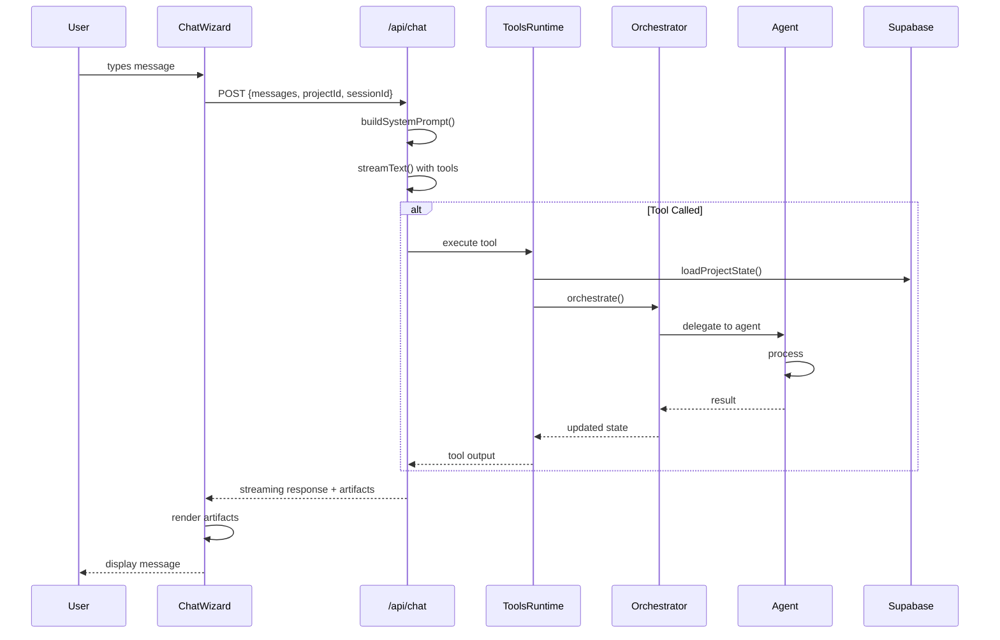

# Agent System Architecture

> High-level system map for the KnearMe portfolio chat agent.

## System Overview

```mermaid
graph TB
    subgraph "Client Layer"
        CW[ChatWizard.tsx]
        AR[ArtifactRenderer.tsx]
        CM[ChatMessages.tsx]
    end

    subgraph "API Layer"
        CR[/api/chat/route.ts]
        TS[tool-schemas.ts]
        TR[tools-runtime.ts]
    end

    subgraph "Agent Layer - Orchestrator + Subagents"
        AM[Account Manager<br/>Orchestrator]
        SA[Story Agent]
        DA[Design Agent]
        QA[Quality Agent]
        AM --> SA
        AM --> DA
        AM --> QA
    end

    subgraph "Data Layer"
        SB[(Supabase)]
        PS[ProjectState]
    end

    CW -->|sendMessage| CR
    CR -->|streamText| CW
    CR --> TS
    CR --> TR
    TR --> AM
    TR -->|loadProjectState| SB
    SA --> PS
    DA --> PS
    QA --> PS
    CR -->|artifacts| AR
    AR --> CM
```

---

## Orchestrator + Subagents Architecture

> **Pattern:** Account Manager coordinates specialist subagents.
> See [AGENT-PERSONAS.md](AGENT-PERSONAS.md) for detailed agent definitions.

```
┌─────────────────────────────────────────────────────────────────────────┐
│                    ACCOUNT MANAGER (Orchestrator)                        │
│              User-facing persona • Coordinates specialists               │
├─────────────────────────────────────────────────────────────────────────┤
│  Role: Analyze request → Delegate complex tasks → Synthesize results    │
│  Tools: Lightweight (read, routing) - delegates heavy work              │
└────────────────────────────────────┬────────────────────────────────────┘
                                     │
          ┌──────────────────────────┼──────────────────────────┐
          │                          │                          │
          ▼                          ▼                          ▼
┌──────────────────┐    ┌──────────────────┐    ┌──────────────────┐
│   STORY AGENT    │    │   DESIGN AGENT   │    │  QUALITY AGENT   │
│   (Subagent)     │    │   (Subagent)     │    │   (Subagent)     │
├──────────────────┤    ├──────────────────┤    ├──────────────────┤
│ • Conversation   │    │ • Layout tokens  │    │ • Assessment     │
│ • Image analysis │    │ • Composition    │    │ • Contextual     │
│ • Narrative      │    │ • Preview gen    │    │ • Advisory       │
│ • Content write  │    │ • Design refine  │    │ • NOT blocking   │
└──────────────────┘    └──────────────────┘    └──────────────────┘
```

### Key Architecture Principles

1. **Don't overload orchestrator** - Delegate complex tasks to subagents
2. **Subagents are specialists** - Each has focused expertise and tools
3. **Context isolation** - Each subagent works in its own context
4. **Parallel when possible** - Independent tasks run simultaneously
5. **Orchestrator synthesizes** - Combines subagent outputs coherently
6. **Quality is advisory** - Suggests, doesn't block

See `todo/ai-sdk-phase-10-persona-agents.md` for implementation details.

---

## Component Responsibilities

### Client Layer

| Component | File | Purpose |
|-----------|------|---------|
| **ChatWizard** | `src/components/chat/ChatWizard.tsx` | Main chat orchestrator. Derives behavior from project state, not explicit mode |
| **ArtifactRenderer** | `src/components/chat/artifacts/ArtifactRenderer.tsx` | Routes tool outputs to appropriate UI components |
| **ChatMessages** | `src/components/chat/ChatMessages.tsx` | Renders message list with artifacts inline |
| **ProjectState** | `src/lib/chat/project-state.ts` | Derives project state (isEmpty, hasContent, isPublished) for adaptive behavior |

### API Layer

| Component | File | Purpose |
|-----------|------|---------|
| **Chat Route** | `src/app/api/chat/route.ts` | Main streaming endpoint. Tool selection, auth, context |
| **Tool Schemas** | `src/lib/chat/tool-schemas.ts` | Zod schemas for all tool inputs/outputs |
| **Tools Runtime** | `src/lib/chat/tools-runtime.ts` | Tool executors, FAST/DEEP classification |

### Agent Layer

| Component | File | Purpose |
|-----------|------|---------|
| **Orchestrator** | `src/lib/agents/orchestrator.ts` | Phase management (transitional → agent-initiated handoffs) |
| **Story Extractor** | `src/lib/agents/story-extractor.ts` | Extracts structured data from conversation |
| **Content Generator** | `src/lib/agents/content-generator.ts` | Creates title, description, SEO content |
| **Layout Composer** | `src/lib/agents/layout-composer.ts` | Structures description blocks |
| **Quality Checker** | `src/lib/agents/quality-checker.ts` | Validates publish readiness |

## Data Flow



## Tool Classification

Tools are classified by latency and context requirements:

### FAST_TURN_TOOLS (auto-allowed)

Always available, low latency, immediate feedback:

- `extractProjectData` - Parse user input
- `requestClarification` - Ask for clarity
- `promptForImages` - Show upload UI
- `showPortfolioPreview` - Trigger preview refresh
- `suggestQuickActions` - Show action chips
- `updateField` - Direct field update
- `regenerateSection` - AI rewrite request
- `reorderImages` - Change order
- `validateForPublish` - Check requirements
- `checkPublishReady` - Quality validation

### DEEP_CONTEXT_TOOLS (explicit request)

Require `toolChoice` parameter, higher latency:

- `generatePortfolioContent` - Full AI generation
- `composePortfolioLayout` - Block structure creation

## Key Patterns

### 1. ToolContext Pattern

Secure context passed via closure (not from model):

```typescript
const toolContext: ToolContext = {
  userId: auth.user.id,
  contractorId: auth.contractor.id,
  projectId,  // from request body
  sessionId,  // from request body
};
```

### 2. State Loading Pattern

Project state loaded from database for tools:

```typescript
const projectState = await loadProjectState(toolContext.projectId);
```

### 3. Artifact Rendering Pattern

Tools return data, client renders:

```typescript
// Tool returns structured data
return { ready: true, missing: [], summary: '...' };

// ArtifactRenderer maps to component
<PublishReadinessCard data={output} />
```

## File Dependency Graph

```
route.ts
├── tool-schemas.ts (schemas)
├── tools-runtime.ts (executors)
│   └── agents/
│       ├── orchestrator.ts
│       ├── story-extractor.ts
│       ├── content-generator.ts
│       ├── layout-composer.ts
│       └── quality-checker.ts
├── chat-prompts.ts (system prompt + adaptive greeting)
└── prompt-context.ts (context loading)

ChatWizard.tsx
├── useChat (Vercel AI SDK)
├── project-state.ts (derives behavior from project state)
│   ├── deriveProjectState()
│   ├── getInitialPhase()
│   └── getInitialCanvasSize()
├── chat-prompts.ts
│   └── getAdaptiveOpeningMessage()
├── ArtifactRenderer.tsx
│   └── artifacts/*.tsx (individual components)
└── hooks/
    ├── useCompleteness.ts
    └── useQuickActions.ts

Routes (Project-First Flow)
├── /projects/new → eager-create → redirect to /projects/[id]
├── /projects/[id] → unified workspace (ChatWizard)
└── /projects/[id]/edit → redirect to /projects/[id] (backward compat)
```

---

*Last updated: 2026-01-01*
*See [TOOL-CATALOG.md](TOOL-CATALOG.md) for detailed tool documentation*
