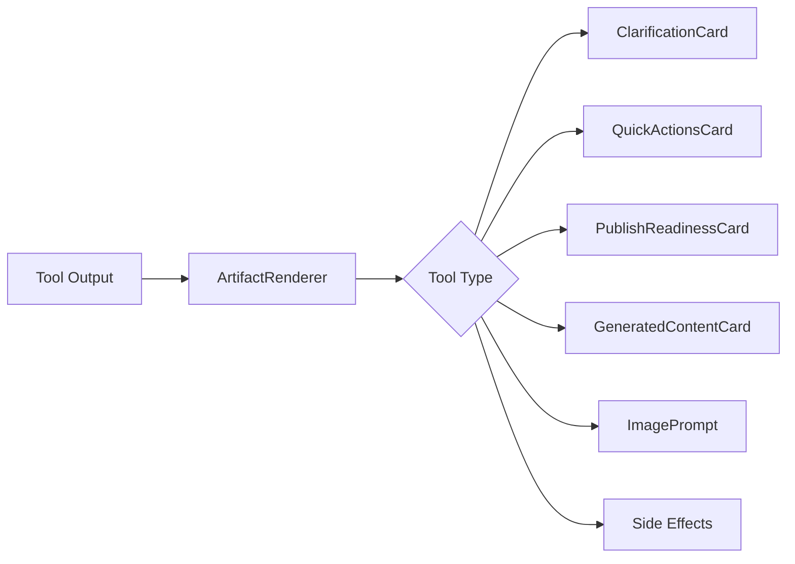

# Artifact Guide

> UI components rendered from tool outputs in the chat interface.

## Artifact System Overview

Artifacts are interactive UI components rendered inline within chat messages. They're triggered by AI tool calls and display structured data.



## Rendering Flow

1. **ChatMessage** receives `UIMessage` with `parts[]`
2. Each part with `type.startsWith('tool-')` is an artifact
3. **ArtifactRenderer** extracts tool name and dispatches to component
4. Component renders based on `state` and `output`

File: `src/components/chat/artifacts/ArtifactRenderer.tsx`

---

## Tool Part States

From AI SDK 6 (`src/types/artifacts.ts:19-27`):

| State | Description |
|-------|-------------|
| `input-streaming` | Tool input being streamed from LLM |
| `input-available` | Input ready, execution pending |
| `approval-requested` | Waiting for user approval |
| `approval-responded` | User responded to approval |
| `output-available` | Executed successfully, result ready |
| `output-error` | Execution failed |
| `output-denied` | Denied by user |

**Rendering Rules**:
- `isLoading()` → Show skeleton
- `hasError()` → Show error state
- `hasOutput()` → Render component

---

## Artifact Components

### ClarificationCard

**Tool**: `requestClarification`

**File**: `src/components/chat/artifacts/ClarificationCard.tsx`

**Data**:
```typescript
interface ClarificationData {
  field: string;
  currentValue?: string;
  alternatives?: string[];
  question: string;
  confidence: number;
  context?: string;
}
```

**UI Elements**:
- Field label badge
- Current value with confidence indicator (color-coded)
- Alternative options as clickable chips
- "Something else" text input
- Context explanation (expandable)

---

### QuickActionsCard

**Tool**: `suggestQuickActions`

**File**: `src/components/chat/artifacts/QuickActionsCard.tsx`

**Data**:
```typescript
interface SuggestQuickActionsOutput {
  actions: Array<{
    label: string;
    type: 'addPhotos' | 'generate' | 'openForm' |
          'showPreview' | 'composeLayout' |
          'checkPublishReady' | 'insert';
    value?: string;
  }>;
  reason?: string;
}
```

**UI Elements**:
- Horizontal chip row
- Icons per action type
- Hover tooltips
- Click handlers dispatch to ChatWizard

**Action Handlers** (in ChatWizard):
- `addPhotos` → Open photo sheet
- `generate` → Trigger generatePortfolioContent
- `openForm` → Open edit form panel
- `showPreview` → Toggle preview
- `composeLayout` → Trigger composePortfolioLayout
- `checkPublishReady` → Run quality check
- `insert` → Prefill chat input with value

---

### PublishReadinessCard

**Tool**: `checkPublishReady`

**File**: `src/components/chat/artifacts/PublishReadinessCard.tsx`

**Data**:
```typescript
interface PublishReadinessData {
  ready: boolean;
  missing: string[];
  warnings: string[];
  suggestions: string[];
  topPriority: string | null;
  summary: string;
}
```

**UI Elements**:
- Status indicator (green check / yellow warning / red X)
- Summary text
- Missing requirements list (blocking)
- Warnings list (non-blocking)
- Suggestions with action buttons
- "Publish" button (when ready)

---

### GeneratedContentCard

**Tool**: `generatePortfolioContent`

**File**: `src/components/chat/artifacts/GeneratedContentCard.tsx`

**Data**:
```typescript
interface GeneratedContentData {
  success: boolean;
  title: string;
  description: string;
  seoTitle: string;
  seoDescription: string;
  tags: string[];
  error?: string;
}
```

**UI Elements**:
- Title preview with edit icon
- Description preview (truncated)
- SEO preview section
- Tags as chips
- "Apply" / "Edit" / "Regenerate" buttons
- Error state if `success: false`

---

### ImagePrompt / ChatPhotoSheet

**Tool**: `promptForImages`

**Files**:
- `src/components/chat/artifacts/ImagePrompt.tsx`
- `src/components/chat/ChatPhotoSheet.tsx`

**Data**:
```typescript
interface ImagePromptData {
  existingCount: number;
  suggestedCategories?: ('before' | 'after' | 'progress' | 'detail')[];
  message?: string;
}
```

**UI Elements**:
- Drop zone with dashed border
- Category chips for classification
- Upload progress indicator
- Existing images thumbnail grid
- "Done" button

---

## Side-Effect Tools

Some tools don't render inline artifacts but trigger side effects:

### showPortfolioPreview

**Behavior**:
- Desktop: Highlights preview pane, may scroll to it
- Mobile: Opens preview overlay sheet

**Handled in**: `ChatWizard.tsx` via `onPreviewRequest` callback

### showContentEditor (DEPRECATED)

No longer renders. Use `suggestQuickActions` with `openForm` instead.

---

## Loading States

File: `src/components/chat/artifacts/shared/ArtifactSkeleton.tsx`

Shows shimmer animation while tool is executing.

---

## Error States

File: `src/components/chat/artifacts/shared/ArtifactError.tsx`

Shows error message with optional retry button.

---

## Type Guards

Utility functions in `src/types/artifacts.ts`:

```typescript
// Check if part is a tool part
isToolPart(part): boolean

// Check if tool has output
hasOutput<T>(part): part is ToolPart<unknown, T> & { output: T }

// Check if tool is still loading
isLoading(part): boolean

// Check if tool has error
hasError(part): boolean

// Extract tool name from type
extractToolName('tool-checkPublishReady'): 'checkPublishReady'
```

---

## Adding New Artifacts

1. **Define schema** in `tool-schemas.ts`
2. **Add executor** in `tools-runtime.ts`
3. **Add type** to `ArtifactType` in `artifacts.ts`
4. **Create component** in `artifacts/` directory
5. **Register in ArtifactRenderer** switch statement
6. **Update this guide**

---

## Component Props Pattern

All artifact components receive:

```typescript
interface ArtifactProps<T> {
  data: T;                    // Tool output
  state: ToolPartState;       // Current state
  onAction?: (action: ArtifactAction) => void;  // Callback
}
```

---

*Last updated: 2025-01-01*
*See [TOOL-CATALOG.md](TOOL-CATALOG.md) for tool details*
