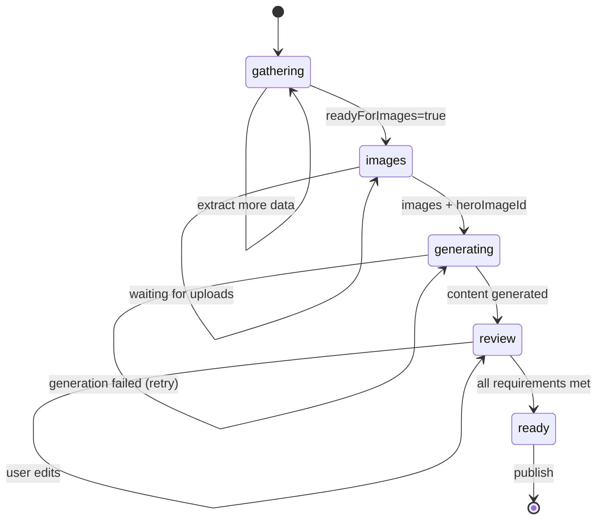
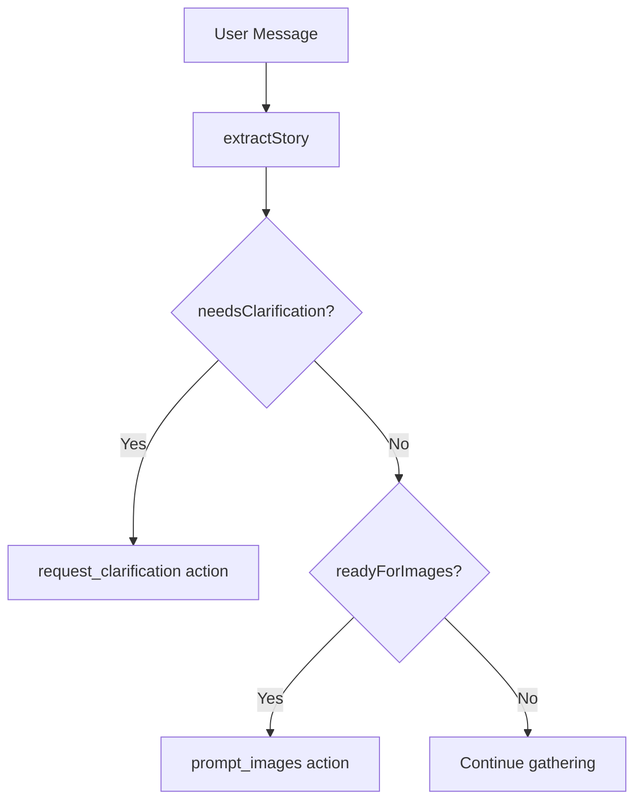
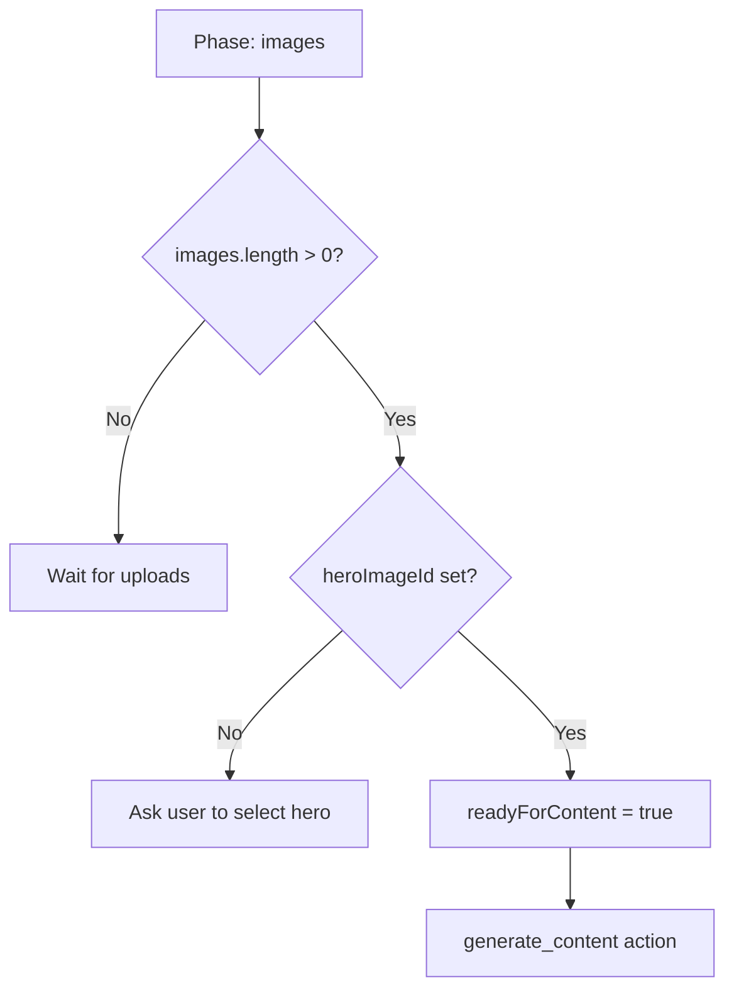
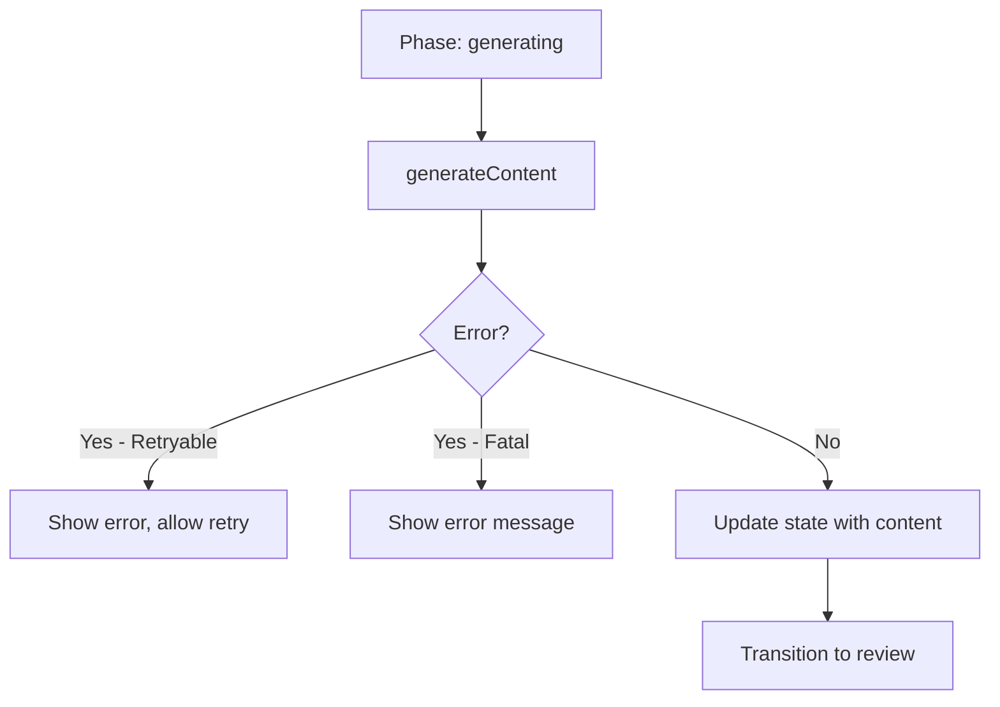
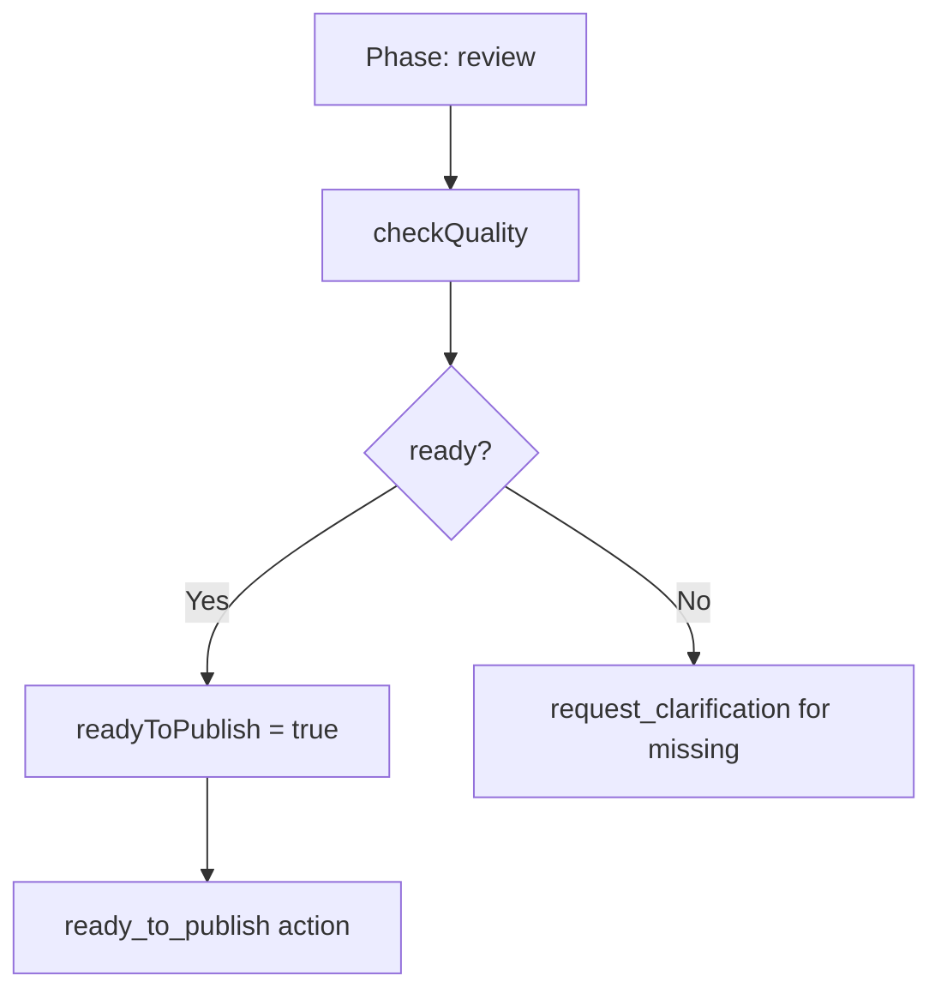
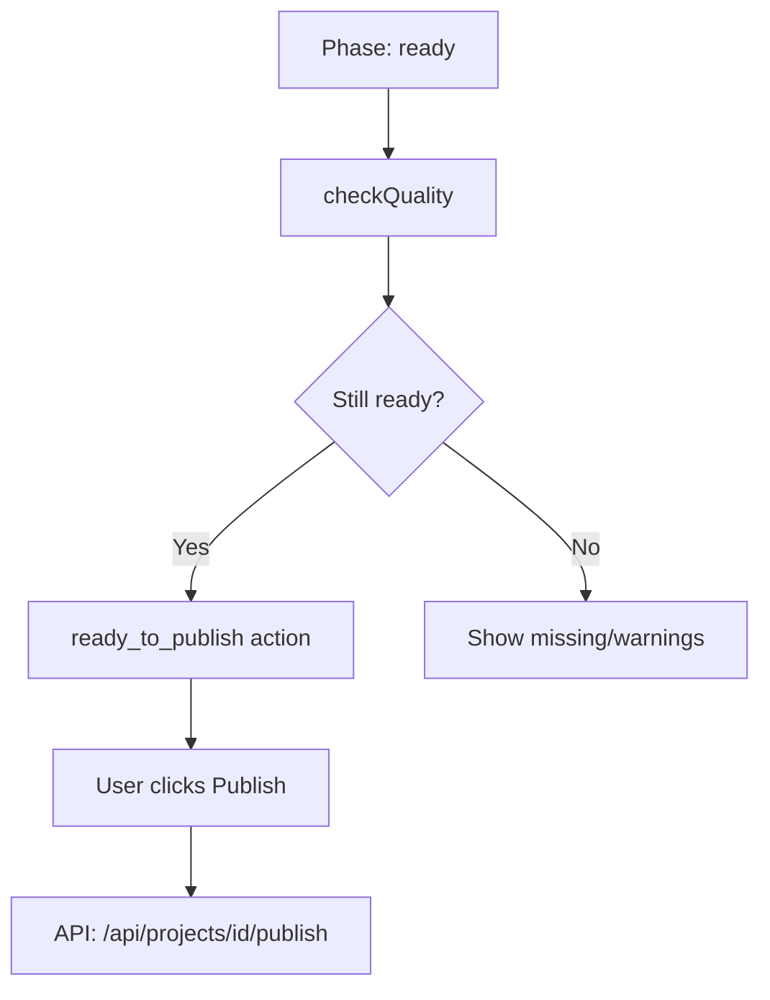
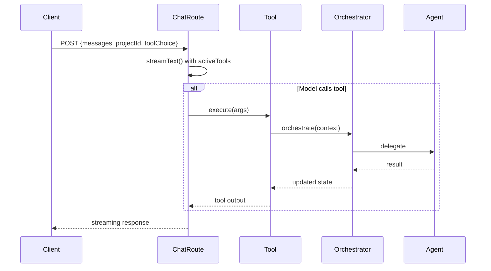

# Phase Flows

> Chat phase state machine and orchestration logic.

## Project-First Entry Flow

All project work now enters through a unified route. The agent adapts to project state:

```mermaid
graph TB
    subgraph "Entry Points"
        N[/projects/new] -->|eager-create| C[Create Draft Project]
        E[/projects/:id/edit] -->|redirect| U
        D[Dashboard/List] --> U
    end

    C --> U[/projects/:id<br/>Unified Workspace]

    subgraph "State Derivation"
        U --> DS[deriveProjectState]
        DS --> IP[getInitialPhase]
        DS --> IC[getInitialCanvasSize]
        DS --> AM[getAdaptiveOpeningMessage]
    end

    subgraph "Adaptive Behavior"
        IP -->|isEmpty| CONV[phase: conversation]
        IP -->|hasContent| REV[phase: review]
        IC -->|isEmpty| COLL[canvas: collapsed]
        IC -->|hasContent| MED[canvas: medium]
    end
```

### Adaptive Greeting Messages

Based on `ProjectState`, the agent greets appropriately:

| State | Greeting Style |
|-------|---------------|
| `isEmpty && !hasExistingSession` | "Hey - what project are we documenting today?" |
| `isEmpty && hasExistingSession` | "Picking up where we left off - what's this project about?" |
| `hasImages && !hasContent` | "Got your photos - want me to write up the story?" |
| `hasContent` (draft) | "Back to work on [title] - what needs tweaking?" |
| `isPublished` | "[title] is live - anything you want to update?" |

---

## Phase State Machine



## Phase Definitions

Defined in: `src/lib/agents/orchestrator.ts:54-62`

```typescript
type Phase = 'gathering' | 'images' | 'generating' | 'review' | 'ready';
```

### Phase Determination

Function: `determinePhase()` in `orchestrator.ts:67-73`

```typescript
function determinePhase(state: SharedProjectState): Phase {
  if (state.readyToPublish) return 'ready';
  if (state.title && state.description) return 'review';
  if (state.readyForContent) return 'generating';
  if (state.readyForImages) return 'images';
  return 'gathering';
}
```

---

## Phase Handlers

### 1. Gathering Phase

**Entry**: Session start or incomplete story data

**Goal**: Extract project information from conversation

**Handler**: `handleGatheringPhase()` in `orchestrator.ts:116-146`



**Tools Used**:
- `extractProjectData` - Parse conversation
- `requestClarification` - Ask for clarity
- `suggestQuickActions` - Guide user

**Transition Trigger**:
- `readyForImages === true`

---

### 2. Images Phase

**Entry**: Story data complete, waiting for photos

**Goal**: Collect project images

**Handler**: `handleImagesPhase()` in `orchestrator.ts:151-167`



**Tools Used**:
- `promptForImages` - Show upload UI
- `showPortfolioPreview` - Preview with images
- `suggestQuickActions` - "Generate content" chip

**Transition Trigger**:
- `images.length > 0 && heroImageId`

---

### 3. Generating Phase

**Entry**: Has images and hero, ready for AI content

**Goal**: Create polished portfolio content

**Handler**: `handleGeneratingPhase()` in `orchestrator.ts:172-201`



**Tools Used**:
- `generatePortfolioContent` - Full AI generation
- `composePortfolioLayout` - Block structure (optional)

**Transition Trigger**:
- `title && description` populated

---

### 4. Review Phase

**Entry**: Content generated, user reviewing

**Goal**: Let user review and edit before publish

**Handler**: `handleReviewPhase()` in `orchestrator.ts:206-228`



**Tools Used**:
- `checkPublishReady` - Validate requirements
- `updateField` - Edit fields
- `regenerateSection` - AI rewrite
- `reorderImages` - Change order
- `showPortfolioPreview` - Show changes

**Transition Trigger**:
- `checkQuality().ready === true`

---

### 5. Ready Phase

**Entry**: All requirements met

**Goal**: Final validation and publish

**Handler**: `handleReadyPhase()` in `orchestrator.ts:233-261`



**Tools Used**:
- `validateForPublish` - Server-side check
- `checkPublishReady` - Client display

---

## Orchestrator Actions

Defined in `orchestrator.ts:25-31`:

```typescript
type OrchestratorAction =
  | { type: 'extract_story'; message: string }
  | { type: 'generate_content' }
  | { type: 'check_quality' }
  | { type: 'request_clarification'; fields: string[] }
  | { type: 'prompt_images' }
  | { type: 'ready_to_publish' };
```

---

## Chat Route Integration

The chat route (`/api/chat/route.ts`) doesn't directly call the orchestrator for every message. Instead:

1. **Tool Selection**: Route selects which tools are active based on `toolChoice`
2. **Tool Execution**: Individual tools may call orchestrator internally
3. **Streaming**: Response streams back with tool results



---

## toolChoice Parameter

Controls which deep tools are available:

```typescript
// Request body
{
  messages: [...],
  projectId: "uuid",
  sessionId: "uuid",
  toolChoice: "generatePortfolioContent"  // or "composePortfolioLayout"
}

// Route logic
const requestedDeepTool = DEEP_CONTEXT_TOOLS.includes(toolChoice)
  ? toolChoice
  : undefined;

const activeTools = requestedDeepTool
  ? [...FAST_TURN_TOOLS, requestedDeepTool]
  : [...FAST_TURN_TOOLS];

const enforcedToolChoice = requestedDeepTool
  ? { type: 'tool', toolName: requestedDeepTool }
  : 'auto';
```

---

## Phase Recovery

If phase is lost (e.g., session timeout):

1. Load project state from database
2. Call `determinePhase(state)` to infer current phase
3. Resume from appropriate handler

---

*Last updated: 2026-01-01*
*See [ARCHITECTURE.md](ARCHITECTURE.md) for system overview*
