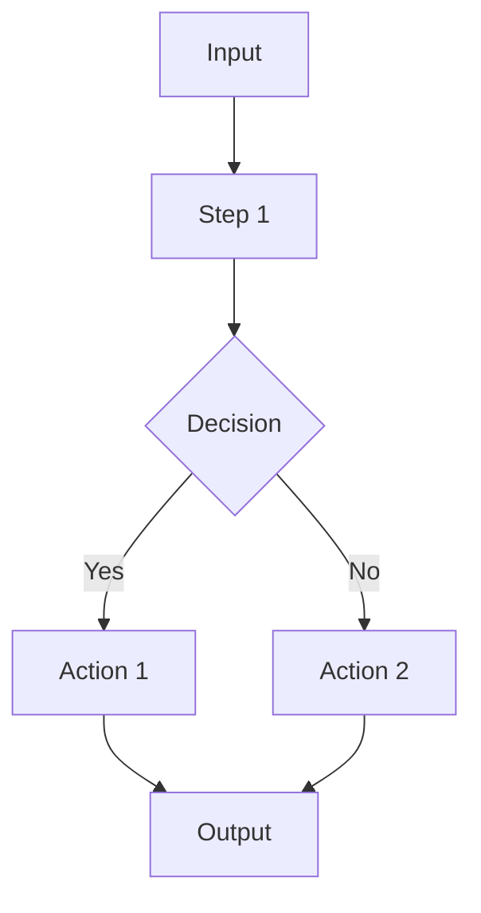

# Agent Entry Template

Copy this template when adding a new agent to the documentation.

---

## Agent Name

**File**: `src/lib/agents/agent-name.ts`

**Purpose**: One paragraph describing what the agent does and when it's called.

### Interface

**Input**:
```typescript
interface AgentInput {
  state: SharedProjectState;
  // other inputs
}
```

**Output**:
```typescript
interface AgentOutput {
  // output fields
}
```

### Flow



### Integration

**Called by**: Orchestrator in `phase` phase

**Calls**: (other agents or functions it uses)

### Key Functions

| Function | Purpose |
|----------|---------|
| `mainFunction()` | Primary entry point |
| `helperFunction()` | Helper description |

---

## Checklist

When adding a new agent:

- [ ] Create agent file in `src/lib/agents/`
- [ ] Add types to `types.ts`
- [ ] Export from `index.ts`
- [ ] Integrate with orchestrator
- [ ] Add documentation to ARCHITECTURE.md
- [ ] Add entry to CHANGE-LOG.md
