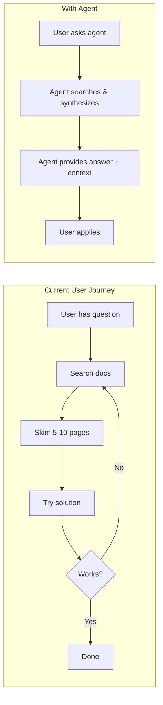
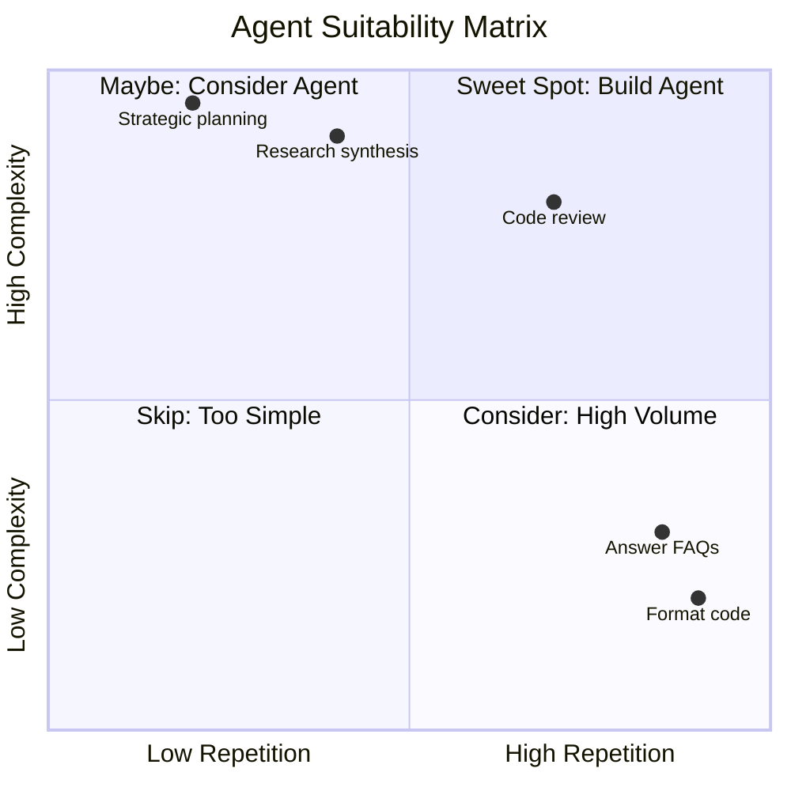
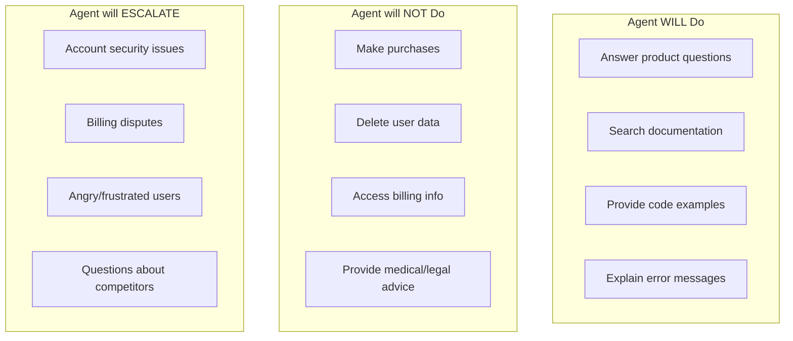
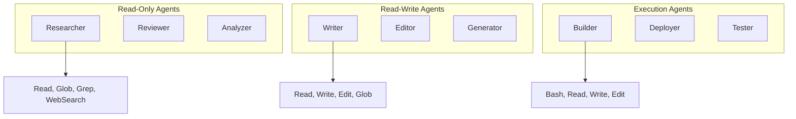
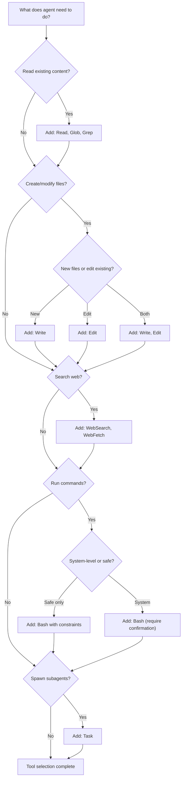
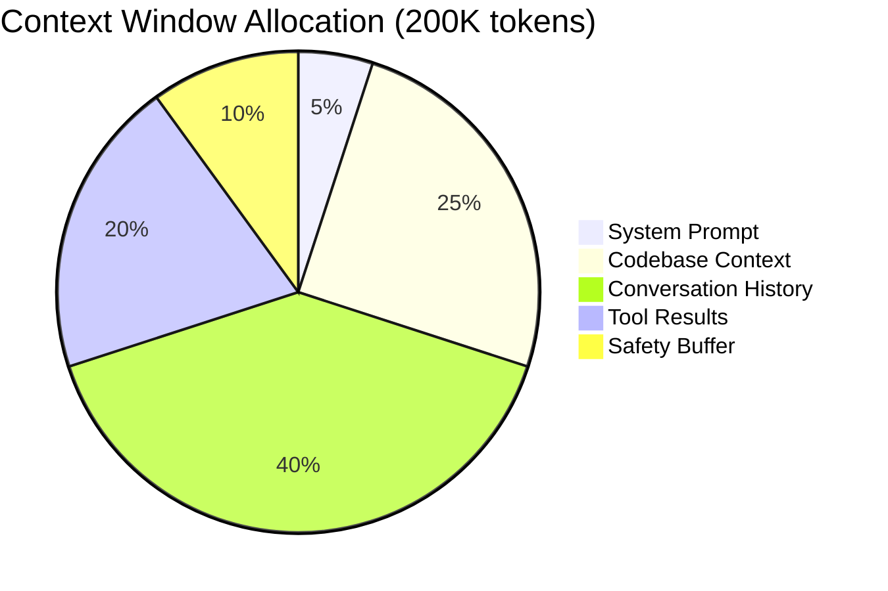
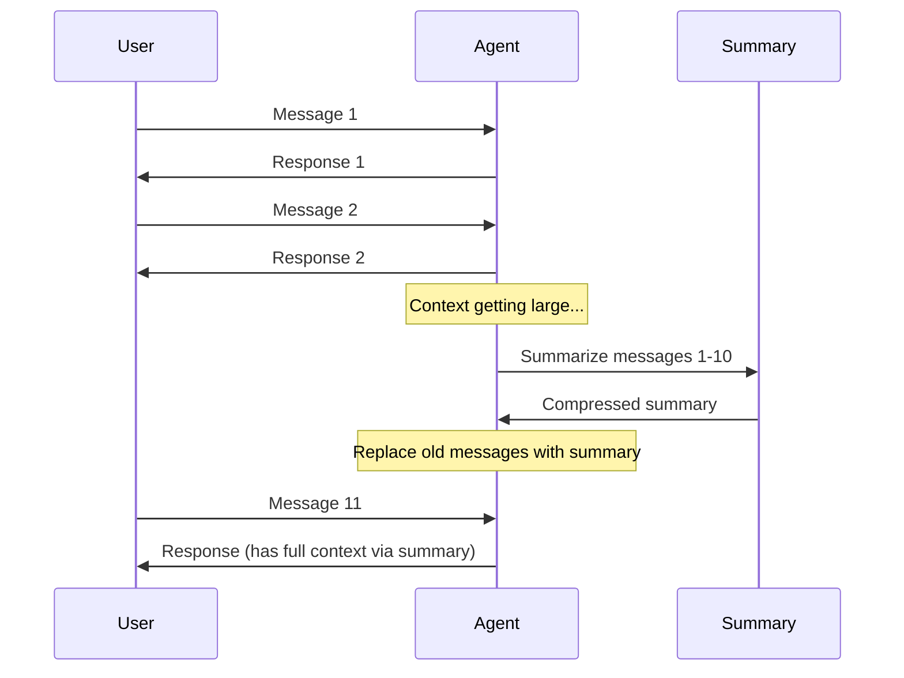

# Agent Design Guide

A comprehensive, practical guide for designing and building effective AI agents with the Claude Agent SDK. This guide covers the full lifecycle from discovery through implementation.

---

## Table of Contents

1. [Discovery Phase](#1-discovery-phase)
2. [Agent Planning](#2-agent-planning)
3. [Prompt Engineering Best Practices](#3-prompt-engineering-best-practices)
4. [Tool Selection Strategies](#4-tool-selection-strategies)
5. [Context Window Management](#5-context-window-management)
6. [Common Anti-patterns](#6-common-anti-patterns)
7. [Design Checklist](#7-design-checklist)

---

## 1. Discovery Phase

Before writing any code, invest time understanding the problem space. Poor discovery leads to agents that technically work but fail to deliver value.

### 1.1 User Journey Mapping

Map the complete journey users take to accomplish their goals. This reveals where an agent can add the most value.



**Journey Mapping Template:**

| Step | User Action | Pain Level (1-5) | Agent Opportunity |
|------|-------------|------------------|-------------------|
| 1 | Describe what they do now | How frustrating is this? | How can agent help? |
| 2 | ... | ... | ... |

**Example: Code Review Agent**

| Step | User Action | Pain Level | Agent Opportunity |
|------|-------------|------------|-------------------|
| 1 | Open PR, read diff | 2 | Auto-summarize changes |
| 2 | Check for patterns/anti-patterns | 4 | Detect issues automatically |
| 3 | Verify test coverage | 3 | Identify untested paths |
| 4 | Write review comments | 3 | Suggest specific fixes |
| 5 | Wait for author response | 1 | N/A (human interaction) |

### 1.2 Identifying Pain Points

Focus on pain points that agents are uniquely suited to solve:



**Best Agent Use Cases:**
- High repetition + moderate complexity (FAQs, code review, data extraction)
- Moderate repetition + high complexity (research, content generation, analysis)

**Poor Agent Use Cases:**
- Low repetition + low complexity (one-off simple tasks)
- Low repetition + very high complexity (novel strategic decisions)

### 1.3 Defining Success Metrics

Define measurable outcomes before building. This prevents scope creep and enables iteration.

**Metric Categories:**

| Category | Metrics | Example Target |
|----------|---------|----------------|
| **Efficiency** | Time saved, tasks completed | 50% reduction in review time |
| **Quality** | Error rate, accuracy, user rating | 90% accuracy, 4.5/5 rating |
| **Adoption** | Usage rate, retention, referrals | 80% weekly active users |
| **Business** | Cost savings, revenue impact | $10k/month saved |

**Success Metric Template:**

```markdown
## Agent: [Name]

### Primary Metric
- **What:** [Specific measurement]
- **Target:** [Quantified goal]
- **Baseline:** [Current state]
- **Measurement:** [How you'll track]

### Secondary Metrics
1. [Metric]: [Target]
2. [Metric]: [Target]

### Anti-Metrics (what NOT to optimize)
1. [Metric to avoid gaming]
```

**Example: Portfolio Content Agent**

```markdown
## Agent: Portfolio Content Generator

### Primary Metric
- **What:** Time from photo upload to published project
- **Target:** < 5 minutes (from 45+ minutes)
- **Baseline:** 45 minutes manual process
- **Measurement:** Timestamp delta in database

### Secondary Metrics
1. Content quality score (human rating): 4.0/5.0
2. SEO keyword coverage: 85%+ of target keywords
3. Edit rate: < 20% of content requires changes

### Anti-Metrics
1. Word count (don't optimize for length)
2. Generation speed (don't sacrifice quality)
```

---

## 2. Agent Planning

Before implementation, define clear boundaries and capabilities.

### 2.1 Agent Purpose Definition

Answer these questions in one sentence each:

| Question | Your Answer |
|----------|-------------|
| **What does this agent do?** | [Single, clear purpose] |
| **Who is it for?** | [Specific user persona] |
| **What triggers its use?** | [Specific event or need] |
| **What does success look like?** | [Observable outcome] |

**Example Definitions:**

```markdown
# Code Review Agent
- **What:** Reviews pull requests for code quality, security issues, and best practices
- **Who:** Engineering team members (all levels)
- **Trigger:** New PR opened or updated
- **Success:** Actionable feedback within 2 minutes, catching 90% of issues

# Support Agent
- **What:** Answers customer questions about product features and troubleshooting
- **Who:** End users of the SaaS product
- **Trigger:** User submits support ticket or asks in chat
- **Success:** Resolves 70% of queries without human escalation
```

### 2.2 Defining Boundaries

Boundaries prevent scope creep and reduce errors. Be explicit about what the agent will NOT do.



**Boundary Template:**

```markdown
## Boundaries for [Agent Name]

### WILL DO (In Scope)
- [ ] Capability 1
- [ ] Capability 2
- [ ] Capability 3

### WILL NOT DO (Hard Limits)
- [ ] Never do X because [reason]
- [ ] Never access Y because [reason]
- [ ] Never modify Z because [reason]

### WILL ESCALATE (Soft Limits)
- [ ] Escalate when [condition] because [reason]
- [ ] Escalate when [condition] because [reason]

### REQUIRES CONFIRMATION
- [ ] Before doing X, always confirm because [reason]
- [ ] Before doing Y, always confirm because [reason]
```

### 2.3 Expertise Requirements

Map the knowledge domains your agent needs. This informs prompt design and tool selection.

**Expertise Matrix:**

| Domain | Depth Needed | Source |
|--------|--------------|--------|
| [Domain 1] | Expert / Intermediate / Basic | Prompt / Tools / Both |
| [Domain 2] | ... | ... |

**Example: Masonry Portfolio Agent**

| Domain | Depth | Source |
|--------|-------|--------|
| Masonry terminology | Expert | System prompt with glossary |
| SEO writing | Intermediate | System prompt + examples |
| Photo analysis | Basic | Gemini Vision tool |
| Local geography | Basic | WebSearch tool |
| Content structure | Expert | System prompt templates |

---

## 3. Prompt Engineering Best Practices

The system prompt is the heart of your agent. A well-crafted prompt can make a simple agent outperform a complex one with poor prompts.

### 3.1 Prompt Structure Template

Use this structure for consistent, effective prompts:

```markdown
# [Agent Role]

[One-sentence identity statement]

## Context
[Background the agent needs to understand its environment]

## Capabilities
[What the agent CAN do - be specific]

## Constraints
[What the agent must NEVER do]

## Process
[Step-by-step workflow the agent should follow]

## Output Format
[Exact structure of expected responses]

## Examples
[2-3 concrete examples of ideal behavior]
```

### 3.2 Writing Effective Identity Statements

The identity statement shapes all agent behavior. Be specific and actionable.

**Bad Identity Statements:**
```markdown
# Bad: Too vague
You are a helpful assistant.

# Bad: Too broad
You are an expert in everything related to software development.

# Bad: No personality
You answer questions about code.
```

**Good Identity Statements:**
```markdown
# Good: Specific role + context
You are a senior code reviewer at a fintech company. You focus on security,
performance, and maintainability in TypeScript codebases.

# Good: Clear expertise + boundaries
You are a masonry industry specialist who helps contractors document their work.
You know brick types, mortar techniques, and restoration terminology.

# Good: Personality + expertise
You are a patient, thorough technical writer who helps developers create
clear API documentation. You ask clarifying questions and provide examples.
```

### 3.3 Constraint Specification

Constraints prevent harmful or undesired behavior. Be explicit and provide reasoning.

**Constraint Categories:**

| Category | Example Constraint |
|----------|-------------------|
| **Safety** | Never execute code that deletes files without explicit confirmation |
| **Scope** | Only answer questions about this codebase; redirect others |
| **Tone** | Never use sarcasm or condescension, even with incorrect code |
| **Format** | Never produce responses longer than 500 words unless asked |
| **Authority** | Never claim to be human or pretend to have emotions |

**Constraint Writing Pattern:**

```markdown
## Constraints

### Hard Limits (Never violate)
1. **Never [action]** because [specific harm it could cause]
2. **Never [action]** because [specific harm it could cause]

### Soft Limits (Prefer not to)
1. **Avoid [action]** unless [specific exception condition]
2. **Prefer [alternative]** over [action] because [reason]

### Required Behaviors
1. **Always [action]** when [condition] because [reason]
2. **Always [action]** when [condition] because [reason]
```

### 3.4 Output Format Guidance

Consistent output formats improve user experience and enable downstream processing.

**Format Specification Example:**

```markdown
## Output Format

### For Code Reviews
Respond using this exact structure:

```
## Summary
[1-2 sentence overview of the changes]

## Issues Found
| Severity | File:Line | Issue | Suggested Fix |
|----------|-----------|-------|---------------|
| 🔴 High | ... | ... | ... |
| 🟡 Medium | ... | ... | ... |
| 🟢 Low | ... | ... | ... |

## Positive Notes
- [What was done well]

## Questions for Author
1. [Clarifying question]
```

### For When No Issues Found
```
## Summary
[Overview]

## Result
No issues found.

## Positive Notes
- [What was done well]
```
```

### 3.5 Examples: Good vs Bad Prompts

**Bad Prompt Example:**

```markdown
You are an AI assistant. Help users with their code.

Be helpful and friendly. Answer questions about programming.

If you don't know something, say so.
```

Problems:
- No specific expertise defined
- No constraints
- No output format
- No process guidance
- "Be helpful" is meaningless

**Good Prompt Example:**

```markdown
# TypeScript Code Review Specialist

You are a senior TypeScript engineer conducting code reviews. You focus on:
- Type safety and proper TypeScript usage
- Performance implications
- Security vulnerabilities
- Code maintainability

## Context
You review code for a Next.js 14 application using:
- Supabase for database
- Tailwind CSS for styling
- React Hook Form + Zod for forms

## Capabilities
- Analyze TypeScript/TSX code for issues
- Suggest specific improvements with code examples
- Explain the "why" behind recommendations
- Rate severity of issues (high/medium/low)

## Constraints

### Hard Limits
1. **Never approve code with obvious security issues** (SQL injection, XSS, exposed secrets)
2. **Never suggest changes that break existing tests** without noting this
3. **Never comment on coding style preferences** (formatting, naming conventions)
   unless they violate established patterns in the codebase

### Soft Limits
1. **Limit suggestions to 5 most important issues** unless asked for comprehensive review
2. **Avoid rewriting entire functions** - suggest targeted changes instead

## Process
1. Read the code change completely before commenting
2. Identify the purpose of the change
3. Check for: type errors, security issues, performance problems, maintainability
4. Prioritize issues by severity
5. Provide specific, actionable feedback with code examples

## Output Format
```
## Summary
[1-2 sentences on what the code does and overall assessment]

## Issues
| Severity | Location | Issue | Suggested Fix |
|----------|----------|-------|---------------|
| 🔴/🟡/🟢 | file:line | Problem | Solution |

## Positive Observations
- [What was done well]
```

## Examples

### Example 1: Security Issue
Input: `const query = "SELECT * FROM users WHERE id = " + userId`
Output:
| 🔴 High | db.ts:45 | SQL injection vulnerability | Use parameterized query: `supabase.from('users').select('*').eq('id', userId)` |

### Example 2: Type Issue
Input: `const user: any = await getUser()`
Output:
| 🟡 Medium | auth.ts:23 | Using `any` bypasses type checking | Define User type: `const user: User = await getUser()` |
```

---

## 4. Tool Selection Strategies

Apply the principle of least privilege: give agents the minimum tools needed for their job.

### 4.1 Tool-Role Matching Matrix



### 4.2 Tool Categories by Risk Level

| Risk Level | Tools | Use Case | Caution |
|------------|-------|----------|---------|
| **Low** | Read, Glob, Grep | Information gathering | Minimal risk |
| **Medium** | WebSearch, WebFetch | External data | Verify sources |
| **High** | Write, Edit | File modifications | Review outputs |
| **Critical** | Bash | System commands | Sandbox required |

### 4.3 Tool Selection Decision Tree



### 4.4 Tool Selection Examples

**Example 1: Documentation Agent**
```typescript
// Purpose: Help users find and understand documentation
// Risk tolerance: Low

allowedTools: ["Read", "Glob", "Grep"]

// Rationale:
// - Read: Access documentation files
// - Glob: Find relevant files by pattern
// - Grep: Search for specific content
//
// Excluded:
// - Write/Edit: Shouldn't modify docs
// - Bash: No system access needed
// - WebSearch: Docs are local
```

**Example 2: Code Generation Agent**
```typescript
// Purpose: Generate and modify code based on requirements
// Risk tolerance: Medium

allowedTools: ["Read", "Glob", "Grep", "Write", "Edit"]

// Rationale:
// - Read/Glob/Grep: Understand existing codebase
// - Write: Create new files
// - Edit: Modify existing files
//
// Excluded:
// - Bash: Don't run arbitrary commands
// - Task: Single-purpose agent
```

**Example 3: DevOps Agent**
```typescript
// Purpose: Manage deployments and infrastructure
// Risk tolerance: High (requires extra safeguards)

allowedTools: ["Read", "Glob", "Grep", "Bash", "Edit"]

// Rationale:
// - Bash: Required for deployments
// - Edit: Modify config files
// - Read/Glob/Grep: Check current state
//
// CRITICAL CONSTRAINTS in prompt:
// - Only run commands in approved list
// - Never use sudo
// - Never modify production configs without confirmation
```

### 4.5 Least-Privilege Checklist

Before finalizing tools, verify:

- [ ] Is each tool actually needed? (Remove unused tools)
- [ ] Is there a lower-risk alternative? (Grep instead of Bash for searches)
- [ ] Are write tools necessary? (Read-only is safer)
- [ ] Is Bash absolutely required? (Highest risk)
- [ ] Are subagents needed? (Add complexity)
- [ ] Have I added constraints for risky tools?

---

## 5. Context Window Management

Efficient context usage prevents truncation and maintains agent coherence over long interactions.

### 5.1 Context Budget Allocation



**Allocation Guidelines:**

| Component | Recommended % | Max Tokens (200K window) |
|-----------|---------------|--------------------------|
| System prompt | 2-5% | 4K-10K |
| Reference docs | 10-20% | 20K-40K |
| Conversation | 30-50% | 60K-100K |
| Tool results | 15-25% | 30K-50K |
| Safety buffer | 10% | 20K |

### 5.2 What to Include in System Prompts

**Include:**
- Agent identity and purpose
- Key constraints and boundaries
- Output format specifications
- 2-3 critical examples
- Essential domain knowledge that won't change

**Exclude:**
- Large reference documents (load on-demand)
- Dynamic data (fetch via tools)
- Rarely-used information
- Verbose explanations (be concise)

**Example: Compact vs Verbose**

```markdown
# Verbose (Bad) - 500+ tokens
You are an AI assistant designed to help software developers with their
coding tasks. Your primary function is to assist with code review, and
you should focus on identifying potential issues in the code. When you
find problems, you should explain them clearly and provide suggestions
for how to fix them. You should be friendly and helpful, but also
thorough in your analysis. Remember that developers have different
skill levels, so try to explain things in a way that is accessible
to everyone. [continues for paragraphs...]

# Compact (Good) - 100 tokens
# Code Review Specialist

Senior TypeScript reviewer. Focus: security, performance, maintainability.

## Output: Table of issues by severity (🔴🟡🟢) with specific fixes.

## Rules:
- Max 5 issues unless asked for more
- Always explain the "why"
- Include code examples
```

### 5.3 Summarization Strategies

For long conversations, implement summarization to preserve context:



**Summarization Prompt Template:**

```markdown
Summarize this conversation for context preservation:

## Conversation to summarize:
[messages]

## Summarize into:
1. **User's Goal:** [What they're trying to accomplish]
2. **Key Decisions Made:** [Important choices]
3. **Current State:** [Where we are now]
4. **Open Questions:** [Unresolved issues]
5. **Important Context:** [Facts that must be preserved]

Keep summary under 500 tokens.
```

### 5.4 Session Management Patterns

Use the SDK's session management for continuity:

```typescript
// Pattern 1: Session persistence
let sessionId: string | undefined;

// First message - capture session
for await (const msg of query({ prompt, options })) {
  if (msg.type === "system" && msg.subtype === "init") {
    sessionId = msg.session_id;
    saveToDatabase(userId, sessionId); // Persist
  }
}

// Later - resume session
const savedSessionId = await getFromDatabase(userId);
const response = query({
  prompt: newMessage,
  options: { resume: savedSessionId }
});

// Pattern 2: Fork for exploration
const forked = query({
  prompt: "Let's try a different approach",
  options: {
    resume: sessionId,
    forkSession: true  // Don't modify original
  }
});
```

### 5.5 Context Loading Strategies

**Lazy Loading:** Load context only when needed

```typescript
const SUBAGENTS = {
  "code-analyzer": {
    description: "Use when user asks about code patterns or architecture",
    prompt: `Analyze code in the current project.

    When activated, first use Glob to find relevant files,
    then Read only the files you need.`, // Loads context lazily
    tools: ["Read", "Glob", "Grep"],
  },
};
```

**Pre-loading:** Load frequently-needed context upfront

```typescript
// Pre-load critical files into system prompt
const criticalFiles = await Promise.all([
  fs.readFile("./docs/api-reference.md"),
  fs.readFile("./docs/architecture.md"),
]);

const systemPrompt = `
# Agent Context

## API Reference
${criticalFiles[0]}

## Architecture
${criticalFiles[1]}
`;
```

---

## 6. Common Anti-patterns

Learn from common mistakes to avoid them in your designs.

### 6.1 Over-Broad Prompts

**Anti-pattern:**
```markdown
You are a helpful AI that can do anything the user asks.
Be creative and flexible. Help with any task.
```

**Problem:** No focus leads to inconsistent behavior and poor results.

**Fix:**
```markdown
# Masonry Project Documenter

You help masonry contractors create portfolio content.

## Scope
- Analyze project photos
- Write project descriptions
- Generate SEO metadata

## Out of Scope (redirect these)
- Pricing questions → "Contact sales at..."
- Technical troubleshooting → "Check docs at..."
- Unrelated topics → "I specialize in project documentation"
```

### 6.2 Tool Overload

**Anti-pattern:**
```typescript
allowedTools: [
  "Read", "Write", "Edit", "Glob", "Grep", "Bash",
  "WebSearch", "WebFetch", "Task", "TodoWrite",
  "NotebookEdit", "AskUserQuestion"
]
```

**Problem:** More tools = more ways to fail + confused tool selection.

**Fix:**
```typescript
// Start minimal, add only what's proven necessary
allowedTools: ["Read", "Glob", "Grep"]  // Research agent

// Or with clear justification
allowedTools: [
  "Read",    // Analyze existing code
  "Write",   // Create new files
  "Edit",    // Modify existing files
  "Glob",    // Find files
]  // Code generation agent - each tool justified
```

### 6.3 Missing Constraints

**Anti-pattern:**
```markdown
# Data Analyst Agent

Analyze data and provide insights.
Use any methods you find appropriate.
```

**Problem:** Agent might access sensitive data, run dangerous queries, or produce harmful outputs.

**Fix:**
```markdown
# Data Analyst Agent

Analyze data and provide insights.

## Hard Constraints
1. **NEVER** access tables: users, payments, auth_tokens
2. **NEVER** run DELETE, DROP, or UPDATE queries
3. **NEVER** export data outside this system
4. **NEVER** include PII in responses

## Query Limits
- Max 1000 rows per query
- Timeout after 30 seconds
- Only SELECT statements allowed

## Escalation
If user requests access to restricted data, respond:
"I can't access that data directly. Please contact the data team."
```

### 6.4 Poor Error Handling

**Anti-pattern:**
```typescript
const response = query({ prompt, options });
for await (const msg of response) {
  console.log(msg);  // Hope nothing goes wrong!
}
```

**Problem:** Failures cause crashes or confusing behavior.

**Fix:**
```typescript
try {
  const response = query({ prompt, options });

  for await (const msg of response) {
    if (msg.type === "result") {
      switch (msg.subtype) {
        case "success":
          return handleSuccess(msg);
        case "error_max_turns":
          return handleMaxTurns(msg);
        case "error_during_execution":
          return handleExecutionError(msg);
      }
    }
  }
} catch (error) {
  // Handle SDK-level errors
  if (error.code === "RATE_LIMITED") {
    return scheduleRetry(prompt, options);
  }
  if (error.code === "CONTEXT_OVERFLOW") {
    return summarizeAndRetry(prompt, options);
  }
  throw error;  // Unknown error, propagate
}
```

### 6.5 Ignoring Cost Controls

**Anti-pattern:**
```typescript
const response = query({
  prompt: userMessage,
  options: {
    model: "claude-opus-4-5-20251101",  // Most expensive
    // No cost limits!
  },
});
```

**Problem:** Runaway costs from infinite loops or expensive operations.

**Fix:**
```typescript
const response = query({
  prompt: userMessage,
  options: {
    model: "claude-sonnet-4-5-20250929",  // Cost-effective default
    maxTurns: 25,          // Prevent infinite loops
    maxBudgetUsd: 1.00,    // Hard cost limit per query
  },
});

// Monitor in result
for await (const msg of response) {
  if (msg.type === "result") {
    logCost(msg.total_cost_usd);  // Track for billing
    if (msg.total_cost_usd > 0.50) {
      alertOps("High cost query", msg);
    }
  }
}
```

### 6.6 Not Testing Edge Cases

**Anti-pattern:** Only testing the happy path.

**Fix: Test Matrix**

| Category | Test Case | Expected Behavior |
|----------|-----------|-------------------|
| **Empty input** | User sends "" | Prompt for clarification |
| **Malicious input** | SQL injection in query | Reject, don't execute |
| **Very long input** | 50K token message | Handle gracefully |
| **Wrong domain** | Question about unrelated topic | Polite redirect |
| **Contradictory request** | "Do X" then "Don't do X" | Ask for clarification |
| **Rate limiting** | 100 rapid requests | Queue or reject gracefully |
| **Tool failure** | File not found | Explain, suggest alternatives |

---

## 7. Design Checklist

Use this checklist before implementing any agent.

### Pre-Implementation

#### Discovery
- [ ] Mapped current user journey
- [ ] Identified top 3 pain points
- [ ] Defined primary success metric with baseline
- [ ] Documented secondary metrics
- [ ] Identified anti-metrics (what not to optimize)

#### Planning
- [ ] One-sentence purpose statement
- [ ] Defined target user persona
- [ ] Listed in-scope capabilities (max 5)
- [ ] Listed hard boundaries (what agent will NEVER do)
- [ ] Listed escalation triggers
- [ ] Identified expertise domains needed

#### Prompt Design
- [ ] Written concise identity statement
- [ ] Defined specific constraints with reasoning
- [ ] Specified exact output format
- [ ] Created 2-3 concrete examples
- [ ] Tested prompt under 5K tokens

#### Tool Selection
- [ ] Started with minimal tools
- [ ] Justified each tool's inclusion
- [ ] Applied least-privilege principle
- [ ] Added constraints for high-risk tools
- [ ] Documented why excluded tools aren't needed

#### Context Management
- [ ] Estimated context budget per component
- [ ] Planned lazy-loading strategy for large contexts
- [ ] Defined summarization trigger point
- [ ] Set up session persistence (if needed)

### Implementation

#### Safety
- [ ] Set `maxTurns` limit (default: 25)
- [ ] Set `maxBudgetUsd` limit
- [ ] Added error handling for all result subtypes
- [ ] Tested with malicious inputs
- [ ] Verified constraints work in practice

#### Testing
- [ ] Tested happy path
- [ ] Tested empty/null inputs
- [ ] Tested very long inputs
- [ ] Tested out-of-scope requests
- [ ] Tested tool failures
- [ ] Tested rate limiting

#### Monitoring
- [ ] Logging cost per query
- [ ] Logging success/failure rates
- [ ] Alerting on high costs
- [ ] Alerting on repeated failures
- [ ] Tracking user satisfaction

### Post-Implementation

- [ ] Documented actual vs expected performance
- [ ] Collected user feedback
- [ ] Identified improvement opportunities
- [ ] Scheduled review after 2 weeks

---

## Quick Reference Card

### Prompt Structure
```markdown
# [Role]
[One-sentence identity]

## Context
[Environment details]

## Capabilities
[What agent CAN do]

## Constraints
[What agent MUST NOT do]

## Process
[Step-by-step workflow]

## Output Format
[Exact response structure]

## Examples
[2-3 concrete cases]
```

### Tool Risk Levels
- **Safe:** Read, Glob, Grep
- **Medium:** WebSearch, WebFetch, Write, Edit
- **High:** Bash, Task

### Cost Controls
```typescript
options: {
  maxTurns: 25,
  maxBudgetUsd: 1.00,
}
```

### Session Management
```typescript
// Resume: options: { resume: sessionId }
// Fork: options: { resume: sessionId, forkSession: true }
// Continue: options: { continue: true }
```

### Error Handling
```typescript
switch (msg.subtype) {
  case "success": // Normal completion
  case "error_max_turns": // Hit limit
  case "error_during_execution": // Tool failed
}
```

---

## Resources

- [Claude Agent SDK Documentation](https://docs.anthropic.com/claude-code/agent-sdk)
- [Architecture Patterns](./architectures.md)
- [Agent Template](./agent-template.ts)
- [SKILL.md (VPS Deployment)](../SKILL.md)
