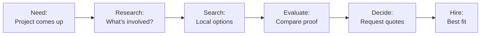

# User Personas

> **Version:** 1.1
> **Last Updated:** January 2, 2026

---

## Primary Persona: Mike the Portfolio Owner

### Demographics
- **Age:** 45
- **Location:** Denver, CO metro area
- **Business:** Stone & Steel Works (3 employees)
- **Experience:** 18 years in hands-on services
- **Revenue:** ~$350K/year

### Background
Mike started as an apprentice and worked his way up. He now runs a small specialty services business focused on custom installs, repairs, and restorations. His reputation is strong, but most of his work comes from referrals. He knows great work sells itself—if people can actually see it.

### Technology Profile
| Aspect | Detail |
|--------|--------|
| **Primary Device** | iPhone 13 Pro (upgraded for camera) |
| **Computer Use** | Laptop for invoicing, rarely |
| **Software** | Scheduling/invoicing app, QuickBooks, personal Facebook |
| **Tech Comfort** | Moderate — can use apps, hates typing |
| **Website** | 5-year-old site, rarely updated |

### Daily Routine
```
5:30 AM  - Wake up, check schedule
6:00 AM  - Load truck, drive to job site
7:00 AM  - Start work
12:00 PM - Lunch break, check phone for messages
12:30 PM - Back to work
4:30 PM  - Clean up, take photos of completed work
5:00 PM  - Drive home, call family
5:30 PM  - Answer customer calls/texts
7:00 PM  - Dinner
8:00 PM  - Relax, maybe check Facebook
10:00 PM - Bed
```

### Goals
1. **Stay fully booked** — Keep his crew working year-round
2. **Find quality leads** — Fewer price-shoppers, more serious clients
3. **Build reputation** — Be the go-to name for his specialty
4. **Spend less time on marketing** — More time on job sites

### Frustrations
- "I do great work but no one can see it online"
- "My website is embarrassing but I don’t have time to fix it"
- "I keep explaining the same things to every new lead"
- "Directories are full of noise"
- "Competitors have better online presence"

### Quotes
> "If I could post a project in two minutes on my phone, I’d do it. But anything longer? Not happening."

> "The photos are already on my phone. I just need them to look professional."

### How KnearMe Helps Mike
| Pain Point | KnearMe Solution |
|------------|------------------|
| No time to write | Agents generate professional descriptions |
| Hates typing | Voice-first interview |
| Website is outdated | Portfolio auto-builds with each job |
| Explaining work to prospects | Showcase speaks for itself |
| Missing online visibility | SEO-ready project pages |

### Success Scenario
Mike finishes a custom install on Thursday afternoon. While cleaning up, he snaps 5 photos with his phone. Driving home, he opens KnearMe and uploads the photos. The app asks him 4 questions—he answers by voice. By the time he gets home, there's a draft to approve. He taps "Looks good" and the project is live on his portfolio.

**Total time invested: 3 minutes**  
**Result: A professional showcase page ranking for "custom installs Denver"**

---

## Secondary Persona: Jordan the Decision Maker

> **Note:** This is a Phase 2 persona. MVP focuses on the supply side first.

### Demographics
- **Age:** 38
- **Location:** Denver, CO suburb
- **Occupation:** Marketing Manager (remote)
- **Project:** Hiring a specialist for a home or business project
- **Income:** $120K household

### Background
Jordan needs a specialist for a specific job. They want to see real proof of similar work, not stock images. They’re willing to pay more for the right fit, but only if the work looks credible and relevant.

### Technology Profile
| Aspect | Detail |
|--------|--------|
| **Primary Device** | iPhone 14, MacBook Pro |
| **Research Style** | Thorough — reads reviews, views portfolios, compares multiple options |
| **Social Media** | Instagram, Pinterest (visual inspiration) |
| **Trust Signals** | Real project photos, detailed explanations, local presence |

### The Search Journey


### Current Experience (Pain Points)
1. **Search results are unhelpful**
   - Generic directories with thin info
   - Stock photos instead of real work
   - Reviews with no context

2. **Hard to verify quality**
   - "How do I know they’ve done this exact type of work?"
   - "All the reviews look the same"
   - "I can’t see their style"

3. **Comparison is difficult**
   - "Every website looks the same"
   - "I can’t tell who specializes in what"
   - "No clear way to compare real outcomes"

### What Jordan Wants
| Need | Ideal Solution |
|------|----------------|
| **See real work** | Project portfolios with real photos |
| **Verify expertise** | Filter by project type or service |
| **Local focus** | Providers who work nearby |
| **Understand process** | Clear descriptions of what was done |
| **Make confident decision** | Enough proof to choose fast |

### How KnearMe Helps Jordan (Phase 2)
- Browse projects by location and service
- See real project photos with detailed descriptions
- Find businesses who’ve done similar work
- Understand the approach and outcomes
- Contact businesses directly through the platform

### Success Scenario (Phase 2)
Jordan searches for a specialist and finds KnearMe. They browse local projects and find a portfolio with multiple similar jobs. The descriptions explain the work clearly, and the photos show results. Jordan contacts the business directly.

**From search to qualified lead: 15 minutes**  
**Confidence level: High (they’ve seen the work)**

---

## Tertiary Persona: Alex the Growth-Stage Pro

> **Note:** Alex represents the growth opportunity in capturing newer businesses.

### Demographics
- **Age:** 28
- **Location:** Austin, TX
- **Business:** Solo operation, 2 years in business
- **Experience:** Strong craft skills, still learning the business side
- **Revenue:** ~$80K/year (growing)

### Background
Alex is skilled but early. They know they need credibility fast, and they already post work online—but it’s inconsistent and unpolished.

### Key Differences from Mike
| Aspect | Mike | Alex |
|--------|------|------|
| Business stage | Established | Growing |
| Tech comfort | Moderate | High |
| Time available | Very limited | Some flexibility |
| Content skills | None | Basic |
| Primary need | Efficiency | Growth |

### How KnearMe Helps Alex
- **Levels up content** — Professional pages without design work
- **Builds portfolio fast** — No backlog to catch up on
- **Establishes credibility** — Looks established despite being new
- **SEO foundation** — Starts ranking before competitors

---

## Persona Comparison Matrix

| Attribute | Mike (Primary) | Jordan (Secondary) | Alex (Tertiary) |
|-----------|----------------|-------------------|-----------------|
| **Role** | Business owner | Client/Buyer | New business owner |
| **Age** | 45 | 38 | 28 |
| **Tech Comfort** | Moderate | High | High |
| **Time for Platform** | 2 min max | 15-30 min research | 5-10 min |
| **Primary Value** | Efficiency | Discovery | Growth |
| **Key Feature** | Voice interview | Browse & filter | Agent-written content |
| **Willingness to Pay** | $29/mo if saves time | N/A (free browse) | $29/mo for growth |
| **MVP Priority** | Yes | Phase 2 | Yes (same as Mike) |

---

## Design Implications

### For Mike (Business Owner UX)
- **Voice-first everything** — Minimize typing
- **Large touch targets** — Often on a phone, sometimes on site
- **Quick actions** — Complete tasks in under 60 seconds
- **Offline tolerance** — Job sites may have poor connectivity
- **Smart reminders** — Prompt to publish after a project is done

### For Jordan (Client UX - Phase 2)
- **Visual browsing** — Photo-forward design
- **Powerful filters** — Location, project type, outcomes
- **Trust indicators** — Number of projects, years on platform
- **Mobile-optimized** — Research on the go
- **Quick contact** — Low-friction outreach

### For Alex (Same UX as Mike)
- Alex uses the same interface as Mike
- Difference is in onboarding messaging ("grow your business" vs "save time")
- More responsive to tips/suggestions that improve presentation

---

## Validation Questions (User Research)

### For Mike-type Business Owners
1. "Walk me through what you do when you finish a job. Do you take photos?"
2. "How often do you update your website or post your work online?"
3. "If you could post a project in 2 minutes by answering questions with your voice, would you?"
4. "Would you pay $29/month for a tool that automatically built your portfolio?"

### For Jordan-type Clients
1. "How did you find your last provider? What was frustrating about that process?"
2. "What would make you trust a business you found online?"
3. "If you could see a portfolio of real projects, would that change your decision?"

---

*Personas are directional. Validate with interviews before MVP launch.*
