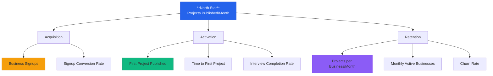

# KnearMe Vision

> **Version:** 1.1
> **Last Updated:** January 2, 2026
> **Status:** Approved for MVP

---

## One-Line Summary

**KnearMe** turns finished projects into shareable proof that wins more jobs for portfolio-based businesses. Agents handle the writing; the business’s work is the hero.

---

## Terminology & Scope

- **Portfolio business:** Any business where real project outcomes are the primary proof (trades, builders, remodelers, fabricators, landscape, design-build, studios, specialty services).
- **Project:** A completed job or engagement with real photos, outcomes, and context.
- **Scope note:** Some implementation and SEO docs still reference masonry as the initial vertical; these are being generalized.

---

## Problem Statement

Portfolio-based businesses do great work but struggle to show it consistently. They’re too busy delivering projects to write polished case pages, update galleries, or keep their websites current.

The result? **Most small businesses that rely on proof of work have outdated or empty portfolios**, even though they finish impressive projects every week. Meanwhile, potential clients can’t verify quality, style, or fit before reaching out.

**The core friction:** Creating a portfolio entry takes 15-30 minutes of writing, formatting, and uploading. After a long day on a job, no business owner is doing that.

---

## Solution

KnearMe eliminates the content creation burden entirely. When a business finishes a job:

1. **They snap a few photos** (which they're already doing)
2. **Open the app and upload photos** (takes 30 seconds)
3. **Agents interpret the images** and pull out what matters
4. **A quick voice interview** (3-5 questions, 60 seconds total) captures the story
5. **Agents generate a professional 400-600 word showcase** with SEO-ready structure
6. **Business approves in 30 seconds** → Published

**Total effort: Under 3 minutes.**
**Result: A professional portfolio that builds itself.**

> **MVP Focus:** Conversation is the primary interface. Forms are fallbacks. Most portfolio businesses capture work on their phone and move on; KnearMe meets them there, right after the job.

---

## KPI Tree

### Metric Definitions

| Metric | Definition | Target (6-month) |
|--------|------------|------------------|
| **Projects Published/Month** | Total projects published across all businesses | 500/month |
| **Business Signups** | New business accounts created | 100 total |
| **First Project Published** | % of signups who publish at least 1 project | >60% |
| **Time to First Project** | Minutes from signup to first published project | <10 min |
| **Interview Completion Rate** | % of started interviews that complete | >85% |
| **Projects per Business/Month** | Average projects published per active business | 3+ |
| **Monthly Active Businesses** | Businesses who published in last 30 days | 50+ |
| **Churn Rate** | % of Pro subscribers who cancel per month | <5% |

---

## Target Users

### Primary: The Portfolio Business Owner (MVP Focus)

**Mike the Builder** - 45, owns a 3-person specialty services company
- Completes 2-4 projects per week
- Has a 5-year-old website with a few outdated project photos
- Gets most work through word-of-mouth and referrals
- Uses a simple scheduling/invoicing tool
- Technically capable (smartphone, basic apps) but hates typing
- Would love to post his work but "doesn't have time for marketing"

**Key Insight:** Mike already captures project photos for customers or social. The content exists—he just needs help turning it into proof.

### Secondary: The Client/Buyer (Phase 2)

**Sarah the Searcher** - 38, decision-maker for a project or service
- Searches for local providers with proof of similar work
- Frustrated by thin websites and generic directories
- Wants to see real projects, not stock images
- Willing to pay premium for proven quality
- Values: transparency, craftsmanship evidence, local expertise

---

## Strategic Positioning

### What KnearMe IS

| Attribute | Description |
|-----------|-------------|
| **Agent-led content partner** | We write the portfolio, not the business owner |
| **Portfolio network** | Proof-first discovery for project-based work |
| **Voice-first interface** | Built for people who work with their hands |
| **SEO engine** | Every project page is a Google landing page |

### What KnearMe is NOT

| Competitor Type | Why We're Different |
|----------------|---------------------|
| **Lead marketplace** (Angi, HomeAdvisor) | We don't sell leads or take referral fees |
| **Design-only portfolio** (Houzz, Behance) | We focus on real-world projects and outcomes |
| **Social media** (Instagram) | Purpose-built for showing craftsmanship |
| **Directory** (Yelp) | Living showcase, not static listing |

---

## Competitive Moats

### 1. The Integration Moat
Once we're connected to scheduling/CRM tools, switching costs are high. We become embedded in the business workflow.

### 2. The Data Moat
Every approved post trains our agents to write better project narratives. Over time, we understand industry language, regional nuances, and common problems better than generic tools.

### 3. The Content Moat
The portfolio content lives on KnearMe. More projects → better SEO → more client discovery → more businesses. Network effects compound.

### 4. The Workflow Moat
Once "approve on phone after each job" becomes habit, businesses aren’t going back to manual website updates.

---

## Success Criteria (6-Month Milestones)

### Month 1-2: MVP Validation
- [ ] 20 businesses onboarded in launch city
- [ ] 100 projects published
- [ ] <3 min average time to publish
- [ ] >80% first-try approval rate (no regenerations)

### Month 3-4: Product-Market Fit Signals
- [ ] 50+ monthly active businesses
- [ ] 300+ projects/month published
- [ ] 5+ organic referrals (businesses telling other businesses)
- [ ] <5% monthly churn on Pro tier

### Month 5-6: Growth Readiness
- [ ] 100 businesses total
- [ ] 500+ projects/month
- [ ] First client-initiated contact via platform
- [ ] Jobber integration live (Phase 2)

---

## Risks & Mitigations

| Risk | Likelihood | Impact | Mitigation |
|------|------------|--------|------------|
| Businesses won't adopt (too busy) | Medium | High | Voice-first, <2 min flow, mobile-native |
| AI generates poor content | Low | Medium | Human review queue, regenerate option, prompt tuning |
| No SEO traction | Medium | Medium | Focus on long-tail local keywords, schema markup |
| Competitors copy features | Low | Low | Integration + data moats defensible |
| Clients don't discover | Medium | Low | Phase 2 focus; validate supply first |

---

## Non-Goals (Explicitly Out of Scope for MVP)

- Native mobile app (PWA only)
- Homeowner accounts or search
- Jobber/ServiceTitan integrations
- Social media cross-posting
- Industry-specific quoting/CRM features
- Payment processing or lead gen
- Analytics dashboard

---

## Document References

| Document | Purpose |
|----------|---------|
| `02-requirements/user-journeys.md` | Detailed user flows with sequence diagrams |
| `02-requirements/capabilities.md` | MoSCoW prioritization of features |
| `03-architecture/data-model.md` | Database schema and entity relationships |
| `05-decisions/adr/` | Architecture Decision Records |

---

*"The best portfolio is the one that builds itself."*
