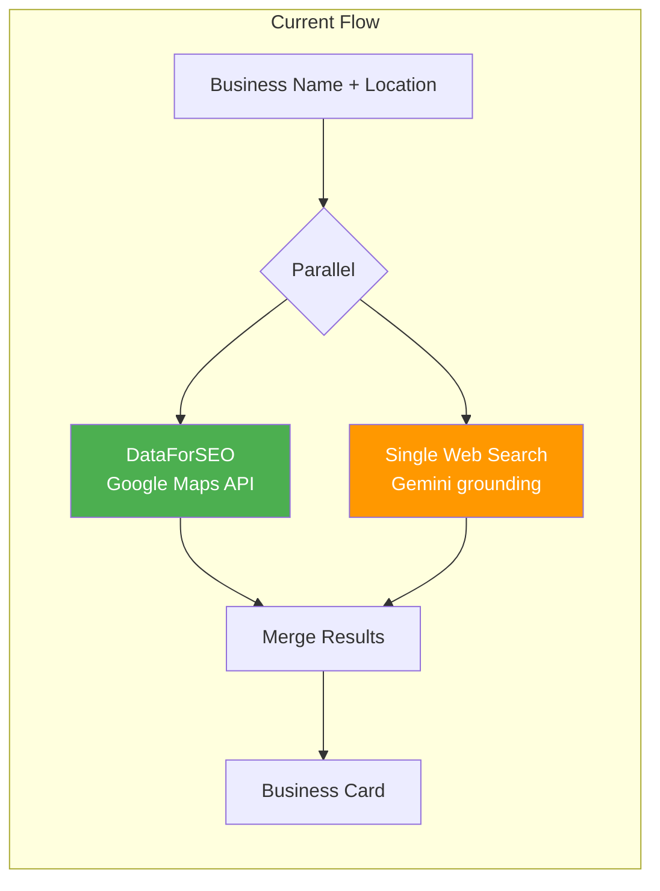
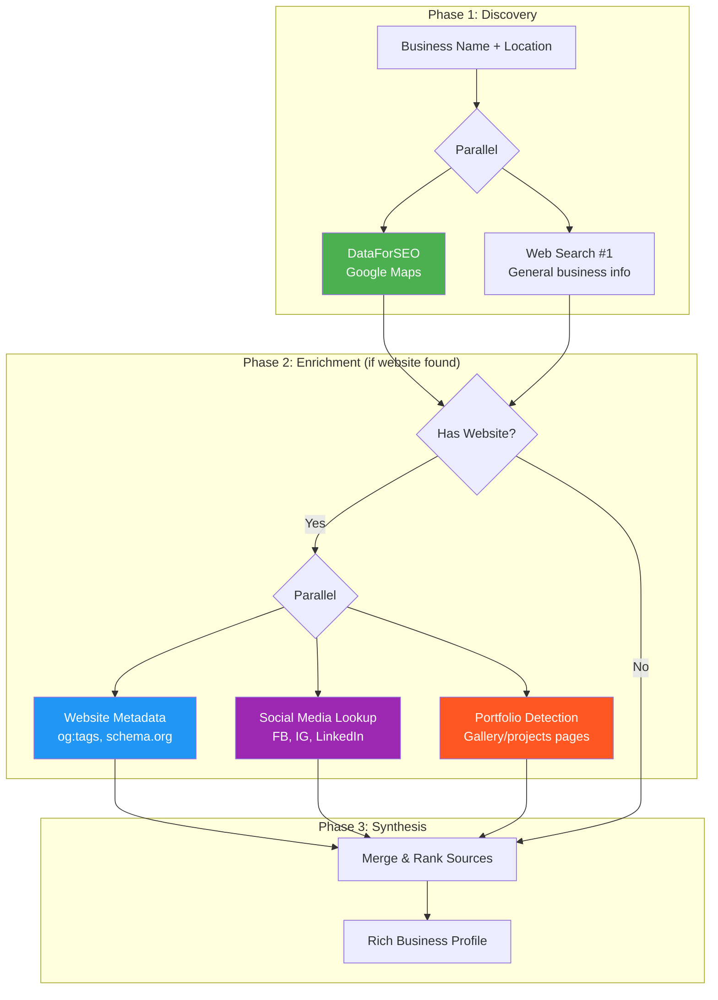
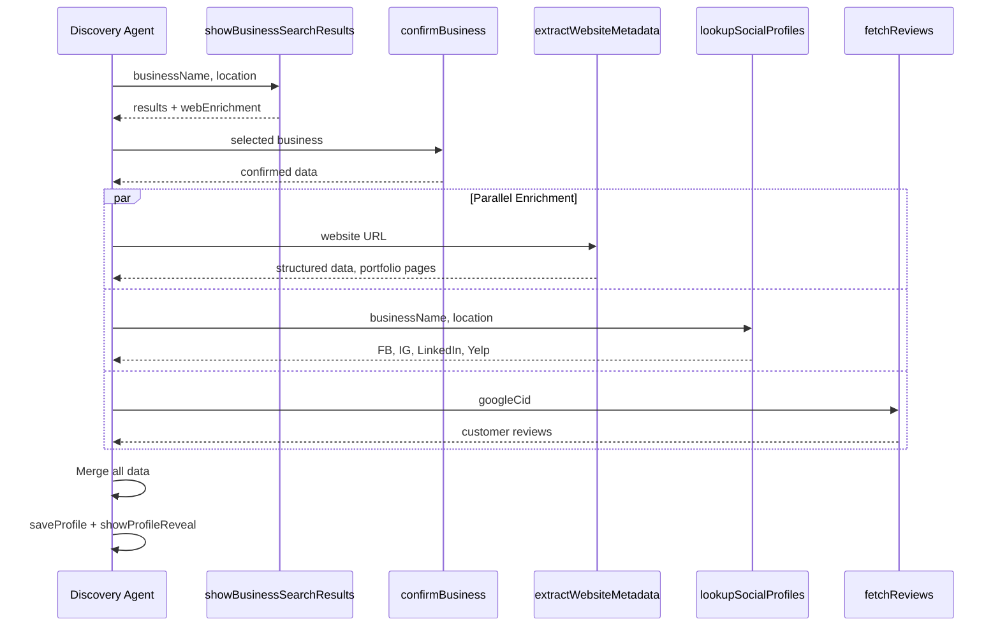
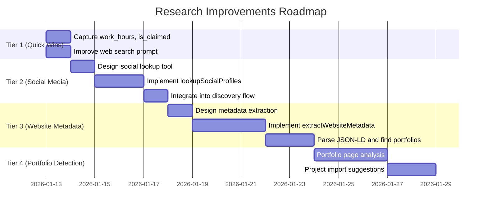

# Business Research Improvements

> Making the Discovery Agent's research step more comprehensive to capture website, social media, and richer business context.

---

## Current State Analysis

### What We Have Today



### Data Sources & Gaps

| Source | What It Provides | What's Missing |
|--------|-----------------|----------------|
| **DataForSEO** | Name, address, phone, website, rating, reviews, category, coordinates | `work_hours` (available but discarded), `is_claimed` (not stored) |
| **Web Search** | About description, services, years in business | Social media, portfolio pages, structured data, multiple sources |

### The Problem

The web search (`web-search.ts` lines 73-97) is a **single-shot prompt** that asks Gemini to extract business info. It:

1. **Doesn't iterate** - One search, done
2. **Doesn't specifically look for social media** - Hopes to find it in general results
3. **Doesn't visit the business website** - Just summarizes search snippets
4. **Doesn't extract structured data** - No JSON-LD, no meta tags
5. **Doesn't find portfolio/gallery pages** - Misses visual proof of work

---

## Proposed Architecture: Multi-Step Research

### Enhanced Research Flow



---

## Implementation Plan

### Tier 1: Quick Wins (1-2 days)

#### 1.1 Capture Missing DataForSEO Fields

**Files to modify:**
- `src/lib/tools/business-discovery/client.ts` (lines 262-276)
- `src/lib/tools/business-discovery/types.ts`
- `src/lib/agents/discovery/types.ts`

**Changes:**
```typescript
// In DiscoveredBusiness type, add:
interface DiscoveredBusiness {
  // ... existing fields
  workHours?: Record<string, string>;  // NEW
  isClaimed?: boolean;                  // NEW
}

// In searchBusinesses(), add to results.push():
results.push({
  // ... existing fields
  workHours: item.work_hours?.work_hours ? formatWorkHours(item.work_hours) : null,
  isClaimed: item.is_claimed ?? null,
});
```

**Effort:** 2-4 hours

#### 1.2 Improve Web Search Prompt for Social Media

**File:** `src/lib/agents/web-search.ts` (lines 73-97)

**Current prompt asks for:**
```
"aboutDescription", "website", "phone", "services", etc.
```

**Enhanced prompt should also ask for:**
```typescript
const prompt = `
Search for: ${input.query}

After searching, provide a response in this EXACT JSON format:
{
  "summary": "2-3 sentence summary",
  "businessInfo": {
    // ... existing fields
    "facebookUrl": "Facebook business page URL if found",
    "instagramUrl": "Instagram profile URL if found",
    "linkedinUrl": "LinkedIn company page URL if found",
    "yelpUrl": "Yelp listing URL if found",
    "portfolioUrls": ["URLs to portfolio/gallery/projects pages"],
    "certifications": ["BBB Accredited", "Licensed & Insured", etc.],
    "foundedYear": "2008 or null",
    "teamSize": "5-10 employees or null"
  }
}
`;
```

**Effort:** 1-2 hours

---

### Tier 2: Social Media Lookup Tool (1 sprint)

#### 2.1 New Tool: `lookupSocialProfiles`

**New file:** `src/lib/tools/social-media-lookup.ts`

```typescript
/**
 * Social Media Profile Lookup
 *
 * Searches for business social media profiles on major platforms.
 * Uses targeted web searches for each platform.
 */

export interface SocialMediaProfiles {
  facebook?: { url: string; followers?: number; verified?: boolean };
  instagram?: { url: string; followers?: number; verified?: boolean };
  linkedin?: { url: string; employees?: string };
  yelp?: { url: string; rating?: number; reviewCount?: number };
  nextdoor?: { url: string };
  houzz?: { url: string; rating?: number }; // Important for contractors
}

export async function lookupSocialProfiles(
  businessName: string,
  location: string
): Promise<SocialMediaProfiles> {
  // Run targeted searches in parallel
  const [facebook, instagram, linkedin, yelp] = await Promise.all([
    searchPlatform('facebook.com', businessName, location),
    searchPlatform('instagram.com', businessName, location),
    searchPlatform('linkedin.com/company', businessName, location),
    searchPlatform('yelp.com', businessName, location),
  ]);

  return { facebook, instagram, linkedin, yelp };
}
```

**Integration in Discovery Agent:**
- Add as new tool `lookupSocialProfiles`
- Call after `confirmBusiness` (alongside `fetchReviews`)
- Store results in `discoveredData.socialProfiles`

**Effort:** 1-2 days

#### 2.2 Schema for Social Profiles

**File:** `src/lib/agents/discovery/schemas.ts`

```typescript
export const lookupSocialProfilesSchema = z.object({
  businessName: z.string().describe('Business name to search for'),
  location: z.string().describe('City and state'),
  website: z.string().optional().describe('Business website to help identify correct profiles'),
});
```

---

### Tier 3: Website Metadata Extraction (1 sprint)

#### 3.1 New Tool: `extractWebsiteMetadata`

**New file:** `src/lib/tools/website-metadata.ts`

```typescript
/**
 * Website Metadata Extraction
 *
 * Fetches a business website and extracts:
 * - Meta tags (description, keywords, og:tags)
 * - JSON-LD structured data (LocalBusiness, Organization)
 * - Portfolio/gallery page links
 * - Contact information
 */

export interface WebsiteMetadata {
  title?: string;
  description?: string;
  ogImage?: string;

  // Structured data (schema.org)
  structuredData?: {
    '@type'?: string;
    name?: string;
    description?: string;
    address?: object;
    telephone?: string;
    openingHours?: string[];
    priceRange?: string;
    aggregateRating?: { ratingValue: number; reviewCount: number };
  };

  // Discovered pages
  portfolioPages?: string[];  // URLs containing "portfolio", "gallery", "projects"
  aboutPage?: string;
  contactPage?: string;

  // Social links found on website
  socialLinks?: {
    facebook?: string;
    instagram?: string;
    linkedin?: string;
    youtube?: string;
  };
}

export async function extractWebsiteMetadata(url: string): Promise<WebsiteMetadata> {
  // 1. Fetch homepage
  const html = await fetchWithTimeout(url, 10000);

  // 2. Parse meta tags
  const meta = parseMetaTags(html);

  // 3. Extract JSON-LD
  const jsonLd = extractJsonLd(html);

  // 4. Find internal links to portfolio/gallery
  const portfolioPages = findPortfolioLinks(html, url);

  // 5. Extract social links from footer/header
  const socialLinks = extractSocialLinks(html);

  return { ...meta, structuredData: jsonLd, portfolioPages, socialLinks };
}
```

**Effort:** 2-3 days

#### 3.2 Integration Flow



---

### Tier 4: Portfolio Detection (Future)

#### 4.1 Detect Portfolio/Gallery Pages

When `extractWebsiteMetadata` finds portfolio pages, we could:

1. **Index the pages** - Store URLs for later project suggestions
2. **Extract project thumbnails** - Parse images from gallery pages
3. **Suggest projects to showcase** - "I found 12 projects on your website. Want to import some?"

**Example enhancement to project suggestions:**

```typescript
// In project-suggestions.ts
export function extractProjectSuggestions(input: ProjectSuggestionsInput) {
  const suggestions = [];

  // From reviews with photos (existing)
  if (input.reviews) {
    // ... existing logic
  }

  // NEW: From portfolio pages
  if (input.portfolioPages && input.portfolioPages.length > 0) {
    suggestions.push({
      source: 'website_portfolio',
      confidence: 'high',
      message: `Found ${input.portfolioPages.length} portfolio pages on your website`,
      action: 'import_from_website',
      urls: input.portfolioPages,
    });
  }

  return suggestions;
}
```

---

## Data Model Updates

### Updated DiscoveryState

```typescript
interface DiscoveryState {
  // ... existing fields

  // NEW: Social media profiles
  socialProfiles?: {
    facebook?: { url: string; followers?: number };
    instagram?: { url: string; followers?: number };
    linkedin?: { url: string };
    yelp?: { url: string; rating?: number };
  };

  // NEW: Website metadata
  websiteMetadata?: {
    structuredData?: object;
    portfolioPages?: string[];
    socialLinks?: Record<string, string>;
  };

  // NEW: Business hours (from DataForSEO)
  workHours?: Record<string, string>;

  // NEW: Verification signals
  isClaimed?: boolean;
  certifications?: string[];
}
```

### Database Schema Updates

```sql
-- Add columns to businesses table
ALTER TABLE businesses ADD COLUMN social_profiles JSONB;
ALTER TABLE businesses ADD COLUMN website_metadata JSONB;
ALTER TABLE businesses ADD COLUMN work_hours JSONB;
ALTER TABLE businesses ADD COLUMN is_claimed BOOLEAN;
```

---

## Comparison: Current vs Proposed

| Aspect | Current | Proposed |
|--------|---------|----------|
| **Search Queries** | 2 parallel (DataForSEO + 1 web) | 2 + 4 enrichment (social per platform) |
| **Website Analysis** | None (just search snippets) | Full metadata + JSON-LD extraction |
| **Social Media** | Incidental (if in search results) | Targeted lookup per platform |
| **Portfolio Pages** | Not detected | Discovered and indexed |
| **Structured Data** | Not extracted | JSON-LD parsed and stored |
| **Total Latency** | ~2-3 seconds | ~4-6 seconds (parallel enrichment) |

---

## Implementation Priority



---

## Quick Start: Tier 1 Implementation

### Step 1: Update DataForSEO Client

```typescript
// src/lib/tools/business-discovery/client.ts
// Line 262-276, update results.push() to include:

results.push({
  name: item.title,
  address: item.address || null,
  phone: item.phone || null,
  website: item.url || null,
  rating: item.rating?.value || null,
  reviewCount: item.rating?.votes_count || null,
  category: item.category || null,
  googlePlaceId: item.place_id || null,
  googleCid: item.cid || null,
  coordinates: item.latitude && item.longitude
    ? { lat: item.latitude, lng: item.longitude }
    : null,
  // NEW FIELDS
  workHours: item.work_hours?.work_hours
    ? formatWorkHours(item.work_hours.work_hours)
    : null,
  isClaimed: item.is_claimed ?? null,
});
```

### Step 2: Enhance Web Search Prompt

```typescript
// src/lib/agents/web-search.ts
// Lines 73-97, update prompt to include social media fields:

prompt: [
  'You are a web search assistant helping gather comprehensive information about a business.',
  'Use google_search to find their official website, social media profiles, and any relevant listings.',
  '',
  'Search for: ' + input.query,
  '',
  'After searching, provide a response in this EXACT JSON format:',
  '{',
  '  "summary": "2-3 sentence summary of what you found",',
  '  "businessInfo": {',
  '    "aboutDescription": "Company description from their about page or Google listing",',
  '    "website": "Official website URL if found",',
  '    "phone": "Public phone number if found",',
  // ... existing fields
  '    "facebookUrl": "Facebook business page URL if found",',
  '    "instagramUrl": "Instagram profile URL if found",',
  '    "linkedinUrl": "LinkedIn company page URL if found",',
  '    "yelpUrl": "Yelp listing URL if found",',
  '    "portfolioUrl": "URL to their portfolio/gallery/projects page if found",',
  '    "foundedYear": "Year founded (e.g., 2008) if mentioned"',
  '  }',
  '}',
].join('\n'),
```

### Step 3: Update Types

```typescript
// src/lib/agents/web-search.ts
// Update WebSearchAgentResult interface:

export interface WebSearchAgentResult {
  summary: string;
  sources: WebSearchSource[];
  businessInfo?: {
    // ... existing fields
    facebookUrl?: string;
    instagramUrl?: string;
    linkedinUrl?: string;
    yelpUrl?: string;
    portfolioUrl?: string;
    foundedYear?: string;
  };
}
```

---

## Success Metrics

After implementation, measure:

| Metric | Current | Target |
|--------|---------|--------|
| **Website capture rate** | ~60% | 85%+ |
| **Social profile discovery** | ~10% | 50%+ |
| **Portfolio page detection** | 0% | 30%+ |
| **Average data fields populated** | 6-8 | 12-15 |
| **Research latency** | 2-3s | <6s |

---

## References

- Current web search: `src/lib/agents/web-search.ts:57-122`
- DataForSEO client: `src/lib/tools/business-discovery/client.ts:211-284`
- Discovery agent tools: `src/lib/agents/discovery.ts:75-160`
- Deep research comparison: `docs/03-architecture/deep-research-agents-comparison.md`

---

*Created: January 2026*
