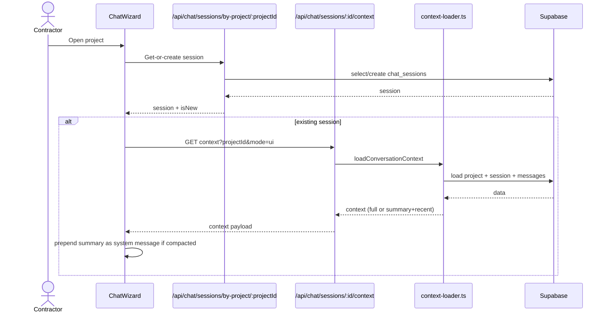
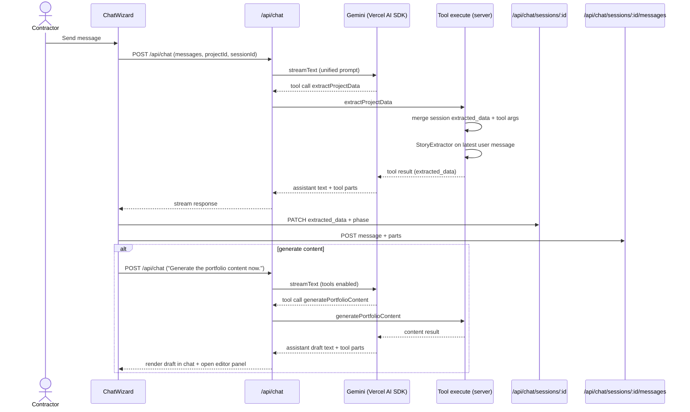
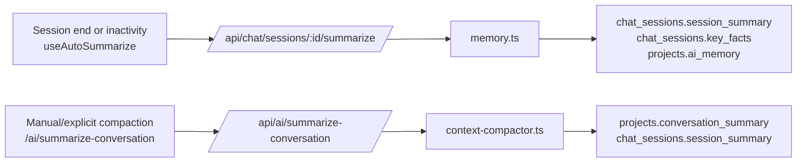
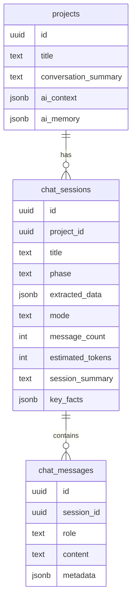

# Agent Architecture (Chat + Context System)

This directory documents how the portfolio chat agent works after the single-session refactor.
It focuses on how conversations are persisted, how context is loaded, and how summaries are produced.

## Overview

The agent is a Next.js + Supabase chat system that powers the portfolio creation and edit experience.
Key traits:
- **One active session per project** via `/api/chat/sessions/by-project/[projectId]` (shared across all chat entry points).
- **Eager project creation** on the first message (create mode) for immediate persistence.
- **Smart context loading** that swaps full history for summary + recent messages when the context budget is exceeded.
- **Lightweight session bootstrap**: `/by-project` returns session metadata only; messages load via `/context`.
- **Server as source of truth** (no IndexedDB/offline layer).

## Agent Runtime (Unified Chat)

- `/api/chat` streams responses via Vercel AI SDK using `UNIFIED_PROJECT_SYSTEM_PROMPT` plus injected business profile, project state, and summary context.
- Tool execution runs server-side agents:
  - `extractProjectData` merges `chat_sessions.extracted_data` + tool args, then runs Story Extractor on the latest user message.
  - `generatePortfolioContent` loads project data and runs Content Generator.
  - `checkPublishReady` loads project data and runs Quality Checker (final gating via `validateForPublish`).
- `promptForImages`, `requestClarification`, and `suggestQuickActions` are model-driven tool calls; orchestrator actions are not surfaced.

## Tool Inventory (Unified Chat)

Fast-turn interviewer tools (quick turnaround):
- `extractProjectData` — extract project details from the latest user message.
- `requestClarification` — ask a targeted clarification with alternatives.
- `promptForImages` — show the inline photo upload UI.
- `showPortfolioPreview` — refresh the live preview canvas.
- `suggestQuickActions` — render next-step action chips.
- `updateField` — edit title/description/SEO/tags/materials/techniques.
- `regenerateSection` — rewrite title/description/SEO.
- `reorderImages` — set hero or reorder gallery.
- `validateForPublish` — server validation check (authoritative).

Deep-context agent tools (slower, broader context):
- `generatePortfolioContent` — Content Generator agent.
- `checkPublishReady` — Quality Checker agent.
- `composePortfolioLayout` — Layout Composer agent (wired; outputs blocks + image order).

Wiring note:
- `/api/chat` exposes fast-turn tools by default and requires explicit invocation to access deep-context tools.

Apply tools (persist results):
- `updateDescriptionBlocks` — apply a layout draft to `description_blocks`.
- `showContentEditor` — deprecated; do not call.

## High-Level Architecture

```mermaid
flowchart TB
  User[Contractor] --> UI[Chat UI\nChatWizard]

  UI -->|stream chat| ChatAPI[/api/chat (unified)]
  UI -->|session + context| SessionAPI[/api/chat/sessions.../]
  UI -->|save messages| MessagesAPI[/api/chat/sessions/:id/messages/]
  UI -->|auto-summarize| SummarizeSessionAPI[/api/chat/sessions/:id/summarize/]

  SessionAPI --> ContextLoader[context-loader.ts]
  ContextLoader --> DB[(Supabase\nprojects, chat_sessions, chat_messages)]

  MessagesAPI --> DB

  SummarizeSessionAPI --> Memory[memory.ts\n(session_summary + key_facts)]
  Memory --> DB

  ChatAPI --> AI[Gemini via Vercel AI SDK]
  ChatAPI --> Tools[Tool schemas & UI artifacts]

  SummarizeConversationAPI[/api/ai/summarize-conversation/] --> ContextCompactor[context-compactor.ts]
  ContextCompactor --> DB
```

## Core Conversation Flow (Create Mode)



## Tool-Call Sequence (Create Flow)



## Context Loading Decision

```mermaid
flowchart TD
  A[message_count + estimated_tokens] --> B{shouldCompact or maxMessages cap?}
  B -- No --> C[Load all messages]
  B -- Yes --> D[Pick summary\nproject.conversation_summary or session.session_summary]
  D --> E[Load recent messages (10 default, 20 in mode=ui)]
  C --> F[Return context: messages + projectData]
  E --> F
```

Notes:
- **Budget constants** live in `src/lib/chat/context-loader.ts` (e.g., `MAX_CONTEXT_TOKENS = 30_000`).
- When compacted, the client prepends a system message built by `createSummarySystemMessage(...)`.
- UI loads default to `mode=ui`, which caps messages to 50 and uses 20 recent messages.
- `estimated_tokens` is updated per message using the stored `parts` payload size (tool outputs included).

## Summarization & Memory Paths

There are two related summarization paths:



## Data Model (Relevant Tables)



## Key Files & APIs

- `src/components/chat/ChatWizard.tsx` – Unified create/edit chat UI and session bootstrap.
- `src/app/api/chat/route.ts` – Unified chat runtime (Account Manager prompt + tools).
- `src/lib/chat/context-loader.ts` – Server-side smart context loading.
- `src/lib/chat/context-shared.ts` – Shared types/utilities for summary and project context.
- `src/lib/chat/context-compactor.ts` – Summarization for long conversations.
- `src/lib/chat/memory.ts` – Session summary + key facts + project memory.
- `src/app/api/chat/sessions/by-project/[projectId]/route.ts` – Get-or-create session (single session per project).
- `src/lib/chat/chat-prompts.ts` – Unified system prompt + edit addendum.
- `src/lib/chat/tool-schemas.ts` – Tool schemas for extraction, generation, and edit actions.
- `src/app/api/chat/sessions/[id]/route.ts` – Session updates (phase/extracted_data).
- `src/app/api/chat/sessions/[id]/context/route.ts` – Context API endpoint.
- `src/app/api/chat/sessions/[id]/messages/route.ts` – Message persistence.
- `src/app/api/chat/sessions/[id]/summarize/route.ts` – Session-end summary + key facts.
- `src/app/api/ai/summarize-conversation/route.ts` – Compaction summary endpoint.
- `supabase/migrations/022_conversation_refactor.sql` – Schema updates for summaries + context.
- `supabase/migrations/023_archive_multi_session_data.sql` – Data migration to single-session model.

## Practical Notes

- **Single session per project** is shared across create/edit flows (no mode separation).
- Context loading always includes **project data** (title, type, location, extracted data, etc.).
- When the history is large, **summary + recent messages** are used instead of full history.
- The client **persists messages** via `/api/chat/sessions/:id/messages` after streaming completes.
- Session **extracted data + phase** persist via `/api/chat/sessions/:id` (optimistic save queue).
- `/api/chat/sessions/by-project/:id` returns session metadata only; use `/context` to load messages.
- Assistant chat responses render **Markdown (GFM)** in the UI (no raw HTML).
- **Publish readiness**: `checkPublishReady` is for coaching; final gating uses `validateForPublish` (dry_run on `/api/projects/[id]/publish`).
- `chat_sessions.mode` is a legacy field and is no longer used for routing behavior.
- Auto-summarize triggers on inactivity/visibility/unload once conversations exceed the context budget.

## Proposals

- `docs/09-agent/implementation-plan.md` – Consolidated plan for current interviewer + agent work (source of truth).
- `docs/09-agent/project-chat-unification.md` – Proposal to unify create/edit chat UI, persistence, and cleanup.
- `docs/09-agent/multi-agent-system-review.md` – Review of current multi-agent wiring, gaps, and recommendations.
- `docs/09-agent/interviewer-experience.md` – Experience principles and back office architecture for the interviewing agent.
- `docs/09-agent/interviewer-example-conversations.md` – Example scripts with back office actions.
- `docs/09-agent/interviewer-system-prompt.md` – Draft system prompt for the interviewer persona.
- `docs/09-agent/tool-call-budget.md` – Tool call budget, priorities, and decision rules.
