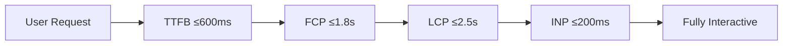
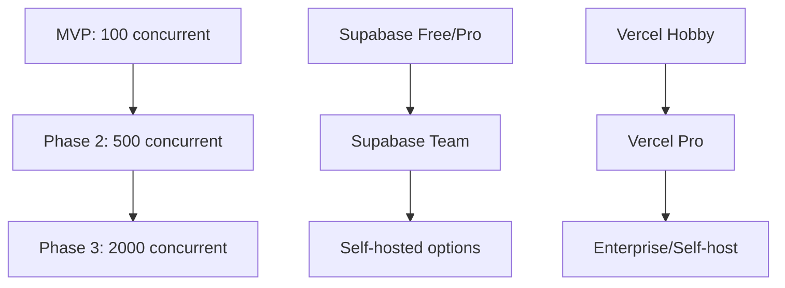
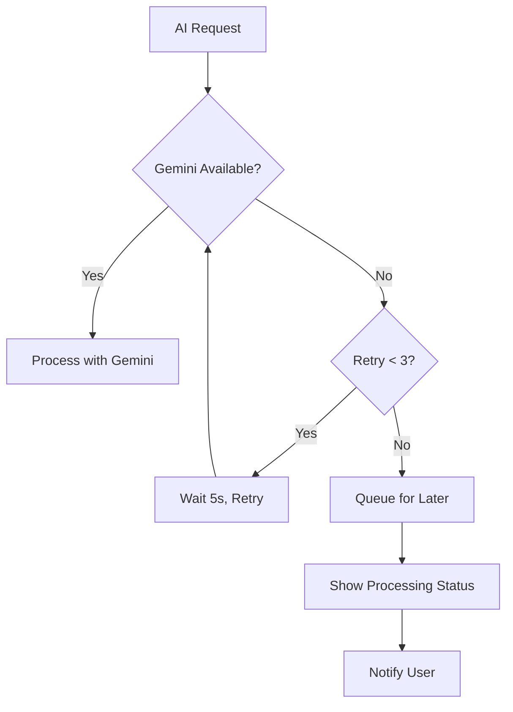
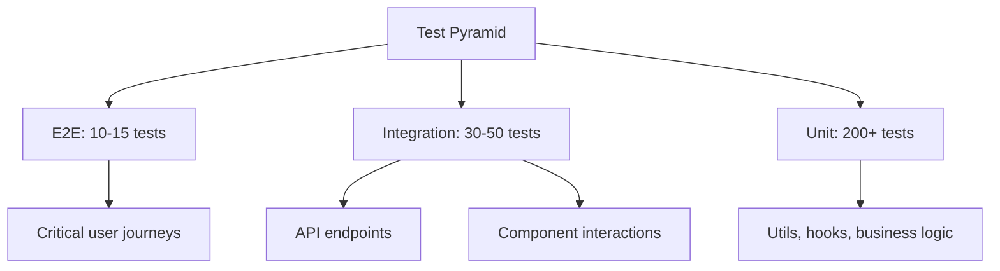
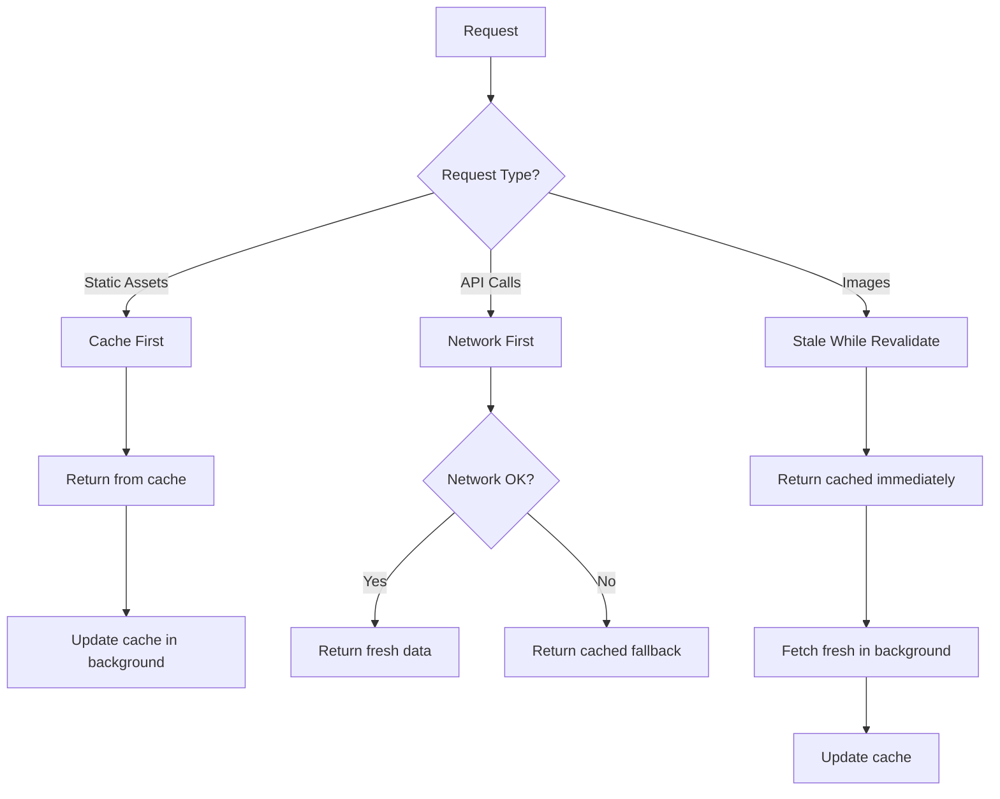

# Non-Functional Requirements (NFR)

> **Version:** 1.0
> **Last Updated:** December 8, 2025
> **Status:** Ready for Development

---

## Overview

This document defines the quality attributes and constraints for the KnearMe MVP. These requirements apply across all epics and ensure the platform meets performance, security, and user experience standards.

---

## 1. Performance Requirements

### 1.1 Core Web Vitals (Public Pages)

| Metric | Target | Measurement | Priority |
|--------|--------|-------------|----------|
| **LCP** (Largest Contentful Paint) | ≤ 2.5s | Lighthouse, CrUX | Must Have |
| **INP** (Interaction to Next Paint) | ≤ 200ms | Lighthouse, CrUX | Must Have |
| **CLS** (Cumulative Layout Shift) | ≤ 0.1 | Lighthouse, CrUX | Must Have |
| **FCP** (First Contentful Paint) | ≤ 1.8s | Lighthouse | Should Have |
| **TTFB** (Time to First Byte) | ≤ 600ms | Server monitoring | Should Have |



### 1.2 API Response Times

| Endpoint Type | Target | P95 | Notes |
|---------------|--------|-----|-------|
| Auth endpoints | < 500ms | < 800ms | Login, signup |
| Read operations | < 200ms | < 400ms | Project lists, profiles |
| Write operations | < 500ms | < 1s | Create/update project |
| Image upload | < 3s | < 5s | Per image, including processing |
| AI analysis | < 10s | < 15s | Gemini image analysis |
| AI generation | < 15s | < 25s | GPT-4o content generation |
| Voice transcription | < 5s | < 8s | Whisper, per recording |

### 1.3 Image Performance

| Aspect | Requirement | Implementation |
|--------|-------------|----------------|
| Format | WebP primary, JPEG fallback | Sharp library conversion |
| Thumbnail size | < 30KB | 400x300px |
| Medium size | < 150KB | 1200x900px |
| Full size | < 400KB | 2400x1800px |
| Lazy loading | Below-fold images | Next.js Image `loading="lazy"` |
| Priority loading | Hero/above-fold | Next.js Image `priority` |
| CDN delivery | All images via CDN | Supabase Storage CDN |

### 1.4 Bundle Performance

| Metric | Target | Notes |
|--------|--------|-------|
| Initial JS bundle | < 150KB gzipped | Critical path only |
| Total JS (lazy loaded) | < 500KB gzipped | All routes |
| CSS bundle | < 50KB gzipped | Tailwind purged |
| Lighthouse Performance | ≥ 90 | Mobile, public pages |

---

## 2. Scalability Requirements

### 2.1 MVP Capacity

| Resource | Capacity | Notes |
|----------|----------|-------|
| Concurrent users | 100 | Active sessions |
| Total contractors | 500 | Registered accounts |
| Total projects | 5,000 | Published |
| Total images | 50,000 | All sizes combined |
| Database size | 10GB | Including indexes |
| Storage size | 100GB | Images |

### 2.2 Growth Path



### 2.3 Database Scaling

| Phase | Strategy | Trigger |
|-------|----------|---------|
| MVP | Supabase managed PostgreSQL | - |
| Scale 1 | Read replicas | > 1000 daily queries |
| Scale 2 | Connection pooling (PgBouncer) | > 100 concurrent |
| Scale 3 | Partitioning by city_slug | > 100K projects |

---

## 3. Availability Requirements

### 3.1 Uptime Targets

| Component | Target | Measurement |
|-----------|--------|-------------|
| Web application | 99.5% | Monthly |
| API endpoints | 99.5% | Monthly |
| Database | 99.9% | Supabase SLA |
| AI services | 99% | External dependency |
| Image storage | 99.9% | Supabase SLA |

### 3.2 Graceful Degradation

| Failure Scenario | Fallback Behavior |
|------------------|-------------------|
| Gemini API down | Queue for retry, show "Processing" |
| OpenAI API down | Queue for retry, manual fallback option |
| Whisper API down | Text-only input mode |
| Supabase Storage down | Show placeholder images |
| Database connection lost | Read from edge cache |



### 3.3 Maintenance Windows

| Type | Frequency | Duration | Notification |
|------|-----------|----------|--------------|
| Database maintenance | Monthly | < 5 min | 24hr advance |
| Deployment | Weekly | Zero downtime | None needed |
| Major upgrades | Quarterly | < 30 min | 1 week advance |

---

## 4. Security Requirements

### 4.1 Authentication & Authorization

| Requirement | Implementation | Priority |
|-------------|----------------|----------|
| Password strength | Min 8 chars, 1 letter, 1 number | Must Have |
| Password hashing | bcrypt, cost factor 12 | Must Have |
| Session tokens | JWT, httpOnly, secure, sameSite | Must Have |
| Session duration | 7 days, auto-refresh | Must Have |
| Rate limiting (auth) | 5 attempts/15 min | Must Have |
| Email verification | Required before publishing | Must Have |
| OAuth support | Google OAuth 2.0 | Should Have |

### 4.2 Row Level Security (RLS)

```sql
-- Contractors can only see their own data
CREATE POLICY "contractor_own_data" ON contractors
  FOR ALL USING (auth.uid() = auth_user_id);

-- Contractors can only manage their own projects
CREATE POLICY "contractor_own_projects" ON projects
  FOR ALL USING (
    contractor_id IN (
      SELECT id FROM contractors WHERE auth_user_id = auth.uid()
    )
  );

-- Published projects are publicly readable
CREATE POLICY "published_projects_public" ON projects
  FOR SELECT USING (status = 'published');

-- Published contractors are publicly readable
CREATE POLICY "published_contractors_public" ON contractors
  FOR SELECT USING (
    EXISTS (SELECT 1 FROM projects WHERE contractor_id = contractors.id AND status = 'published')
  );
```

### 4.3 Input Validation & Sanitization

| Input Type | Validation | Sanitization |
|------------|------------|--------------|
| Email | RFC 5322 regex | Lowercase, trim |
| Business name | 2-100 chars | HTML escape |
| Description | 50-5000 chars | HTML sanitize (DOMPurify) |
| Tags | 2-30 chars each, max 10 | Alphanumeric + hyphens |
| URLs | URL pattern match | Protocol validation |
| Images | Type check, size limit | Strip EXIF (except GPS for location) |

### 4.4 Content Security

| Aspect | Implementation |
|--------|----------------|
| CSP Headers | Strict policy, nonces for inline scripts |
| XSS Prevention | React default escaping + DOMPurify |
| CSRF Protection | SameSite cookies, token validation |
| SQL Injection | Parameterized queries (Supabase SDK) |
| File Upload | Type validation, virus scan (Phase 2) |
| AI Content | Moderation check before publish |

### 4.5 Rate Limiting

| Endpoint | Limit | Window |
|----------|-------|--------|
| Signup | 5 requests | 1 hour |
| Login (failed) | 5 attempts | 15 minutes |
| Password reset | 3 requests | 1 hour |
| Image upload | 50 images | 1 hour |
| AI generation | 20 requests | 1 hour |
| API (authenticated) | 100 requests | 1 minute |
| API (public) | 30 requests | 1 minute |

---

## 5. Reliability Requirements

### 5.1 Data Integrity

| Requirement | Implementation |
|-------------|----------------|
| Database transactions | ACID compliance (PostgreSQL) |
| Referential integrity | Foreign key constraints |
| Soft deletes | `archived` status, no hard deletes |
| Backup frequency | Daily automated (Supabase) |
| Point-in-time recovery | 7-day retention |
| Data validation | Schema validation (Zod) |

### 5.2 Error Handling

| Error Type | User Experience | Logging |
|------------|-----------------|---------|
| Validation errors | Inline field messages | Debug level |
| API errors | Toast with retry option | Error level |
| AI failures | "Processing" + queue retry | Error level + alert |
| Network errors | Offline indicator + cache | Warning level |
| Unhandled errors | Generic message + report option | Error level + alert |

### 5.3 Data Loss Prevention

| Scenario | Prevention |
|----------|------------|
| Form data loss | Autosave every 5 seconds |
| Draft project loss | Persist to localStorage + DB |
| Image upload failure | Resume-able uploads, retry queue |
| Browser crash | Service worker cache |
| Session expiry | Graceful re-auth flow |

---

## 6. Usability Requirements

### 6.1 Accessibility (WCAG 2.1 AA)

| Requirement | Implementation | Testing |
|-------------|----------------|---------|
| Keyboard navigation | All interactive elements | Tab order audit |
| Screen reader support | ARIA labels, semantic HTML | VoiceOver/NVDA |
| Color contrast | 4.5:1 minimum | Lighthouse |
| Focus indicators | Visible focus rings | Manual testing |
| Alt text | All images (AI-generated) | Automated check |
| Form labels | Associated labels for all inputs | axe-core |

### 6.2 Mobile Experience

| Requirement | Target | Notes |
|-------------|--------|-------|
| Touch target size | ≥ 44x44px | Interactive elements |
| Viewport configuration | Mobile-optimized | meta viewport |
| Orientation support | Portrait + Landscape | Responsive design |
| Gesture support | Swipe for galleries | Native feel |
| Input optimization | Appropriate keyboard types | Email, numeric |

### 6.3 Browser Support

| Browser | Minimum Version | Priority |
|---------|-----------------|----------|
| Safari (iOS) | 15+ | Must Have |
| Chrome (Android) | 90+ | Must Have |
| Chrome (Desktop) | 90+ | Should Have |
| Firefox | 90+ | Should Have |
| Edge | 90+ | Could Have |
| Safari (macOS) | 15+ | Could Have |

### 6.4 Device Support

| Device Type | Viewport | Priority |
|-------------|----------|----------|
| iPhone (modern) | 375px - 428px | Must Have |
| Android phones | 360px - 412px | Must Have |
| Tablets | 768px - 1024px | Should Have |
| Desktop | 1024px+ | Should Have |

---

## 7. Maintainability Requirements

### 7.1 Code Quality

| Metric | Target | Tool |
|--------|--------|------|
| TypeScript strict mode | Enabled | tsconfig |
| Type coverage | > 95% | typescript-coverage |
| Linting errors | 0 | ESLint |
| Code formatting | Consistent | Prettier |
| Cyclomatic complexity | ≤ 10 per function | ESLint rule |

### 7.2 Testing Coverage

| Type | Target | Framework |
|------|--------|-----------|
| Unit tests | > 70% | Vitest |
| Integration tests | Critical paths | Playwright |
| E2E tests | Happy paths | Playwright |
| Visual regression | Key components | Playwright |



### 7.3 Documentation

| Type | Location | Update Frequency |
|------|----------|------------------|
| API documentation | `/docs/04-apis/` | With each change |
| Component docs | Storybook (Phase 2) | With new components |
| Architecture decisions | `/docs/05-decisions/adr/` | Per decision |
| README | Repository root | Major changes |

### 7.4 Dependency Management

| Aspect | Policy |
|--------|--------|
| Major updates | Quarterly review |
| Security patches | Within 48 hours |
| Dependency audits | Weekly automated |
| Lock file | Committed, always fresh |

---

## 8. Operational Requirements

### 8.1 Logging

| Log Type | Retention | Content |
|----------|-----------|---------|
| Application logs | 30 days | Errors, warnings, info |
| Access logs | 90 days | Request/response metadata |
| Security logs | 1 year | Auth events, rate limits |
| AI request logs | 30 days | Prompts, responses, costs |

### 8.2 Monitoring & Alerting

| Metric | Alert Threshold | Channel |
|--------|-----------------|---------|
| Error rate | > 1% of requests | Slack + Email |
| Response time P95 | > 2s | Slack |
| AI failure rate | > 5% | Slack + Email |
| Database connections | > 80% pool | Slack |
| Storage usage | > 80% quota | Email |
| Uptime | < 99.5% (hourly) | PagerDuty (Phase 2) |

### 8.3 Analytics

| Event | Data Captured | Purpose |
|-------|---------------|---------|
| Signup started | Source, timestamp | Funnel analysis |
| Signup completed | Time to complete | Conversion |
| Project started | Entry point | Feature usage |
| Project published | Time to publish, edit count | Success metric |
| AI regeneration | Count, reason | Quality metric |
| Page views | Route, device, duration | Engagement |

### 8.4 Cost Monitoring

| Resource | Budget (Monthly) | Alert at |
|----------|------------------|----------|
| Gemini API | $50 | $40 (80%) |
| OpenAI API | $100 | $80 (80%) |
| Vercel | $20 | Usage spike |
| Supabase | $25 | $20 (80%) |
| **Total MVP** | **$195** | $156 (80%) |

---

## 9. Compliance Requirements

### 9.1 Privacy

| Requirement | Implementation |
|-------------|----------------|
| Privacy policy | Required, linked in footer |
| Cookie consent | Banner for non-essential cookies |
| Data export | User can request data export |
| Data deletion | User can request account deletion |
| EXIF stripping | Remove sensitive metadata from images |

### 9.2 Terms of Service

| Aspect | Policy |
|--------|--------|
| Content ownership | Contractor retains ownership |
| Platform license | Non-exclusive display license |
| Prohibited content | No explicit, illegal, or harmful content |
| Account termination | Reserved right for ToS violations |

### 9.3 Accessibility Compliance

| Standard | Target | Timeline |
|----------|--------|----------|
| WCAG 2.1 Level A | 100% | MVP |
| WCAG 2.1 Level AA | 90% | MVP |
| WCAG 2.1 Level AAA | Best effort | Phase 2 |

---

## 10. PWA Requirements

### 10.1 Installation Experience

| Requirement | Implementation |
|-------------|----------------|
| Web App Manifest | Complete manifest.json |
| Install prompt | Custom "Add to Home Screen" banner |
| App icon | 192px, 512px, maskable |
| Splash screen | Branded loading screen |
| Standalone mode | `display: standalone` |

### 10.2 Offline Capabilities

| Feature | Offline Behavior | Cache Strategy |
|---------|------------------|----------------|
| Public pages | Serve cached version | Stale-while-revalidate |
| Dashboard | Show offline indicator | Network-first |
| Image uploads | Queue for sync | Background sync |
| Draft editing | Save to IndexedDB | Local-first |

### 10.3 Service Worker Strategy



---

## 11. AI-Specific Requirements

### 11.1 Response Quality

| Metric | Target | Measurement |
|--------|--------|-------------|
| Image classification accuracy | > 85% | Manual review sample |
| Content relevance | > 90% approval rate | User acceptance |
| Transcription accuracy | > 95% WER | Comparison testing |
| First-try approval | > 80% | Analytics |

### 11.2 AI Failure Handling

| Failure Mode | Detection | Recovery |
|--------------|-----------|----------|
| API timeout | 30s timeout | Retry with exponential backoff |
| Rate limit | 429 response | Queue and retry after delay |
| Content policy violation | API rejection | Flag for manual review |
| Low confidence | Confidence score < 0.7 | Ask user to confirm |
| Hallucination | N/A (hard to detect) | User edit capability |

### 11.3 Cost Control

| Control | Implementation |
|---------|----------------|
| Request deduplication | Cache image analysis results |
| Prompt optimization | Minimize tokens while maintaining quality |
| Model selection | Use cheaper models where appropriate |
| Batch processing | Combine multiple images in single request |
| Usage alerts | 80% budget notification |

---

## 12. Verification & Acceptance

### 12.1 NFR Testing Matrix

| Category | Test Method | Frequency |
|----------|-------------|-----------|
| Performance | Lighthouse CI | Every PR |
| Security | OWASP ZAP scan | Weekly |
| Accessibility | axe-core automated | Every PR |
| Load testing | k6 scripts | Pre-release |
| Penetration testing | Manual | Quarterly |

### 12.2 Acceptance Criteria

All NFRs are considered met when:

- [ ] Lighthouse Performance score ≥ 90 on mobile
- [ ] Lighthouse Accessibility score ≥ 90
- [ ] All WCAG 2.1 AA criteria pass automated testing
- [ ] P95 API response times within targets
- [ ] Zero critical security vulnerabilities
- [ ] Load test passes with 100 concurrent users
- [ ] PWA installable on iOS Safari and Android Chrome
- [ ] All RLS policies verified with test cases

---

## Appendix A: Technology Constraints

| Technology | Version | Rationale |
|------------|---------|-----------|
| Next.js | 14+ | App Router, Server Components |
| React | 18+ | Concurrent features |
| TypeScript | 5+ | Strict mode |
| Node.js | 20+ | LTS, native fetch |
| PostgreSQL | 15+ | Supabase default |

## Appendix B: AI Provider Constraints

| Provider | Model | Constraint |
|----------|-------|------------|
| Google | Gemini 2.5 Flash | 1M context, 15 images/request |
| OpenAI | GPT-4o | 128K context, $10/1M output tokens |
| OpenAI | Whisper | 25MB audio file limit |

## Appendix C: Vercel AI SDK Integration

For building reactive AI interfaces, the Vercel AI SDK provides:

| Feature | Pattern | Use Case |
|---------|---------|----------|
| `useChat` hook | Streaming chat UI | AI interview conversation |
| `streamText` | Server-side streaming | Content generation |
| Tool calling | Function execution | Image analysis orchestration |
| Multi-step agents | `maxSteps` + `stepCountIs()` | Complex generation workflows |

```typescript
// Example: AI Interview with Vercel AI SDK
import { useChat } from 'ai/react';

export function AIInterview() {
  const { messages, input, handleSubmit, isLoading } = useChat({
    api: '/api/ai/interview',
    onFinish: (message) => {
      // Handle completed interview step
    },
  });
  // ... UI implementation
}
```

---

*These NFRs establish the quality bar for KnearMe MVP. All features must meet these standards before release.*
