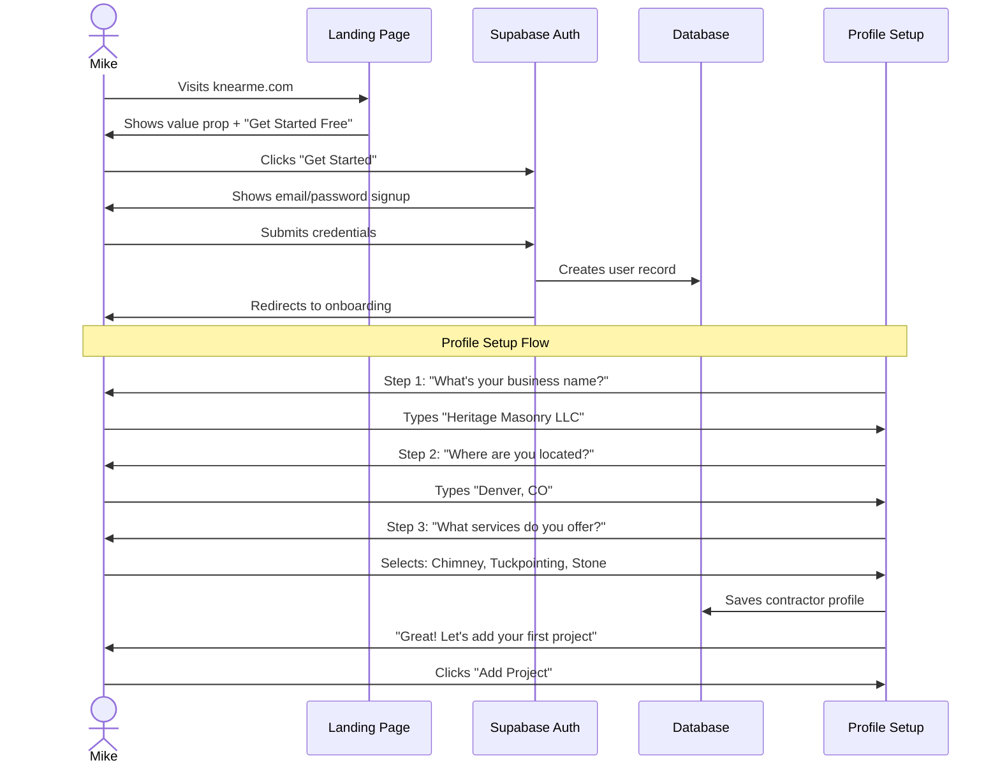
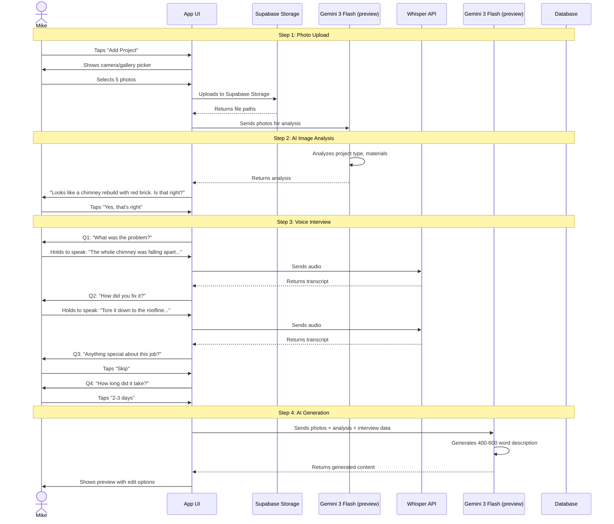
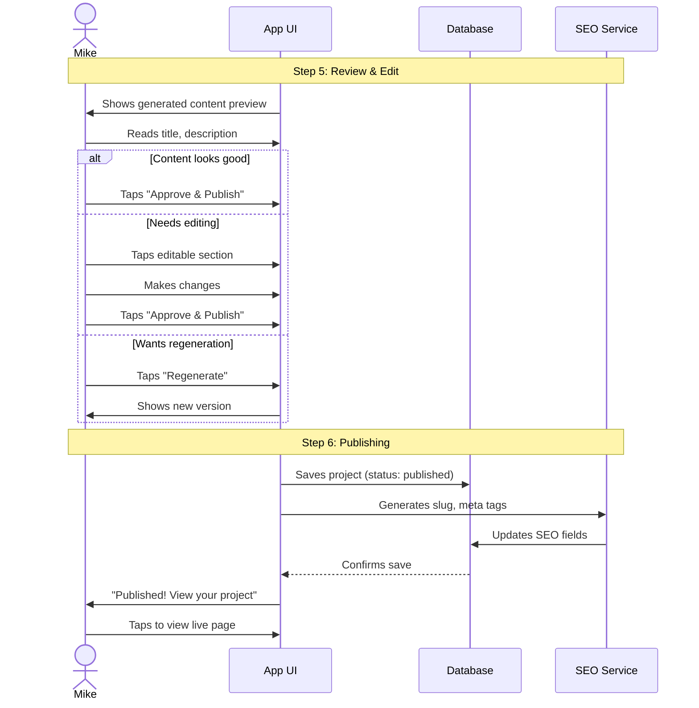
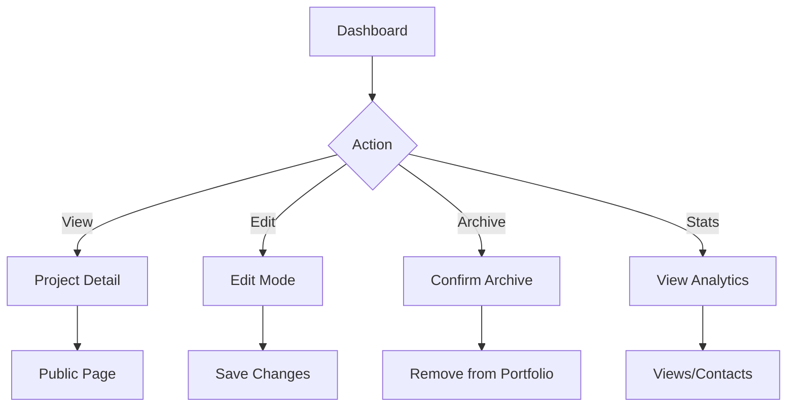
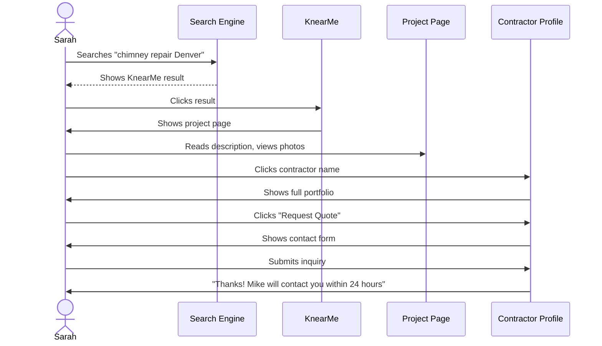
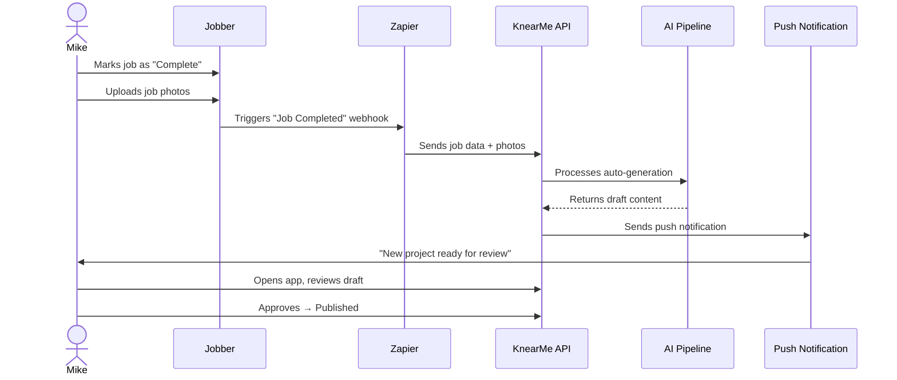

# User Journeys

> **Version:** 1.0
> **Last Updated:** December 26, 2025
> **Related:** `01-vision/personas.md`

---

## Journey Overview

| Journey | Actor | Priority | MVP |
|---------|-------|----------|-----|
| J1: Contractor Onboarding | Mike (Contractor) | P0 | Yes |
| J2: AI Interview Project Creation | Mike (Contractor) | P0 | Yes |
| J3: Project Editing & Publishing | Mike (Contractor) | P0 | Yes |
| J4: Portfolio Management | Mike (Contractor) | P1 | Yes |
| J5: Homeowner Discovery | Sarah (Homeowner) | P2 | No |
| J6: Jobber Auto-Creation | Mike (Contractor) | P2 | No |

---

## J1: Contractor Onboarding

### Summary
A new contractor discovers KnearMe, creates an account, sets up their profile, and publishes their first project.

### Actor
**Mike the Mason** - First-time user

### Goal
Go from stranger to published project in under 10 minutes.

### Preconditions
- Mike has a smartphone with camera
- Mike has at least one completed project photo
- Mike knows his business name and location

### Flow Diagram



### Screens

#### Screen 1: Landing Page
```
┌─────────────────────────────────────────┐
│         KnearMe                    [Login]
│                                         │
│    Build Your Portfolio in             │
│    30 Seconds Per Project              │
│                                         │
│  "Upload photos, answer a few questions │
│   by voice, and AI does the rest."     │
│                                         │
│        [Get Started Free]              │
│                                         │
│  ┌─────────────────────────────────────┐│
│  │  📸 → 🎤 → ✨ → ✅                   ││
│  │ Upload  Voice  AI    Published      ││
│  └─────────────────────────────────────┘│
│                                         │
│    Trusted by 50+ Denver contractors   │
└─────────────────────────────────────────┘
```

#### Screen 2: Profile Setup
```
┌─────────────────────────────────────────┐
│  Welcome! Let's set up your profile    │
│                                         │
│  Business Name                         │
│  ┌─────────────────────────────────────┐│
│  │ Heritage Masonry LLC               ││
│  └─────────────────────────────────────┘│
│                                         │
│  City, State                           │
│  ┌─────────────────────────────────────┐│
│  │ Denver, CO                         ││
│  └─────────────────────────────────────┘│
│                                         │
│  Services Offered                      │
│  [✓] Chimney    [ ] Brick Repair      │
│  [✓] Tuckpointing  [✓] Stone Work     │
│  [ ] Foundation  [ ] Restoration       │
│                                         │
│              [Continue]                │
└─────────────────────────────────────────┘
```

### Success Criteria
- [ ] Time to complete signup: <2 minutes
- [ ] Profile completion rate: >90%
- [ ] Drop-off at each step: <10%

### Edge Cases

| Scenario | Expected Behavior |
|----------|-------------------|
| Email already exists | "Account exists. Log in or reset password" |
| No services selected | "Please select at least one service" |
| Invalid location | Show autocomplete suggestions |
| User abandons mid-flow | Email reminder after 24 hours |

---

## J2: AI Interview Project Creation

### Summary
Mike uploads photos of a completed project and goes through the AI-powered voice interview to generate a professional project showcase.

### Actor
**Mike the Mason** - Authenticated contractor

### Goal
Publish a professional project showcase in under 3 minutes.

### Preconditions
- Mike is logged in
- Mike has 1-10 photos of a completed project
- Mike has working microphone (phone or device)

### Flow Diagram



### Screens

#### Screen 3: Photo Upload
```
┌─────────────────────────────────────────┐
│  ← Add Project                         │
│                                         │
│  ┌─────┐ ┌─────┐ ┌─────┐ ┌─────┐      │
│  │ 📷 │ │ 📷 │ │ 📷 │ │ 📷 │      │
│  │  1  │ │  2  │ │  3  │ │  4  │      │
│  └─────┘ └─────┘ └─────┘ └─────┘      │
│                                         │
│             ┌─────┐                     │
│             │  +  │ Add More           │
│             └─────┘                     │
│                                         │
│  Tip: Include before & after shots     │
│                                         │
│           [Continue →]                 │
└─────────────────────────────────────────┘
```

#### Screen 4: AI Detection Confirmation
```
┌─────────────────────────────────────────┐
│  ← Project Type                        │
│                                         │
│  Based on your photos, this looks like:│
│                                         │
│  ┌─────────────────────────────────────┐│
│  │  🧱 Chimney Rebuild                ││
│  │                                     ││
│  │  Materials detected:               ││
│  │  • Red brick                       ││
│  │  • Portland mortar                 ││
│  │                                     ││
│  │  Location: Denver, CO              ││
│  └─────────────────────────────────────┘│
│                                         │
│  Is this correct?                      │
│                                         │
│  [Yes, that's right] [No, let me edit] │
└─────────────────────────────────────────┘
```

#### Screen 5: Voice Interview
```
┌─────────────────────────────────────────┐
│  ← Interview                    2 of 4 │
│                                         │
│  "How did you fix it?"                 │
│                                         │
│                                         │
│              ┌─────┐                    │
│              │ 🎤 │                    │
│              └─────┘                    │
│         Hold to speak                  │
│                                         │
│  ─────────────────────────────────────  │
│                                         │
│  Common answers:                       │
│  • Full rebuild from roofline          │
│  • Tuckpointing and repair            │
│  • Liner installation                  │
│                                         │
│  [Type instead]           [Skip →]     │
└─────────────────────────────────────────┘
```

### Interview Question Set

| # | Question | Purpose | Response Type | Required |
|---|----------|---------|---------------|----------|
| 1 | "What was the problem the customer had?" | Establishes context | Voice/Text | Yes |
| 2 | "How did you fix it?" | Captures solution | Voice/Text | Yes |
| 3 | "Anything special about this job?" | Unique details | Voice/Text | No |
| 4 | "How long did it take?" | Duration context | Quick select | Yes |

### Success Criteria
- [ ] Time from upload to preview: <2 minutes
- [ ] Voice transcription accuracy: >95%
- [ ] Interview completion rate: >85%
- [ ] AI detection accuracy: >80% correct on first guess

### Edge Cases

| Scenario | Expected Behavior |
|----------|-------------------|
| AI can't detect project type | Show category selector (manual fallback) |
| Voice recording fails | Offer text input with keyboard |
| Poor audio quality | "We couldn't hear that clearly. Try again or type." |
| User uploads non-project photos | "These don't look like masonry work. Try different photos?" |
| Network error during upload | Retry automatically, show progress |

---

## J3: Project Editing & Publishing

### Summary
Mike reviews the AI-generated content, makes optional edits, and publishes the project to his portfolio.

### Actor
**Mike the Mason** - Authenticated contractor

### Goal
Approve or edit content and publish in under 60 seconds.

### Preconditions
- AI has generated project content
- Mike is viewing the preview

### Flow Diagram



### Screens

#### Screen 6: Guided Editing
```
┌─────────────────────────────────────────┐
│  ← Review Your Project                 │
│                                         │
│  Title [✏️]                            │
│  ┌─────────────────────────────────────┐│
│  │ Historic Brick Chimney Rebuild     ││
│  │ in Denver                          ││
│  └─────────────────────────────────────┘│
│                                         │
│  Description [✏️]                      │
│  ┌─────────────────────────────────────┐│
│  │ This 1920s chimney had seen        ││
│  │ better days—the mortar was         ││
│  │ crumbling and bricks were          ││
│  │ falling apart. We rebuilt it       ││
│  │ from the roofline up using         ││
│  │ matching red brick to preserve     ││
│  │ the home's character...            ││
│  │                                 [more]│
│  └─────────────────────────────────────┘│
│                                         │
│  Tags [✏️]                             │
│  [chimney] [rebuild] [denver] [brick]  │
│                                         │
│  ─────────────────────────────────────  │
│                                         │
│ [Regenerate]      [Approve & Publish ✓]│
└─────────────────────────────────────────┘
```

#### Screen 7: Published Confirmation
```
┌─────────────────────────────────────────┐
│                                         │
│              ✓                         │
│                                         │
│      Project Published!                │
│                                         │
│  Your project is now live at:          │
│  knearme.com/denver/masonry/           │
│  chimney-rebuild/historic-brick...     │
│                                         │
│        [View Project]                  │
│                                         │
│        [Add Another Project]           │
│                                         │
│  ─────────────────────────────────────  │
│                                         │
│  📊 This page will appear in Google    │
│     search results within 24-48 hours  │
└─────────────────────────────────────────┘
```

### Editing Modes

| Element | Edit Type | Constraints |
|---------|-----------|-------------|
| Title | Inline text | 10-80 characters |
| Description | Rich text modal | 200-1000 characters |
| Tags | Chip editor | 3-8 tags, alphanumeric |
| Photos | Reorder/delete | Min 1, max 10 |

### Success Criteria
- [ ] First-try approval rate: >80%
- [ ] Average edits per project: <2 fields
- [ ] Time to publish (from preview): <60 seconds
- [ ] Regeneration rate: <15%

### Edge Cases

| Scenario | Expected Behavior |
|----------|-------------------|
| User removes all tags | "Please add at least 3 tags" |
| Description too short after edit | "Add at least 200 characters" |
| Network error on publish | "Publishing failed. Retry?" + Save draft |
| Duplicate slug | Auto-append number (chimney-rebuild-2) |

---

## J4: Portfolio Management

### Summary
Mike views and manages all his published projects from his dashboard.

### Actor
**Mike the Mason** - Authenticated contractor

### Goal
Quickly view, edit, or archive projects.

### Flow Diagram



### Screens

#### Screen 8: Contractor Dashboard
```
┌─────────────────────────────────────────┐
│  Heritage Masonry LLC          [⚙️] [👤]│
│  Denver, CO                            │
│                                         │
│  ─────────────────────────────────────  │
│                                         │
│  Your Projects (12)     [+ Add Project] │
│                                         │
│  ┌─────────────────────────────────────┐│
│  │ [📷] Chimney Rebuild      🔴 Live   ││
│  │      Denver • Nov 2024              ││
│  │      47 views • 2 contacts          ││
│  └─────────────────────────────────────┘│
│  ┌─────────────────────────────────────┐│
│  │ [📷] Stone Retaining Wall  🔴 Live  ││
│  │      Lakewood • Oct 2024            ││
│  │      31 views • 1 contact           ││
│  └─────────────────────────────────────┘│
│  ┌─────────────────────────────────────┐│
│  │ [📷] Tuckpointing Project  ⚫ Draft ││
│  │      Aurora • Nov 2024              ││
│  │      [Continue Editing]             ││
│  └─────────────────────────────────────┘│
│                                         │
└─────────────────────────────────────────┘
```

### Success Criteria
- [ ] Dashboard load time: <2 seconds
- [ ] Projects per page: 10 with infinite scroll
- [ ] Filter/search: By status, date, type

---

## J5: Homeowner Discovery (Phase 2)

### Summary
Sarah searches for masonry contractors in her area and browses project portfolios.

### Actor
**Sarah the Searcher** - Unauthenticated homeowner

### Goal
Find a qualified contractor for her chimney repair.

> **Note:** This is a Phase 2 journey. Not in MVP scope.

### Flow Diagram



---

## J6: Jobber Auto-Creation (Phase 2)

### Summary
When Mike marks a job complete in Jobber, KnearMe automatically generates a project showcase for approval.

### Actor
**Mike the Mason** - Connected Jobber account

### Goal
Zero-effort project creation from existing workflow.

> **Note:** This is a Phase 2 journey. Not in MVP scope.

### Flow Diagram



---

## Journey Success Metrics Summary

| Journey | Key Metric | Target |
|---------|------------|--------|
| J1: Onboarding | Time to first project | <10 min |
| J2: AI Interview | Completion rate | >85% |
| J3: Publishing | First-try approval | >80% |
| J4: Management | Dashboard engagement | >1x/week |
| J5: Discovery | Quote request rate | >5% (Phase 2) |
| J6: Jobber Auto | Approval rate | >90% (Phase 2) |

---

*Journeys should be validated with user testing before and after MVP launch.*
