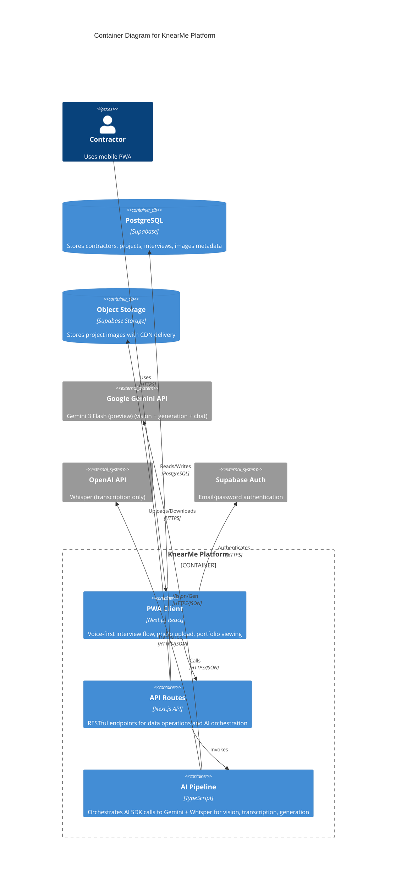
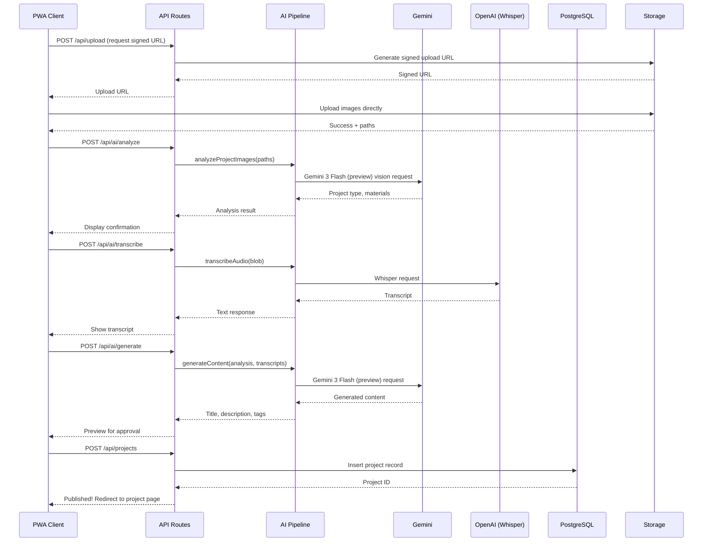

# C4 Model: Container Diagram

> **Version:** 1.2
> **Last Updated:** December 26, 2025
> **Level:** 2 - Container

---

## Overview

The Container diagram shows the high-level technology choices and how responsibilities are distributed.

---

## Container Diagram



---

## Simplified Diagram (Markdown Compatible)

```
┌─────────────────────────────────────────────────────────────────────────────┐
│                           KnearMe Platform                                   │
├─────────────────────────────────────────────────────────────────────────────┤
│                                                                             │
│  ┌─────────────────────────────────────────────────────────────────────┐   │
│  │                     PWA Client (Next.js)                            │   │
│  │                                                                     │   │
│  │   ┌──────────────┐  ┌──────────────┐  ┌──────────────┐            │   │
│  │   │   Auth UI    │  │  Interview   │  │  Portfolio   │            │   │
│  │   │              │  │    Flow      │  │    Pages     │            │   │
│  │   │  • Login     │  │              │  │              │            │   │
│  │   │  • Signup    │  │  • Upload    │  │  • Profile   │            │   │
│  │   │  • Profile   │  │  • Voice     │  │  • Projects  │            │   │
│  │   │              │  │  • Approve   │  │  • Detail    │            │   │
│  │   └──────────────┘  └──────────────┘  └──────────────┘            │   │
│  └────────────────────────────┬────────────────────────────────────────┘   │
│                               │                                             │
│                               ▼  API Calls (REST/JSON)                      │
│                                                                             │
│  ┌─────────────────────────────────────────────────────────────────────┐   │
│  │                     API Routes (Next.js)                            │   │
│  │                                                                     │   │
│  │   /api/auth/*       /api/projects/*     /api/ai/*                  │   │
│  │   /api/contractors/* /api/upload/*                                  │   │
│  │                                                                     │   │
│  └───────┬─────────────────────┬───────────────────────┬───────────────┘   │
│          │                     │                       │                    │
│          ▼                     ▼                       ▼                    │
│  ┌──────────────┐     ┌──────────────┐        ┌──────────────┐            │
│  │ AI Pipeline  │     │  PostgreSQL  │        │   Storage    │            │
│  │              │     │  (Supabase)  │        │  (Supabase)  │            │
│  │  • Vision    │     │              │        │              │            │
│  │  • Whisper   │     │  contractors │        │  /images/*   │            │
│  │  • Generate  │     │  projects    │        │              │            │
│  └──────┬───────┘     │  images      │        └──────────────┘            │
│         │             │  interviews  │                                     │
│         ▼             └──────────────┘                                     │
│  ┌──────────────┐  ┌──────────────┐                                        │
│  │  Gemini API  │  │  OpenAI API  │                                        │
│  │ (Vision/Gen) │  │  (Whisper)   │                                        │
│  └──────────────┘  └──────────────┘                                                          │
│                                                                             │
└─────────────────────────────────────────────────────────────────────────────┘
```

---

## Container Descriptions

### 1. PWA Client

| Attribute | Value |
|-----------|-------|
| **Technology** | Next.js 14, React 18, TypeScript |
| **Purpose** | User interface for contractors and public visitors |
| **Key Features** | Voice recording, photo capture, offline indicator |
| **Deployment** | Vercel Edge Network |

**Responsibilities:**
- Render contractor dashboard and interview flow
- Capture photos via device camera
- Record voice via MediaRecorder API
- Display AI-generated content for approval
- Render SEO-optimized portfolio pages (SSR)

### 2. API Routes

| Attribute | Value |
|-----------|-------|
| **Technology** | Next.js API Routes, TypeScript |
| **Purpose** | Backend logic and data operations |
| **Authentication** | Supabase Auth (JWT verification) |
| **Deployment** | Vercel Serverless Functions |

**Responsibilities:**
- Handle authentication callbacks
- CRUD operations for projects and contractors
- Orchestrate AI pipeline calls
- Generate signed upload URLs for storage
- Generate SEO metadata

### 3. AI Pipeline

| Attribute | Value |
|-----------|-------|
| **Technology** | TypeScript, Vercel AI SDK |
| **Purpose** | Orchestrate all AI operations |
| **External Dependencies** | Google Gemini API, OpenAI API (Whisper) |
| **Location** | Internal module, called by API routes |

**Responsibilities:**
- Send images to Gemini 3 Flash (preview) for analysis
- Send audio to Whisper for transcription
- Send prompts to Gemini 3 Flash (preview) for content generation
- Stream chat responses with tool calling
- Handle retries and error cases
- Validate and parse AI responses with Zod schemas

### 4. PostgreSQL Database

| Attribute | Value |
|-----------|-------|
| **Technology** | PostgreSQL 15 (Supabase hosted) |
| **Purpose** | Persistent data storage |
| **Security** | Row Level Security (RLS) enabled |
| **Connection** | Pooled connections via Supabase client |

**Tables:**
- `contractors` - User profiles and business info
- `projects` - Project records with status
- `project_images` - Image metadata and paths
- `interview_sessions` - AI interview state and transcripts
- `categories` - Project type taxonomy

### 5. Object Storage

| Attribute | Value |
|-----------|-------|
| **Technology** | Supabase Storage (S3-compatible) |
| **Purpose** | Store and serve project images |
| **Features** | CDN delivery, image transformations |
| **Security** | Signed URLs for uploads, public read for published |

**Buckets:**
- `project-images` - Original and transformed images
- `voice-recordings` - Audio files (temporary, deleted after transcription)

---

## Data Flow: Project Creation



---

## Technology Stack Summary

| Layer | Technology | Purpose |
|-------|------------|---------|
| **Frontend** | Next.js 14 + React 18 | PWA with SSR |
| **Styling** | Tailwind CSS + shadcn/ui | Design system |
| **State** | TanStack Query + Zustand | Server + client state |
| **Backend** | Next.js API Routes | Serverless functions |
| **Database** | Supabase PostgreSQL | Relational data |
| **Storage** | Supabase Storage | Images with CDN |
| **Auth** | Supabase Auth | Email/password |
| **AI** | Gemini 3 Flash (preview) + Whisper | Vision, generation, chat + transcription |
| **Hosting** | Vercel | Deployment, CDN, edge |

---

## Security Boundaries

```
┌─────────────────────────────────────────────────────────────────┐
│                    PUBLIC (No Auth Required)                     │
│                                                                 │
│    • Landing page                                               │
│    • Published project pages                                    │
│    • Contractor profile pages                                   │
│    • Login/Signup forms                                         │
└─────────────────────────────────────────────────────────────────┘

┌─────────────────────────────────────────────────────────────────┐
│                 AUTHENTICATED (JWT Required)                     │
│                                                                 │
│    • Dashboard                                                  │
│    • Create/edit projects                                       │
│    • AI interview flow                                          │
│    • Profile management                                         │
│    • Upload signed URLs                                         │
└─────────────────────────────────────────────────────────────────┘

┌─────────────────────────────────────────────────────────────────┐
│                  INTERNAL (Server-side Only)                     │
│                                                                 │
│    • AI API calls (Gemini + Whisper, API keys protected)        │
│    • Database direct access (service role)                      │
│    • Storage admin operations                                   │
└─────────────────────────────────────────────────────────────────┘
```

---

## References

- [C4 Model - Container Diagram](https://c4model.com/#ContainerDiagram)
- [Next.js App Router](https://nextjs.org/docs/app)
- [Supabase Architecture](https://supabase.com/docs/guides/architecture)
