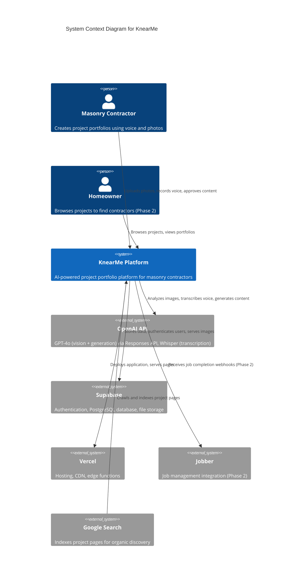

# C4 Model: System Context

> **Version:** 1.1
> **Last Updated:** December 10, 2025
> **Level:** 1 - System Context

---

## Overview

The System Context diagram shows KnearMe and its relationships with users and external systems.

---

## Context Diagram



---

## Simplified Diagram (Markdown Compatible)

```
┌─────────────────────────────────────────────────────────────────────────────┐
│                              EXTERNAL USERS                                  │
├─────────────────────────────────────────────────────────────────────────────┤
│                                                                             │
│    ┌──────────────────┐              ┌──────────────────┐                   │
│    │   Masonry        │              │    Homeowner     │                   │
│    │   Contractor     │              │   (Phase 2)      │                   │
│    │                  │              │                  │                   │
│    │  • Uploads photos│              │  • Browses       │                   │
│    │  • Records voice │              │    projects      │                   │
│    │  • Approves posts│              │  • Views profiles│                   │
│    └────────┬─────────┘              └────────┬─────────┘                   │
│             │                                 │                             │
│             │      Creates portfolios         │    Discovers contractors    │
│             ▼                                 ▼                             │
│    ┌──────────────────────────────────────────────────────────────┐        │
│    │                                                              │        │
│    │                     KnearMe Platform                         │        │
│    │                                                              │        │
│    │   • AI-powered project showcases                            │        │
│    │   • Voice-first interview flow                              │        │
│    │   • SEO-optimized portfolio pages                           │        │
│    │   • Contractor dashboard                                    │        │
│    │                                                              │        │
│    └──────────────────────────────────────────────────────────────┘        │
│                  │              │              │                            │
│                  ▼              ▼              ▼                            │
├─────────────────────────────────────────────────────────────────────────────┤
│                           EXTERNAL SYSTEMS                                   │
├─────────────────────────────────────────────────────────────────────────────┤
│                                                                             │
│    ┌──────────────┐  ┌──────────────┐  ┌──────────────┐  ┌──────────────┐  │
│    │   OpenAI     │  │   Supabase   │  │    Vercel    │  │   Jobber     │  │
│    │              │  │              │  │              │  │  (Phase 2)   │  │
│    │  • GPT-4o    │  │  • Auth      │  │  • Hosting   │  │              │  │
│    │  • Responses │  │  • Database  │  │  • CDN       │  │  • Webhooks  │  │
│    │  • Whisper   │  │  • Storage   │  │  • Edge      │  │  • Job data  │  │
│    └──────────────┘  └──────────────┘  └──────────────┘  └──────────────┘  │
│                                                                             │
│    ┌──────────────┐                                                        │
│    │ Google Search│ ◄─── Indexes project pages for organic discovery       │
│    └──────────────┘                                                        │
│                                                                             │
└─────────────────────────────────────────────────────────────────────────────┘
```

---

## User Descriptions

| User | Type | Description |
|------|------|-------------|
| **Masonry Contractor** | Person | Primary user. Uploads photos of completed projects, answers interview questions via voice, reviews and approves AI-generated content. |
| **Homeowner** | Person | Secondary user (Phase 2). Browses project portfolios to find and evaluate local masonry contractors. |

---

## System Descriptions

| System | Type | Description |
|--------|------|-------------|
| **KnearMe Platform** | Internal | The AI-powered portfolio platform. Handles contractor authentication, project creation workflow, AI pipeline orchestration, and SEO-optimized page generation. |
| **OpenAI API** | External | AI services provider. GPT-4o for image analysis and content generation (via Responses API with Zod schemas), Whisper for voice transcription. |
| **Supabase** | External | Backend-as-a-service. Provides authentication (email/password), PostgreSQL database, and file storage with CDN. |
| **Vercel** | External | Hosting platform. Deploys Next.js application, provides CDN, handles SSL/TLS, edge functions. |
| **Jobber** | External | Job management software (Phase 2). Sends webhooks on job completion for automated project creation. |
| **Google Search** | External | Search engine. Crawls and indexes public project pages, driving organic homeowner discovery. |

---

## Relationship Descriptions

| From | To | Description | Protocol |
|------|----|-------------|----------|
| Contractor | KnearMe | Uploads photos, records voice answers, approves generated content | HTTPS, WebSocket |
| Homeowner | KnearMe | Browses projects, views contractor portfolios | HTTPS |
| KnearMe | OpenAI | Sends images for analysis, audio for transcription, prompts for generation | HTTPS REST API |
| KnearMe | Supabase | CRUD operations on database, auth verification, file uploads/downloads | HTTPS, WebSocket |
| KnearMe | Vercel | Deployment pipeline, static asset serving | HTTPS |
| KnearMe | Jobber | Receives webhook payloads on job completion (Phase 2) | HTTPS Webhook |
| Google | KnearMe | Crawls sitemap.xml and public pages | HTTP/HTTPS |

---

## MVP Scope Boundary

```
┌─────────────────────────────────────────┐
│           MVP (Phase 1)                 │
│                                         │
│  ✓ Contractor authentication            │
│  ✓ Photo upload                         │
│  ✓ AI interview flow                    │
│  ✓ Content generation                   │
│  ✓ Portfolio pages                      │
│  ✓ SEO optimization                     │
│                                         │
│  ✗ Homeowner accounts                   │
│  ✗ Jobber integration                   │
│  ✗ Contact contractor flow              │
│  ✗ Analytics dashboard                  │
└─────────────────────────────────────────┘
```

---

## References

- [C4 Model Documentation](https://c4model.com/)
- [ADR-001: Next.js](../05-decisions/adr/ADR-001-nextjs.md)
- [ADR-002: Supabase](../05-decisions/adr/ADR-002-supabase.md)
- [ADR-003: OpenAI](../05-decisions/adr/ADR-003-openai.md)
