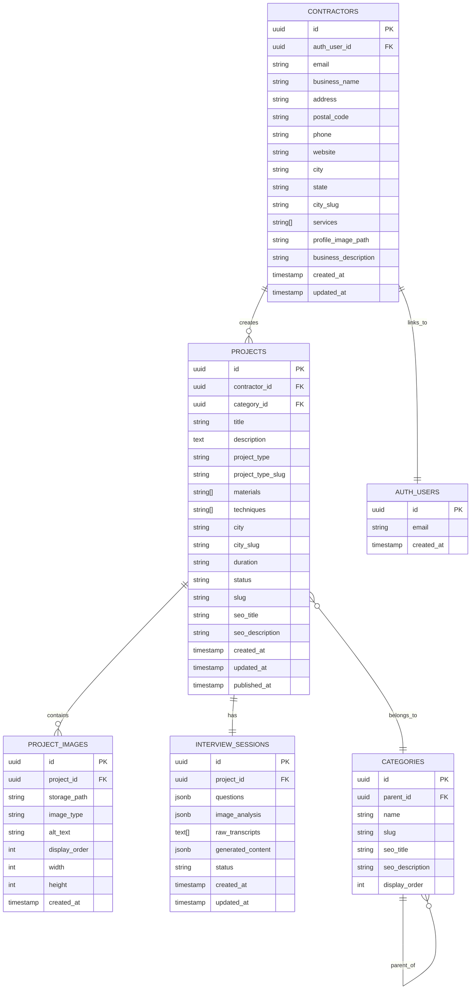

# Data Model Documentation

> **Version:** 1.0
> **Last Updated:** January 2, 2026
> **Database:** PostgreSQL 15 (Supabase)

---

## Entity Relationship Diagram



---

## Table Specifications

### 1. contractors

Primary table for contractor business profiles.

| Column | Type | Nullable | Default | Description |
|--------|------|----------|---------|-------------|
| `id` | `uuid` | NO | `gen_random_uuid()` | Primary key |
| `auth_user_id` | `uuid` | NO | - | FK to `auth.users.id` |
| `email` | `text` | NO | - | Unique, from Supabase Auth |
| `business_name` | `text` | NO | - | Display name for portfolio |
| `address` | `text` | YES | `NULL` | Public street address (NAP) |
| `postal_code` | `text` | YES | `NULL` | Postal/ZIP code (NAP) |
| `phone` | `text` | YES | `NULL` | Public phone number (NAP) |
| `website` | `text` | YES | `NULL` | Public website URL |
| `profile_slug` | `text` | YES | `NULL` | Public profile slug (unique, editable) |
| `city` | `text` | NO | - | City for filtering |
| `state` | `text` | NO | - | Two-letter state code |
| `city_slug` | `text` | NO | - | URL-friendly city (e.g., "denver-co") |
| `services` | `text[]` | NO | `'{}'` | Array of service types |
| `service_areas` | `text[]` | NO | `'{}'` | Cities/neighborhoods served (SEO critical) |
| `profile_image_path` | `text` | YES | `NULL` | Storage path for logo/photo |
| `business_description` | `text` | YES | `NULL` | About the business |
| `plan_tier` | `text` | NO | `'free'` | Billing tier (`free` or `pro`) |
| `created_at` | `timestamptz` | NO | `now()` | Record creation |
| `updated_at` | `timestamptz` | NO | `now()` | Last update |

**Indexes:**
- `PRIMARY KEY (id)`
- `UNIQUE (auth_user_id)`
- `UNIQUE (email)`
- `UNIQUE (profile_slug)`
- `INDEX (city_slug)`
- `INDEX (services)` (GIN)

**SQL Definition:**

```sql
CREATE TABLE contractors (
    id UUID PRIMARY KEY DEFAULT gen_random_uuid(),
    auth_user_id UUID NOT NULL REFERENCES auth.users(id) ON DELETE CASCADE,
    email TEXT NOT NULL UNIQUE,
    business_name TEXT NOT NULL,
    address TEXT,
    postal_code TEXT,
    phone TEXT,
    website TEXT,
    profile_slug TEXT,
    city TEXT NOT NULL,
    state TEXT NOT NULL CHECK (length(state) = 2),
    city_slug TEXT NOT NULL,
    services TEXT[] NOT NULL DEFAULT '{}',
    service_areas TEXT[] NOT NULL DEFAULT '{}', -- Critical for local SEO
    profile_image_path TEXT,
    business_description TEXT,
    plan_tier TEXT NOT NULL DEFAULT 'free' CHECK (plan_tier IN ('free', 'pro')),
    created_at TIMESTAMPTZ NOT NULL DEFAULT now(),
    updated_at TIMESTAMPTZ NOT NULL DEFAULT now()
);

CREATE INDEX idx_contractors_city_slug ON contractors(city_slug);
CREATE UNIQUE INDEX idx_contractors_profile_slug ON contractors(profile_slug);
CREATE INDEX idx_contractors_services ON contractors USING GIN(services);
CREATE INDEX idx_contractors_service_areas ON contractors USING GIN(service_areas); -- Enables: "Find contractors serving Lakewood"

-- Trigger to auto-update updated_at
CREATE OR REPLACE FUNCTION update_updated_at()
RETURNS TRIGGER AS $$
BEGIN
    NEW.updated_at = now();
    RETURN NEW;
END;
$$ LANGUAGE plpgsql;

CREATE TRIGGER contractors_updated_at
    BEFORE UPDATE ON contractors
    FOR EACH ROW
    EXECUTE FUNCTION update_updated_at();
```

---

### 2. projects

Core table for project showcases.

| Column | Type | Nullable | Default | Description |
|--------|------|----------|---------|-------------|
| `id` | `uuid` | NO | `gen_random_uuid()` | Primary key |
| `contractor_id` | `uuid` | NO | - | FK to `contractors.id` |
| `category_id` | `uuid` | YES | `NULL` | FK to `categories.id` |
| `title` | `text` | NO | - | AI-generated or edited title |
| `description` | `text` | NO | - | AI-generated description (400-600 words) |
| `project_type` | `text` | NO | - | Type name (e.g., "Chimney Rebuild") |
| `project_type_slug` | `text` | NO | - | URL slug (e.g., "chimney-rebuild") |
| `materials` | `text[]` | NO | `'{}'` | Materials used |
| `techniques` | `text[]` | NO | `'{}'` | Techniques applied |
| `city` | `text` | NO | - | Project location city |
| `city_slug` | `text` | NO | - | URL-friendly city |
| `duration` | `text` | YES | `NULL` | Human-readable duration |
| `status` | `text` | NO | `'draft'` | draft, published, archived |
| `slug` | `text` | NO | - | Unique URL slug |
| `seo_title` | `text` | YES | `NULL` | Meta title for SEO |
| `seo_description` | `text` | YES | `NULL` | Meta description for SEO |
| `created_at` | `timestamptz` | NO | `now()` | Record creation |
| `updated_at` | `timestamptz` | NO | `now()` | Last update |
| `published_at` | `timestamptz` | YES | `NULL` | When published |

**Indexes:**
- `PRIMARY KEY (id)`
- `UNIQUE (slug)`
- `INDEX (contractor_id)`
- `INDEX (status)`
- `INDEX (city_slug)`
- `INDEX (project_type_slug)`
- `INDEX (city_slug, project_type_slug)` (composite for URL routing)
- `INDEX (published_at DESC)` (for sorting)

**SQL Definition:**

```sql
CREATE TABLE projects (
    id UUID PRIMARY KEY DEFAULT gen_random_uuid(),
    contractor_id UUID NOT NULL REFERENCES contractors(id) ON DELETE CASCADE,
    category_id UUID REFERENCES categories(id) ON DELETE SET NULL,
    title TEXT NOT NULL,
    description TEXT NOT NULL,
    project_type TEXT NOT NULL,
    project_type_slug TEXT NOT NULL,
    materials TEXT[] NOT NULL DEFAULT '{}',
    techniques TEXT[] NOT NULL DEFAULT '{}',
    city TEXT NOT NULL,
    city_slug TEXT NOT NULL,
    duration TEXT,
    status TEXT NOT NULL DEFAULT 'draft' CHECK (status IN ('draft', 'published', 'archived')),
    slug TEXT NOT NULL UNIQUE,
    seo_title TEXT,
    seo_description TEXT,
    created_at TIMESTAMPTZ NOT NULL DEFAULT now(),
    updated_at TIMESTAMPTZ NOT NULL DEFAULT now(),
    published_at TIMESTAMPTZ
);

CREATE INDEX idx_projects_contractor ON projects(contractor_id);
CREATE INDEX idx_projects_status ON projects(status);
CREATE INDEX idx_projects_city_slug ON projects(city_slug);
CREATE INDEX idx_projects_type_slug ON projects(project_type_slug);
CREATE INDEX idx_projects_seo_route ON projects(city_slug, project_type_slug);
CREATE INDEX idx_projects_published ON projects(published_at DESC) WHERE status = 'published';

CREATE TRIGGER projects_updated_at
    BEFORE UPDATE ON projects
    FOR EACH ROW
    EXECUTE FUNCTION update_updated_at();
```

---

### 3. project_images

Images associated with projects.

| Column | Type | Nullable | Default | Description |
|--------|------|----------|---------|-------------|
| `id` | `uuid` | NO | `gen_random_uuid()` | Primary key |
| `project_id` | `uuid` | NO | - | FK to `projects.id` |
| `storage_path` | `text` | NO | - | Path in Supabase Storage |
| `image_type` | `text` | YES | `NULL` | before, after, process |
| `alt_text` | `text` | YES | `NULL` | AI-generated alt text |
| `display_order` | `int` | NO | `0` | Sort order |
| `width` | `int` | YES | `NULL` | Original image width |
| `height` | `int` | YES | `NULL` | Original image height |
| `created_at` | `timestamptz` | NO | `now()` | Upload timestamp |

**Indexes:**
- `PRIMARY KEY (id)`
- `INDEX (project_id)`
- `INDEX (project_id, display_order)`

**SQL Definition:**

```sql
CREATE TABLE project_images (
    id UUID PRIMARY KEY DEFAULT gen_random_uuid(),
    project_id UUID NOT NULL REFERENCES projects(id) ON DELETE CASCADE,
    storage_path TEXT NOT NULL,
    image_type TEXT CHECK (image_type IN ('before', 'after', 'process', NULL)),
    alt_text TEXT,
    display_order INT NOT NULL DEFAULT 0,
    width INT,
    height INT,
    created_at TIMESTAMPTZ NOT NULL DEFAULT now()
);

CREATE INDEX idx_project_images_project ON project_images(project_id);
CREATE INDEX idx_project_images_order ON project_images(project_id, display_order);
```

---

### 4. interview_sessions

Stores AI interview state and results.

| Column | Type | Nullable | Default | Description |
|--------|------|----------|---------|-------------|
| `id` | `uuid` | NO | `gen_random_uuid()` | Primary key |
| `project_id` | `uuid` | NO | - | FK to `projects.id` |
| `questions` | `jsonb` | NO | `'[]'` | Array of Q&A objects |
| `image_analysis` | `jsonb` | YES | `NULL` | Gemini 3 Flash (preview) vision analysis result |
| `raw_transcripts` | `text[]` | NO | `'{}'` | Whisper transcriptions |
| `generated_content` | `jsonb` | YES | `NULL` | Full AI generation result |
| `status` | `text` | NO | `'in_progress'` | in_progress, completed, approved |
| `created_at` | `timestamptz` | NO | `now()` | Session start |
| `updated_at` | `timestamptz` | NO | `now()` | Last update |

**JSONB Structure: `questions`**

```json
[
  {
    "question": "What was the problem the customer had?",
    "answer": "The chimney was falling apart...",
    "voice_url": "audio/session-123/q1.webm",
    "answered_at": "2025-01-15T10:30:00Z"
  }
]
```

**JSONB Structure: `image_analysis`**

```json
{
  "project_type": "Chimney Rebuild",
  "project_type_confidence": 0.92,
  "materials": ["red brick", "portland mortar"],
  "image_classifications": [
    { "path": "images/123/1.jpg", "type": "before" },
    { "path": "images/123/2.jpg", "type": "after" }
  ]
}
```

**JSONB Structure: `generated_content`**

```json
{
  "title": "Historic Brick Chimney Rebuild in Denver",
  "description": "This 1920s chimney had seen better days...",
  "tags": ["chimney", "rebuild", "denver", "brick"],
  "seo_meta_description": "Professional chimney rebuild in Denver..."
}
```

**SQL Definition:**

```sql
CREATE TABLE interview_sessions (
    id UUID PRIMARY KEY DEFAULT gen_random_uuid(),
    project_id UUID NOT NULL REFERENCES projects(id) ON DELETE CASCADE,
    questions JSONB NOT NULL DEFAULT '[]',
    image_analysis JSONB,
    raw_transcripts TEXT[] NOT NULL DEFAULT '{}',
    generated_content JSONB,
    status TEXT NOT NULL DEFAULT 'in_progress' CHECK (status IN ('in_progress', 'completed', 'approved')),
    created_at TIMESTAMPTZ NOT NULL DEFAULT now(),
    updated_at TIMESTAMPTZ NOT NULL DEFAULT now()
);

CREATE UNIQUE INDEX idx_interview_session_project ON interview_sessions(project_id);

CREATE TRIGGER interview_sessions_updated_at
    BEFORE UPDATE ON interview_sessions
    FOR EACH ROW
    EXECUTE FUNCTION update_updated_at();
```

---

### 5. categories

Hierarchical taxonomy for project types.

| Column | Type | Nullable | Default | Description |
|--------|------|----------|---------|-------------|
| `id` | `uuid` | NO | `gen_random_uuid()` | Primary key |
| `parent_id` | `uuid` | YES | `NULL` | FK to `categories.id` |
| `name` | `text` | NO | - | Display name |
| `slug` | `text` | NO | - | URL slug |
| `seo_title` | `text` | YES | `NULL` | Meta title |
| `seo_description` | `text` | YES | `NULL` | Meta description |
| `display_order` | `int` | NO | `0` | Sort order |

**SQL Definition:**

```sql
CREATE TABLE categories (
    id UUID PRIMARY KEY DEFAULT gen_random_uuid(),
    parent_id UUID REFERENCES categories(id) ON DELETE SET NULL,
    name TEXT NOT NULL,
    slug TEXT NOT NULL UNIQUE,
    seo_title TEXT,
    seo_description TEXT,
    display_order INT NOT NULL DEFAULT 0
);

CREATE INDEX idx_categories_parent ON categories(parent_id);
CREATE INDEX idx_categories_slug ON categories(slug);
```

**Seed Data:**

```sql
-- Top-level categories
INSERT INTO categories (name, slug, display_order) VALUES
    ('Chimney', 'chimney', 1),
    ('Brick Work', 'brick-work', 2),
    ('Stone Work', 'stone-work', 3),
    ('Concrete', 'concrete', 4),
    ('Restoration', 'restoration', 5);

-- Subcategories (Chimney)
INSERT INTO categories (parent_id, name, slug, display_order)
SELECT id, 'Chimney Repair', 'chimney-repair', 1 FROM categories WHERE slug = 'chimney'
UNION ALL
SELECT id, 'Chimney Rebuild', 'chimney-rebuild', 2 FROM categories WHERE slug = 'chimney'
UNION ALL
SELECT id, 'Chimney Liner', 'chimney-liner', 3 FROM categories WHERE slug = 'chimney'
UNION ALL
SELECT id, 'Chimney Cap', 'chimney-cap', 4 FROM categories WHERE slug = 'chimney';
```

---

## Row Level Security (RLS) Policies

```sql
-- Enable RLS on all tables
ALTER TABLE contractors ENABLE ROW LEVEL SECURITY;
ALTER TABLE projects ENABLE ROW LEVEL SECURITY;
ALTER TABLE project_images ENABLE ROW LEVEL SECURITY;
ALTER TABLE interview_sessions ENABLE ROW LEVEL SECURITY;
ALTER TABLE categories ENABLE ROW LEVEL SECURITY;

-- Contractors: Users can only manage their own profile
CREATE POLICY "Users can view own profile"
    ON contractors FOR SELECT
    USING (auth.uid() = auth_user_id);

CREATE POLICY "Users can update own profile"
    ON contractors FOR UPDATE
    USING (auth.uid() = auth_user_id);

CREATE POLICY "Users can insert own profile"
    ON contractors FOR INSERT
    WITH CHECK (auth.uid() = auth_user_id);

-- Projects: Public can view published, owners can manage all
CREATE POLICY "Public can view published projects"
    ON projects FOR SELECT
    USING (status = 'published');

CREATE POLICY "Owners can manage own projects"
    ON projects FOR ALL
    USING (contractor_id IN (
        SELECT id FROM contractors WHERE auth_user_id = auth.uid()
    ));

-- Project Images: Follow project visibility
CREATE POLICY "Public can view images of published projects"
    ON project_images FOR SELECT
    USING (project_id IN (
        SELECT id FROM projects WHERE status = 'published'
    ));

CREATE POLICY "Owners can manage own project images"
    ON project_images FOR ALL
    USING (project_id IN (
        SELECT p.id FROM projects p
        JOIN contractors c ON p.contractor_id = c.id
        WHERE c.auth_user_id = auth.uid()
    ));

-- Interview Sessions: Owners only
CREATE POLICY "Owners can manage interview sessions"
    ON interview_sessions FOR ALL
    USING (project_id IN (
        SELECT p.id FROM projects p
        JOIN contractors c ON p.contractor_id = c.id
        WHERE c.auth_user_id = auth.uid()
    ));

-- Categories: Public read
CREATE POLICY "Everyone can read categories"
    ON categories FOR SELECT
    USING (true);
```

---

## Migration Strategy

```bash
# Generate migration from schema
npx drizzle-kit generate:pg

# Apply migration to database
npx drizzle-kit push:pg

# Or use Supabase CLI
supabase db diff -f create_tables
supabase db push
```

---

## References

- [Supabase Database Guide](https://supabase.com/docs/guides/database)
- [Row Level Security](https://supabase.com/docs/guides/auth/row-level-security)
- [PostgreSQL Data Types](https://www.postgresql.org/docs/current/datatype.html)
