# Deep Research Agents: Architecture Comparison

> Comparing KnearMe's Discovery Agent architecture against industry deep research agent patterns from OpenAI, Google, and emerging multi-agent frameworks.

---

## Executive Summary

Deep Research Agents represent a new class of autonomous AI systems designed for complex, multi-step information gathering tasks. This document compares:

| System | Architecture | Use Case | Duration |
|--------|-------------|----------|----------|
| **OpenAI Deep Research** | Multi-agent pipeline (o3 + GPT-4) | Comprehensive research reports | 5-30 minutes |
| **Gemini Deep Research** | Single-agent with RL-trained planning | Autonomous research synthesis | Several minutes |
| **KnearMe Discovery Agent** | Single-agent streaming with tools | Business onboarding | 2-5 minutes |

---

## Architecture Taxonomy

Research identifies two paradigms for agentic systems:

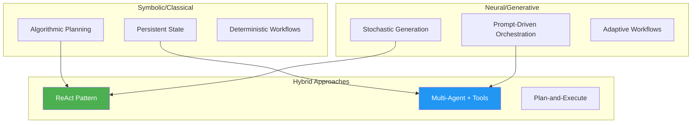

**KnearMe Discovery Agent** uses a **Neural/Generative** approach with tool-based state transitions, while deep research agents typically use **Hybrid** approaches combining planning with adaptive execution.

---

## OpenAI Deep Research Architecture

OpenAI's Deep Research is built on the o3 reasoning model with a modular multi-agent design.

### System Overview

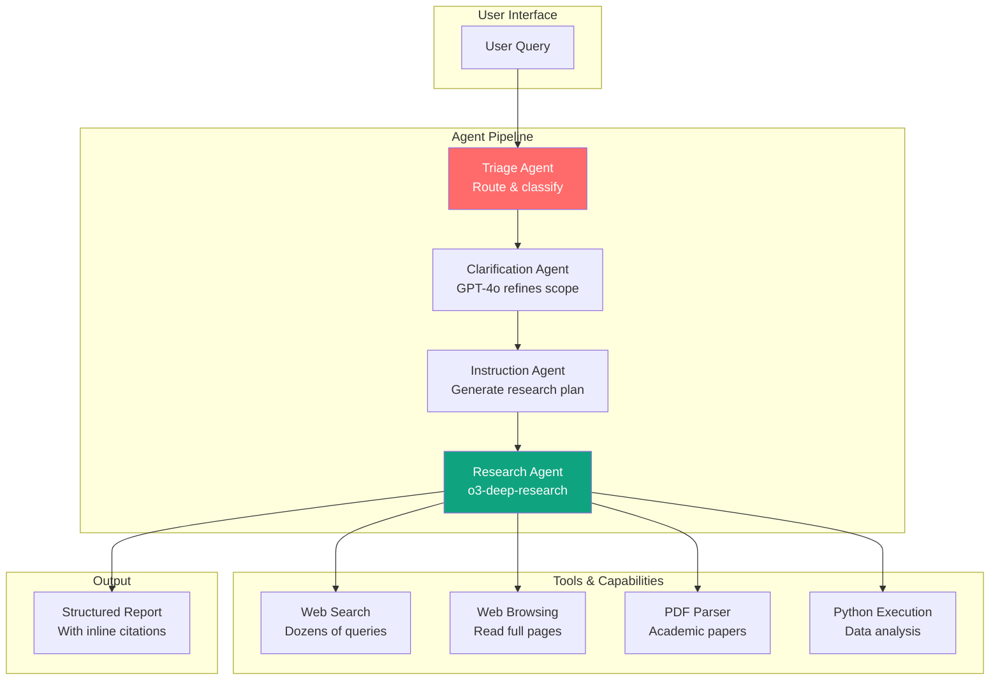

### Key Characteristics

| Aspect | Details |
|--------|---------|
| **Model** | o3-deep-research (specialized o3 variant) |
| **Planning** | Implicit decomposition into subtopics |
| **Iteration** | 20-50+ search queries per task |
| **Duration** | 5-30 minutes |
| **Output** | Long-form report with citations |
| **Cost** | High (extended reasoning + many tool calls) |

### Execution Flow

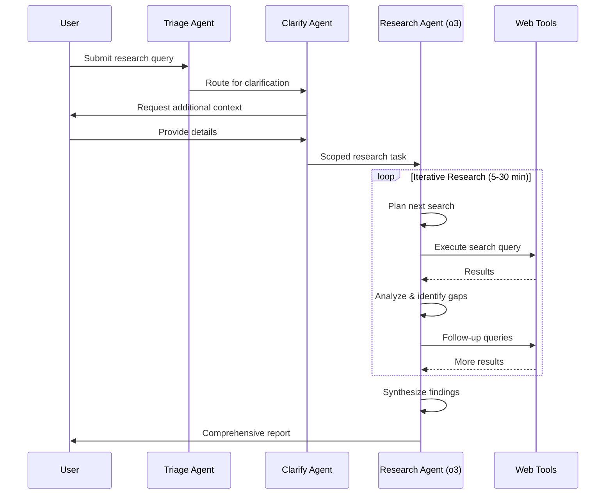

---

## Gemini Deep Research Architecture

Google's approach uses reinforcement learning to train the planning capability directly into the model.

### System Overview

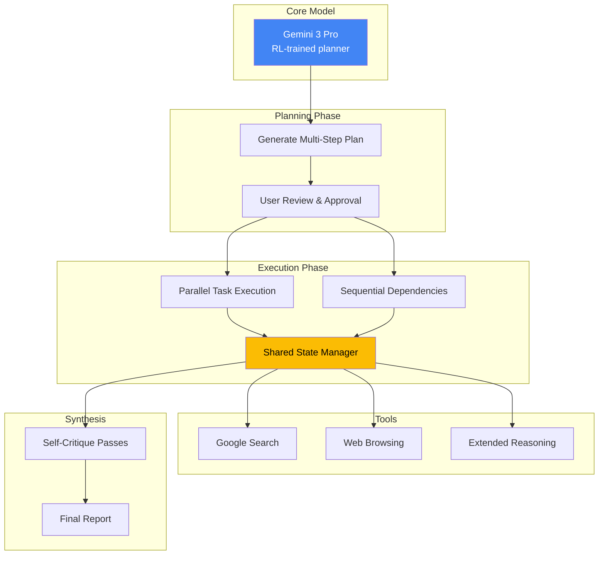

### Key Characteristics

| Aspect | Details |
|--------|---------|
| **Model** | Gemini 3 Pro (most factual, reduced hallucinations) |
| **Planning** | Explicit multi-step plan shown to user |
| **Scale** | 80-160 search queries, 250K-900K tokens |
| **Recovery** | Async task manager with graceful error recovery |
| **Output** | Multi-pass self-critiqued report |

### Novel Features

1. **User-Approved Plans**: Unlike OpenAI, Gemini shows its research plan before execution
2. **Parallel Execution**: Intelligently runs independent subtasks concurrently
3. **Graceful Recovery**: Single failures don't restart the entire pipeline
4. **RL-Trained Planning**: Model learned planning through reinforcement learning, not prompting

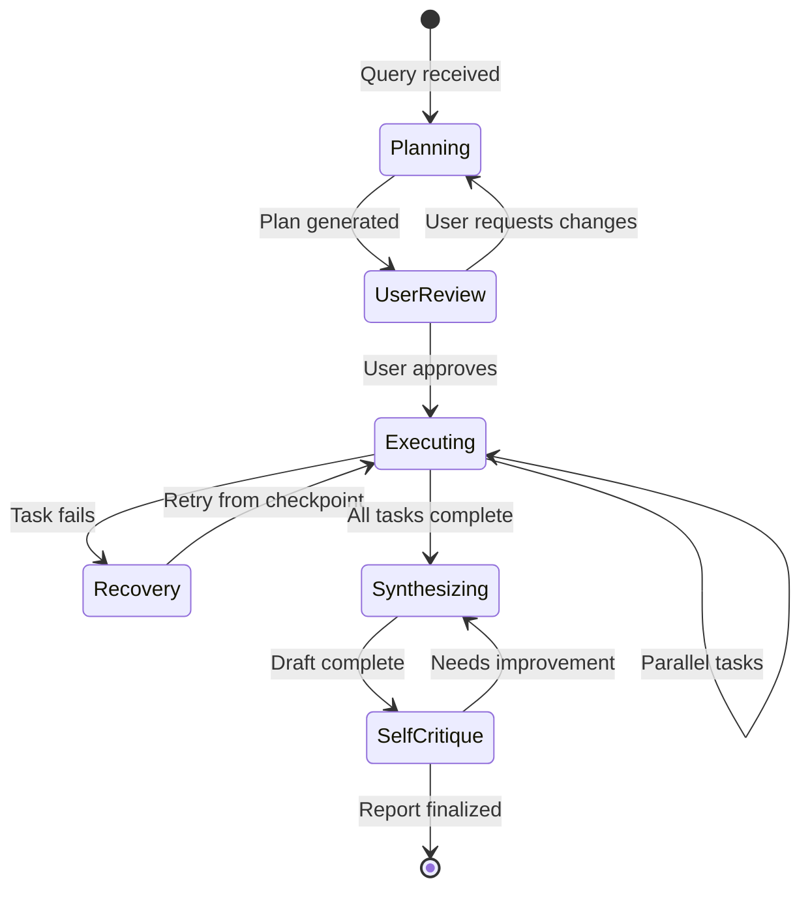

---

## KnearMe Discovery Agent Architecture

KnearMe uses a simpler single-agent streaming architecture optimized for quick business onboarding.

### System Overview

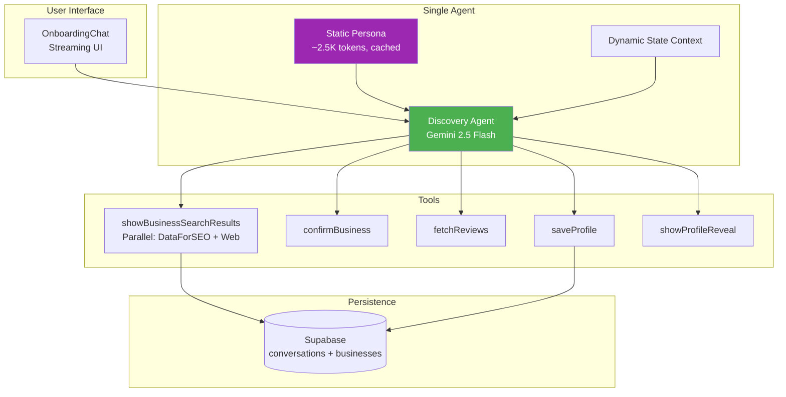

### Key Characteristics

| Aspect | Details |
|--------|---------|
| **Model** | Gemini 2.5 Flash (fast, cost-effective) |
| **Planning** | Implicit via tool availability + state |
| **Iteration** | 1-3 tool calls per turn |
| **Duration** | 2-5 minutes total |
| **Output** | Profile data + celebration artifact |
| **Cost** | Low (cached prompt, minimal tokens) |

### Design Philosophy Comparison

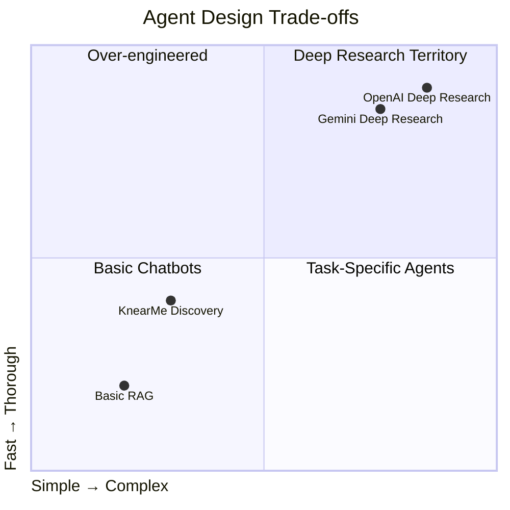

---

## Side-by-Side Comparison

### Architecture Patterns

| Pattern | OpenAI | Gemini | KnearMe |
|---------|--------|--------|---------|
| **Agent Type** | Multi-agent pipeline | Single agent + task manager | Single streaming agent |
| **Planning** | Implicit decomposition | Explicit user-approved plan | Tool-driven state machine |
| **Orchestration** | Sequential agents | Parallel task execution | Turn-by-turn streaming |
| **State Management** | Cross-agent context | Shared async state | DB-persisted conversation |
| **Error Recovery** | Retry individual agents | Checkpoint-based recovery | Circuit breaker + fallback |

### Capability Comparison

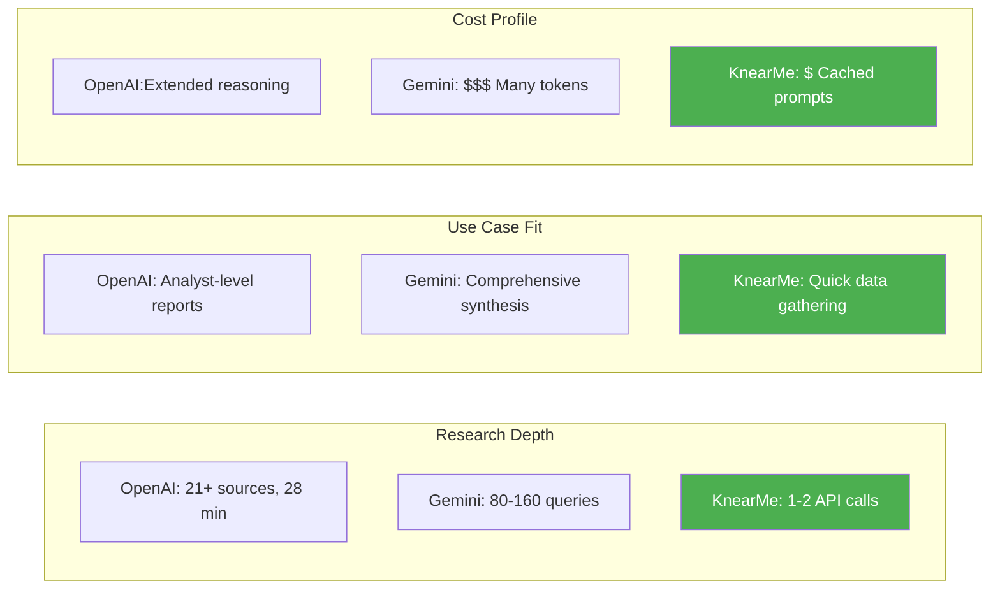

### Tool Usage Patterns

| Aspect | OpenAI | Gemini | KnearMe |
|--------|--------|--------|---------|
| **Search Queries** | 20-50+ iterative | 80-160 parallel | 1-2 targeted |
| **Content Analysis** | Full page reads, PDFs | Multi-format parsing | API responses only |
| **Code Execution** | Python for analysis | Available | Not needed |
| **Output Artifacts** | Long reports | Structured reports | UI artifacts (cards, reveal) |

---

## ReAct vs Plan-and-Execute

The 7 foundational agentic design patterns:

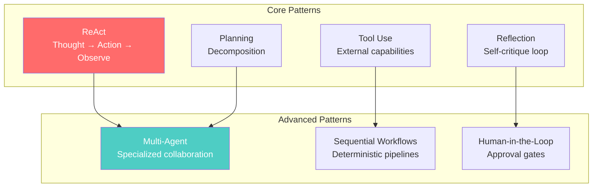

### Pattern Usage by System

| Pattern | OpenAI | Gemini | KnearMe |
|---------|--------|--------|---------|
| **ReAct** | ✅ Core loop | ✅ Internal | ✅ Implicit |
| **Reflection** | ✅ Multi-pass | ✅ Self-critique | ❌ Not needed |
| **Tool Use** | ✅ Heavy | ✅ Heavy | ✅ Moderate |
| **Planning** | ✅ Implicit | ✅ Explicit | ❌ State-driven |
| **Multi-Agent** | ✅ Pipeline | ❌ Single + tasks | ❌ Single |
| **Sequential** | ✅ Agent chain | ✅ Task ordering | ✅ Tool sequence |
| **Human-in-Loop** | ❌ Autonomous | ✅ Plan approval | ✅ Business confirmation |

---

## When to Use Each Pattern

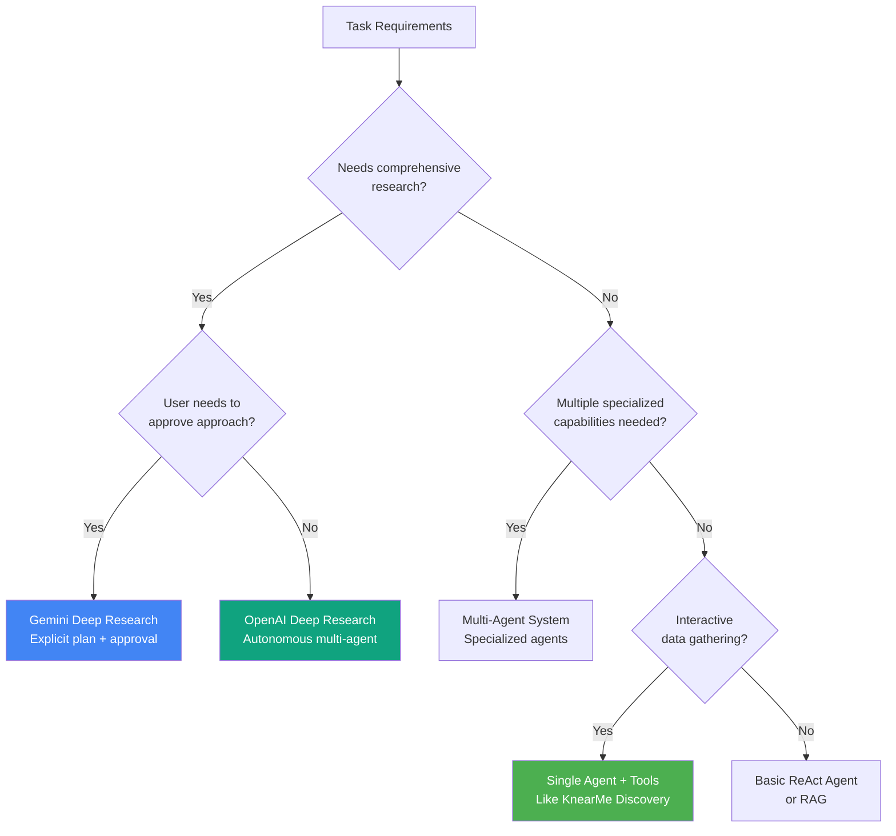

### Recommendations

| Use Case | Recommended Pattern |
|----------|-------------------|
| **Analyst-level research reports** | OpenAI Deep Research |
| **User-guided comprehensive research** | Gemini Deep Research |
| **Quick interactive data gathering** | Single agent + tools (KnearMe style) |
| **Complex multi-domain tasks** | Multi-agent orchestration |
| **Simple Q&A with context** | Basic ReAct or RAG |

---

## Emerging Trends (2025-2026)

### Industry Shifts

1. **Multi-Agent Surge**: Gartner reports 1,445% increase in multi-agent system inquiries (Q1 2024 → Q2 2025)
2. **Framework Consolidation**: Microsoft merging AutoGen + Semantic Kernel (GA Q1 2026)
3. **Task Duration Growth**: AI task duration doubling every 7 months (1hr → 8hr by late 2026)
4. **Enterprise Adoption**: 40% of enterprise apps will embed AI agents by end of 2026

### Architectural Evolution

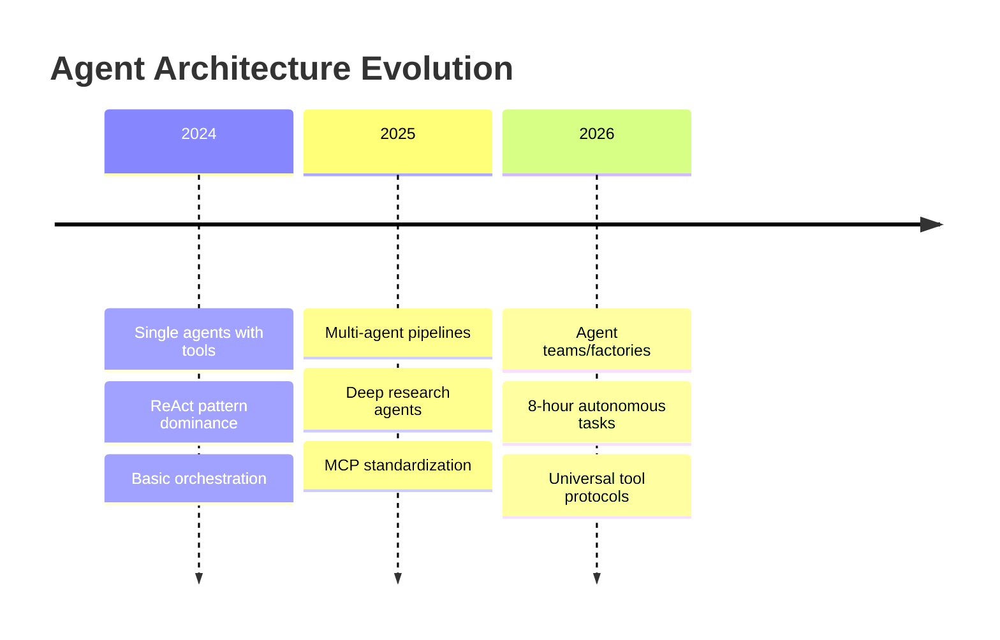

### Protocol Standards

- **MCP (Model Context Protocol)**: Anthropic's "USB-C for AI" standardizing tool connections
- **AG-UI / A2UI**: Emerging standards for agent user interfaces
- **Intent-Driven Surfaces**: Agents that "show, not just tell"

---

## KnearMe Architecture Alignment

### Current State Assessment

| Aspect | Industry Best Practice | KnearMe Status |
|--------|----------------------|----------------|
| **Single vs Multi-Agent** | Start simple, scale when needed | ✅ Appropriately simple |
| **Tool Abstraction** | MCP-style standardization | ⚠️ Custom implementation |
| **State Management** | Persistent, recoverable | ✅ DB-persisted |
| **Error Resilience** | Circuit breakers, fallbacks | ✅ Implemented |
| **User Control** | Approval gates where needed | ✅ Business confirmation |

### Potential Evolution Path

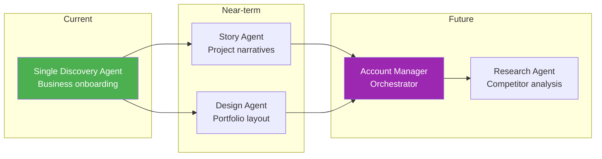

### When KnearMe Should Evolve

| Trigger | Response |
|---------|----------|
| Single agent degrading with more tools | Add specialized sub-agents |
| Users need comprehensive market research | Consider deep research pattern |
| Cross-domain tasks (design + content + SEO) | Multi-agent orchestration |
| Tasks exceeding 10-minute duration | Plan-and-execute with checkpoints |

---

## Sources

- [Deep Research Agents: A Systematic Examination And Roadmap](https://arxiv.org/abs/2506.18096) - arXiv
- [How OpenAI's Deep Research Works](https://blog.promptlayer.com/how-deep-research-works/) - PromptLayer
- [Deep Research API with the Agents SDK](https://cookbook.openai.com/examples/deep_research_api/introduction_to_deep_research_api_agents) - OpenAI Cookbook
- [Gemini Deep Research Agent](https://ai.google.dev/gemini-api/docs/deep-research) - Google AI
- [Build with Gemini Deep Research](https://blog.google/technology/developers/deep-research-agent-gemini-api/) - Google Blog
- [How OpenAI, Gemini, and Claude Use Agents to Power Deep Research](https://blog.bytebytego.com/p/how-openai-gemini-and-claude-use) - ByteByteGo
- [7 Must-Know Agentic AI Design Patterns](https://machinelearningmastery.com/7-must-know-agentic-ai-design-patterns/) - MachineLearningMastery
- [Choose a design pattern for your agentic AI system](https://docs.cloud.google.com/architecture/choose-design-pattern-agentic-ai-system) - Google Cloud
- [Demystifying AI Agents: ReAct-Style Agents vs Agentic Workflows](https://medium.com/@DanGiannone/demystifying-ai-agents-react-style-agents-vs-agentic-workflows-cedca7e26471) - Medium
- [Model Context Protocol (MCP)](https://www.anthropic.com/news/model-context-protocol) - Anthropic
- [Building agents with the Claude Agent SDK](https://www.anthropic.com/engineering/building-agents-with-the-claude-agent-sdk) - Anthropic Engineering

---

*Last updated: January 2026*
