# Onboarding Agents Architecture

> Comprehensive documentation of the Discovery Agent system powering KnearMe's conversation-first onboarding experience.

---

## Overview

The onboarding system uses a **single Discovery Agent** in a streaming context to gather business information through natural conversation. Unlike traditional form-based onboarding, the agent discovers business details through dialogue, leveraging external APIs (DataForSEO, web search) to auto-populate and verify information.

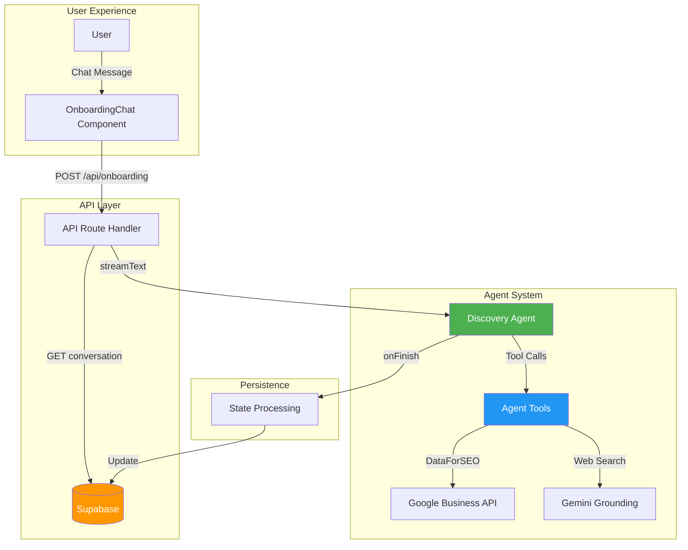
```mermaid
graph TB
    subgraph "User Experience"
        U[User] -->|Chat Message| UI[OnboardingChat Component]
    end

    subgraph "API Layer"
        UI -->|POST /api/onboarding| API[API Route Handler]
        API -->|GET conversation| DB[(Supabase)]
    end

    subgraph "Agent System"
        API -->|streamText| DA[Discovery Agent]
        DA -->|Tool Calls| TOOLS[Agent Tools]
        TOOLS -->|DataForSEO| EXT1[Google Business API]
        TOOLS -->|Web Search| EXT2[Gemini Grounding]
    end

    subgraph "Persistence"
        DA -->|onFinish| STATE[State Processing]
        STATE -->|Update| DB
    end

    style DA fill:#4CAF50,color:#fff
    style TOOLS fill:#2196F3,color:#fff
    style DB fill:#FF9800,color:#fff
```

---

## High-Level Architecture

### System Context (C4 Level 1)

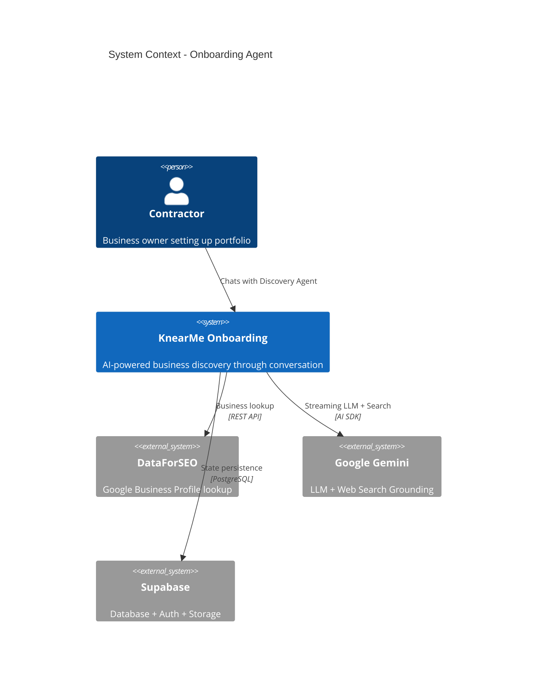
```mermaid
C4Context
    title System Context - Onboarding Agent

    Person(user, "Contractor", "Business owner setting up portfolio")

    System(knearme, "KnearMe Onboarding", "AI-powered business discovery through conversation")

    System_Ext(dataforseo, "DataForSEO", "Google Business Profile lookup")
    System_Ext(gemini, "Google Gemini", "LLM + Web Search Grounding")
    System_Ext(supabase, "Supabase", "Database + Auth + Storage")

    Rel(user, knearme, "Chats with Discovery Agent")
    Rel(knearme, dataforseo, "Business lookup", "REST API")
    Rel(knearme, gemini, "Streaming LLM + Search", "AI SDK")
    Rel(knearme, supabase, "State persistence", "PostgreSQL")
```

### Container View (C4 Level 2)

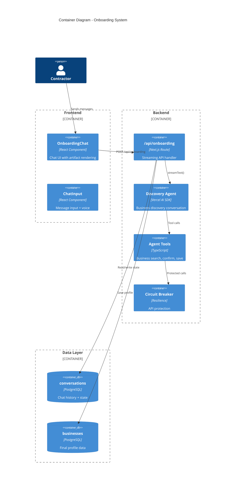
```mermaid
C4Container
    title Container Diagram - Onboarding System

    Person(user, "Contractor")

    Container_Boundary(frontend, "Frontend") {
        Container(chat, "OnboardingChat", "React Component", "Chat UI with artifact rendering")
        Container(input, "ChatInput", "React Component", "Message input + voice")
    }

    Container_Boundary(backend, "Backend") {
        Container(api, "/api/onboarding", "Next.js Route", "Streaming API handler")
        Container(agent, "Discovery Agent", "Vercel AI SDK", "Business discovery conversation")
        Container(tools, "Agent Tools", "TypeScript", "Business search, confirm, save")
        Container(circuit, "Circuit Breaker", "Resilience", "API protection")
    }

    Container_Boundary(data, "Data Layer") {
        ContainerDb(conv, "conversations", "PostgreSQL", "Chat history + state")
        ContainerDb(biz, "businesses", "PostgreSQL", "Final profile data")
    }

    Rel(user, chat, "Sends messages")
    Rel(chat, api, "POST /api/onboarding")
    Rel(api, agent, "streamText()")
    Rel(agent, tools, "Tool calls")
    Rel(tools, circuit, "Protected calls")
    Rel(api, conv, "Read/write state")
    Rel(api, biz, "Save profile")
```

---

## Discovery Agent Architecture

### Agent Components

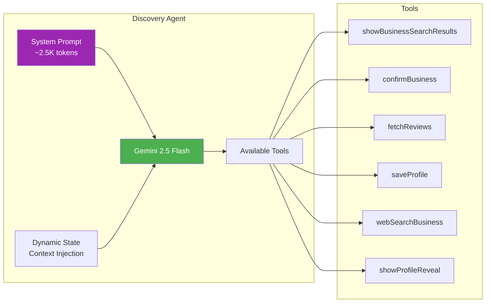
```mermaid
graph LR
    subgraph "Discovery Agent"
        PROMPT[System Prompt<br/>~2.5K tokens]
        STATE[Dynamic State<br/>Context Injection]
        MODEL[Gemini 2.5 Flash]
        TOOLS[Available Tools]
    end

    PROMPT --> MODEL
    STATE --> MODEL
    MODEL --> TOOLS

    subgraph "Tools"
        T1[showBusinessSearchResults]
        T2[confirmBusiness]
        T3[fetchReviews]
        T4[saveProfile]
        T5[webSearchBusiness]
        T6[showProfileReveal]
    end

    TOOLS --> T1
    TOOLS --> T2
    TOOLS --> T3
    TOOLS --> T4
    TOOLS --> T5
    TOOLS --> T6

    style MODEL fill:#4CAF50,color:#fff
    style PROMPT fill:#9C27B0,color:#fff
```

### Tool Flow State Machine

```mermaid
stateDiagram-v2
    [*] --> Gathering: User starts onboarding

    Gathering --> Searching: Agent has name + location
    note right of Searching: showBusinessSearchResults<br/>(parallel: DataForSEO + web)

    Searching --> Confirming: Results returned
    note right of Confirming: User selects business

    Confirming --> Confirmed: confirmBusiness called

    Confirmed --> FetchingReviews: Has Google CID
    note right of FetchingReviews: fetchReviews

    FetchingReviews --> Saving: All fields gathered
    Confirmed --> Saving: No reviews available

    note right of Saving: saveProfile
    Saving --> Complete: Profile saved

    Complete --> Revealing: Show celebration
    note right of Revealing: showProfileReveal

    Revealing --> [*]: Onboarding complete

    Searching --> ManualEntry: No results found
    ManualEntry --> Saving: User provides info
```

### Tool Availability Logic

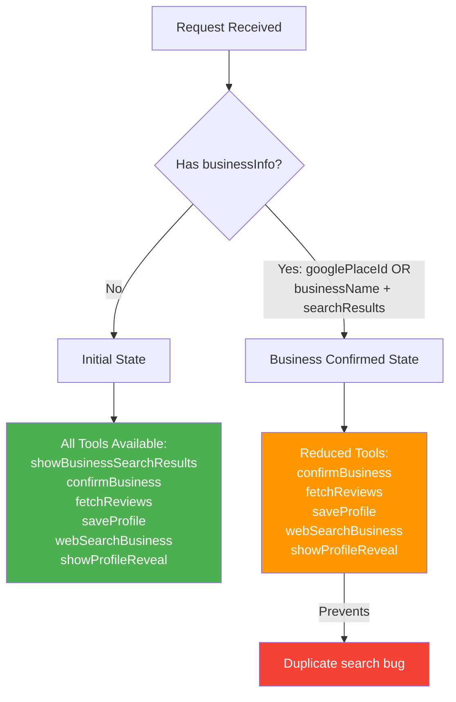
```mermaid
flowchart TD
    START[Request Received] --> CHECK{Has businessInfo?}

    CHECK -->|Yes: googlePlaceId OR<br/>businessName + searchResults| CONFIRMED[Business Confirmed State]
    CHECK -->|No| INITIAL[Initial State]

    INITIAL --> ALL[All Tools Available:<br/>showBusinessSearchResults<br/>confirmBusiness<br/>fetchReviews<br/>saveProfile<br/>webSearchBusiness<br/>showProfileReveal]

    CONFIRMED --> REDUCED[Reduced Tools:<br/>confirmBusiness<br/>fetchReviews<br/>saveProfile<br/>webSearchBusiness<br/>showProfileReveal]

    REDUCED -->|Prevents| DUPLICATE[Duplicate search bug]

    style DUPLICATE fill:#f44336,color:#fff
    style ALL fill:#4CAF50,color:#fff
    style REDUCED fill:#FF9800,color:#fff
```

---

## Data Flow

### Request → Response Flow

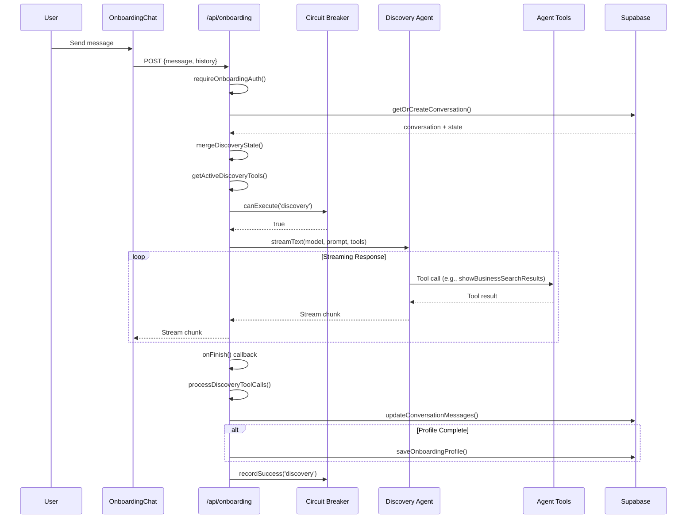
```mermaid
sequenceDiagram
    participant U as User
    participant UI as OnboardingChat
    participant API as /api/onboarding
    participant CB as Circuit Breaker
    participant Agent as Discovery Agent
    participant Tools as Agent Tools
    participant DB as Supabase

    U->>UI: Send message
    UI->>API: POST {message, history}

    API->>API: requireOnboardingAuth()
    API->>DB: getOrCreateConversation()
    DB-->>API: conversation + state

    API->>API: mergeDiscoveryState()
    API->>API: getActiveDiscoveryTools()

    API->>CB: canExecute('discovery')
    CB-->>API: true

    API->>Agent: streamText(model, prompt, tools)

    loop Streaming Response
        Agent->>Tools: Tool call (e.g., showBusinessSearchResults)
        Tools-->>Agent: Tool result
        Agent-->>API: Stream chunk
        API-->>UI: Stream chunk
    end

    API->>API: onFinish() callback
    API->>API: processDiscoveryToolCalls()
    API->>DB: updateConversationMessages()

    alt Profile Complete
        API->>DB: saveOnboardingProfile()
    end

    API->>CB: recordSuccess('discovery')
```

### State Transformation

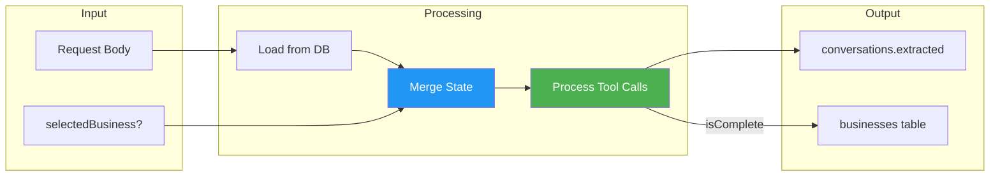
```mermaid
flowchart LR
    subgraph "Input"
        REQ[Request Body]
        SELECTED[selectedBusiness?]
    end

    subgraph "Processing"
        LOAD[Load from DB]
        MERGE[Merge State]
        TOOL_PROC[Process Tool Calls]
    end

    subgraph "Output"
        CONV[conversations.extracted]
        BIZ[businesses table]
    end

    REQ --> LOAD
    LOAD --> MERGE
    SELECTED --> MERGE
    MERGE --> TOOL_PROC
    TOOL_PROC --> CONV
    TOOL_PROC -->|isComplete| BIZ

    style MERGE fill:#2196F3,color:#fff
    style TOOL_PROC fill:#4CAF50,color:#fff
```

---

## State Management

### DiscoveryState Schema

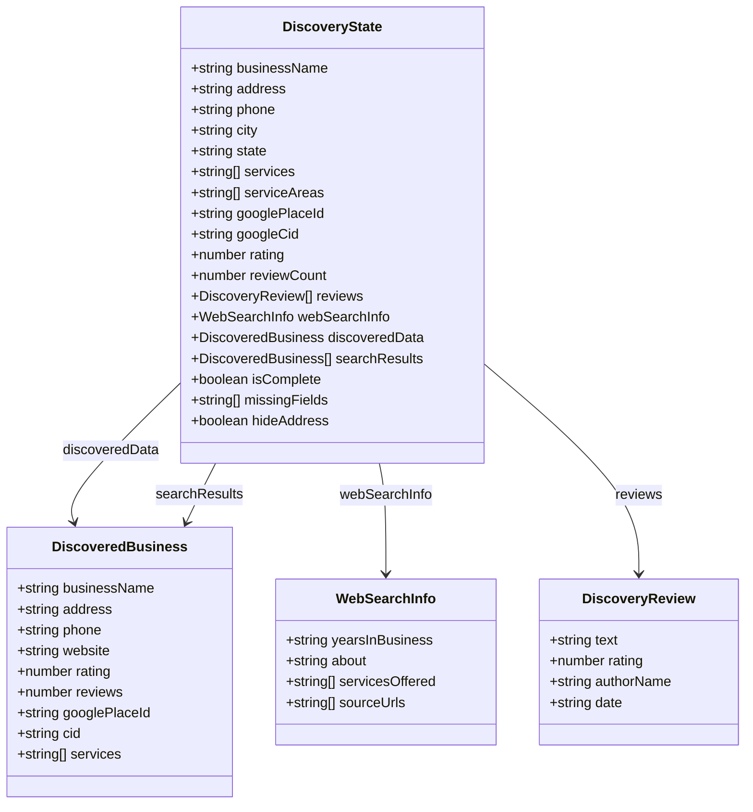
```mermaid
classDiagram
    class DiscoveryState {
        +string businessName
        +string address
        +string phone
        +string city
        +string state
        +string[] services
        +string[] serviceAreas
        +string googlePlaceId
        +string googleCid
        +number rating
        +number reviewCount
        +DiscoveryReview[] reviews
        +WebSearchInfo webSearchInfo
        +DiscoveredBusiness discoveredData
        +DiscoveredBusiness[] searchResults
        +boolean isComplete
        +string[] missingFields
        +boolean hideAddress
    }

    class DiscoveredBusiness {
        +string businessName
        +string address
        +string phone
        +string website
        +number rating
        +number reviews
        +string googlePlaceId
        +string cid
        +string[] services
    }

    class WebSearchInfo {
        +string yearsInBusiness
        +string about
        +string[] servicesOffered
        +string[] sourceUrls
    }

    class DiscoveryReview {
        +string text
        +number rating
        +string authorName
        +string date
    }

    DiscoveryState --> DiscoveredBusiness : discoveredData
    DiscoveryState --> DiscoveredBusiness : searchResults
    DiscoveryState --> WebSearchInfo : webSearchInfo
    DiscoveryState --> DiscoveryReview : reviews
```

### State Persistence Flow

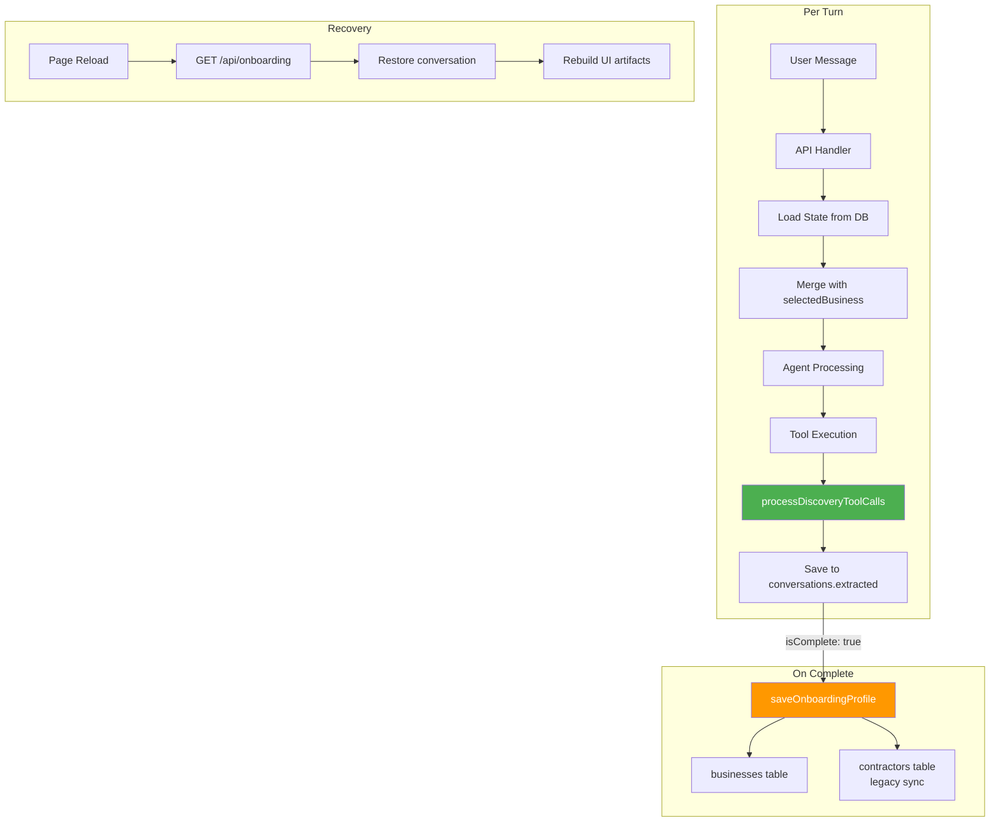
```mermaid
flowchart TB
    subgraph "Per Turn"
        MSG[User Message] --> API[API Handler]
        API --> LOAD[Load State from DB]
        LOAD --> MERGE[Merge with selectedBusiness]
        MERGE --> AGENT[Agent Processing]
        AGENT --> TOOLS[Tool Execution]
        TOOLS --> PROC[processDiscoveryToolCalls]
        PROC --> SAVE[Save to conversations.extracted]
    end

    subgraph "On Complete"
        SAVE -->|isComplete: true| PROFILE[saveOnboardingProfile]
        PROFILE --> BIZ[businesses table]
        PROFILE --> CONTRACTOR[contractors table<br/>legacy sync]
    end

    subgraph "Recovery"
        RELOAD[Page Reload] --> GET[GET /api/onboarding]
        GET --> RESTORE[Restore conversation]
        RESTORE --> UI[Rebuild UI artifacts]
    end

    style PROC fill:#4CAF50,color:#fff
    style PROFILE fill:#FF9800,color:#fff
```

---

## Component Architecture

### UI Component Hierarchy

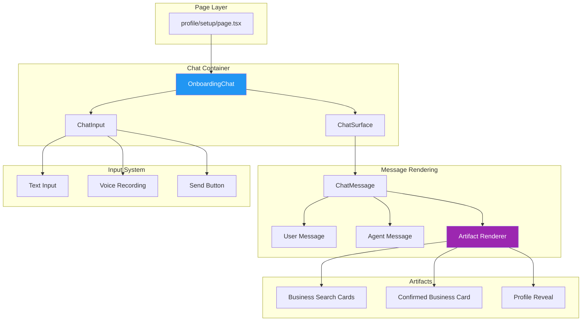
```mermaid
graph TB
    subgraph "Page Layer"
        PAGE[profile/setup/page.tsx]
    end

    subgraph "Chat Container"
        CHAT[OnboardingChat]
        CHAT --> SURFACE[ChatSurface]
        CHAT --> INPUT[ChatInput]
    end

    subgraph "Message Rendering"
        SURFACE --> MSG[ChatMessage]
        MSG --> USER_MSG[User Message]
        MSG --> AGENT_MSG[Agent Message]
        MSG --> ARTIFACT[Artifact Renderer]
    end

    subgraph "Artifacts"
        ARTIFACT --> SEARCH[Business Search Cards]
        ARTIFACT --> CONFIRM[Confirmed Business Card]
        ARTIFACT --> REVEAL[Profile Reveal]
    end

    subgraph "Input System"
        INPUT --> TEXT[Text Input]
        INPUT --> VOICE[Voice Recording]
        INPUT --> SEND[Send Button]
    end

    PAGE --> CHAT

    style CHAT fill:#2196F3,color:#fff
    style ARTIFACT fill:#9C27B0,color:#fff
```

### Chat Hook Data Flow

```mermaid
flowchart LR
    subgraph "useChat Hook"
        MESSAGES[messages]
        APPEND[append()]
        STATUS[status]
    end

    subgraph "Local State"
        SEARCH[searchResults]
        CONFIRMED[confirmedBusiness]
        REVEAL[profileReveal]
        ACTIVE[activeToolCalls]
    end

    subgraph "Effects"
        EXTRACT[Extract tool results<br/>from messages]
        UPDATE[Update local state]
    end

    MESSAGES --> EXTRACT
    EXTRACT --> SEARCH
    EXTRACT --> CONFIRMED
    EXTRACT --> REVEAL

    STATUS --> ACTIVE

    style MESSAGES fill:#4CAF50,color:#fff
    style EXTRACT fill:#2196F3,color:#fff
```

---

## API Route Handler

### POST Handler Flow

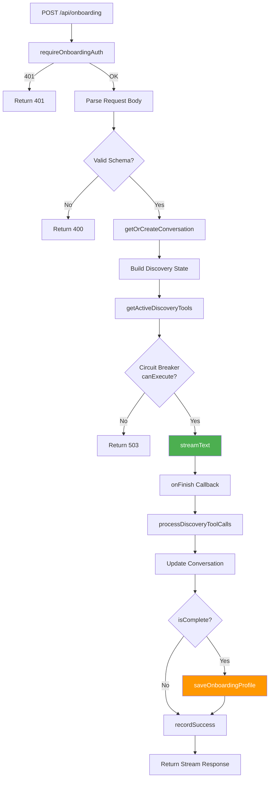
```mermaid
flowchart TD
    START[POST /api/onboarding] --> AUTH[requireOnboardingAuth]
    AUTH -->|401| UNAUTH[Return 401]
    AUTH -->|OK| PARSE[Parse Request Body]

    PARSE --> VALIDATE{Valid Schema?}
    VALIDATE -->|No| BAD[Return 400]
    VALIDATE -->|Yes| CONV[getOrCreateConversation]

    CONV --> STATE[Build Discovery State]
    STATE --> TOOLS[getActiveDiscoveryTools]

    TOOLS --> CB{Circuit Breaker<br/>canExecute?}
    CB -->|No| UNAVAIL[Return 503]
    CB -->|Yes| STREAM[streamText]

    STREAM --> FINISH[onFinish Callback]
    FINISH --> PROC[processDiscoveryToolCalls]
    PROC --> UPDATE[Update Conversation]

    UPDATE --> COMPLETE{isComplete?}
    COMPLETE -->|Yes| SAVE[saveOnboardingProfile]
    COMPLETE -->|No| RECORD[recordSuccess]
    SAVE --> RECORD

    RECORD --> RESPONSE[Return Stream Response]

    style STREAM fill:#4CAF50,color:#fff
    style SAVE fill:#FF9800,color:#fff
```

### GET Handler Flow

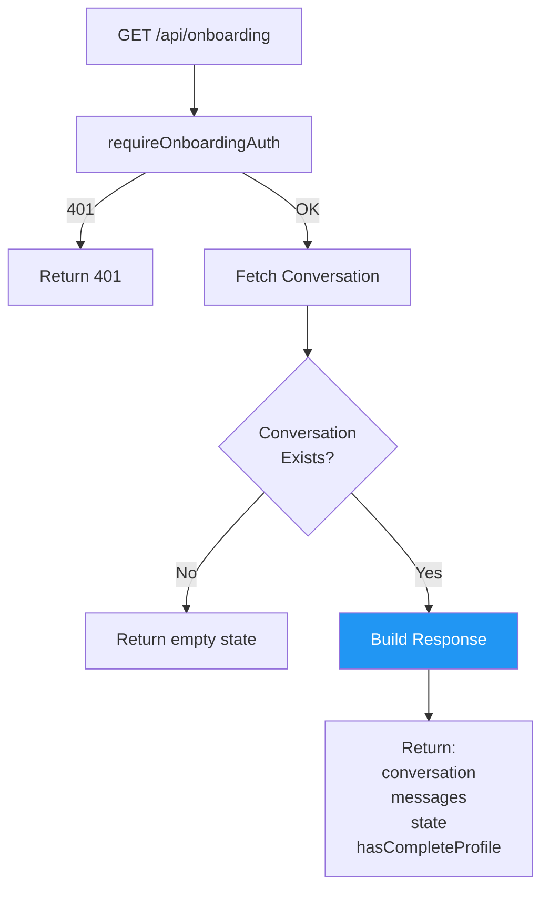
```mermaid
flowchart TD
    START[GET /api/onboarding] --> AUTH[requireOnboardingAuth]
    AUTH -->|401| UNAUTH[Return 401]
    AUTH -->|OK| FETCH[Fetch Conversation]

    FETCH --> EXISTS{Conversation<br/>Exists?}
    EXISTS -->|No| EMPTY[Return empty state]
    EXISTS -->|Yes| BUILD[Build Response]

    BUILD --> RETURN[Return:<br/>conversation<br/>messages<br/>state<br/>hasCompleteProfile]

    style BUILD fill:#2196F3,color:#fff
```

---

## External Integrations

### DataForSEO Integration

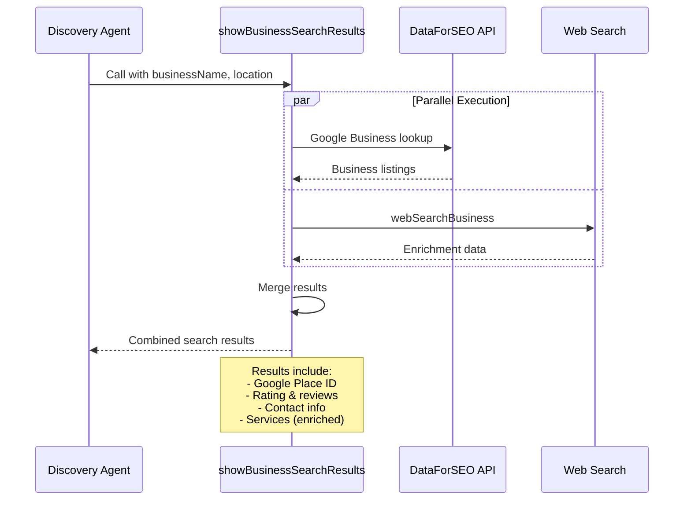
```mermaid
sequenceDiagram
    participant Agent as Discovery Agent
    participant Tool as showBusinessSearchResults
    participant DFSEO as DataForSEO API
    participant Web as Web Search

    Agent->>Tool: Call with businessName, location

    par Parallel Execution
        Tool->>DFSEO: Google Business lookup
        DFSEO-->>Tool: Business listings
    and
        Tool->>Web: webSearchBusiness
        Web-->>Tool: Enrichment data
    end

    Tool->>Tool: Merge results
    Tool-->>Agent: Combined search results

    Note over Tool: Results include:<br/>- Google Place ID<br/>- Rating & reviews<br/>- Contact info<br/>- Services (enriched)
```

### Circuit Breaker Protection

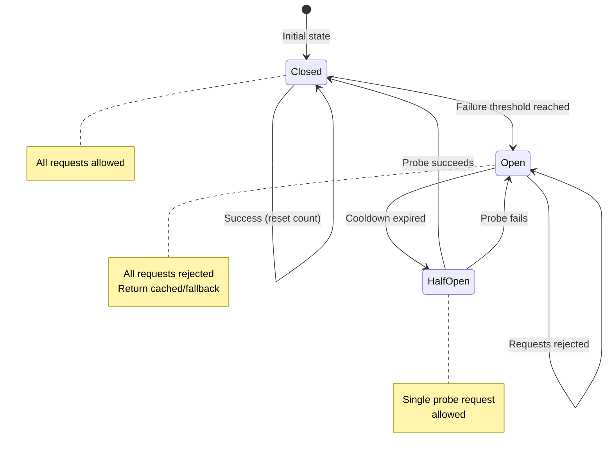
```mermaid
stateDiagram-v2
    [*] --> Closed: Initial state

    Closed --> Closed: Success (reset count)
    Closed --> Open: Failure threshold reached

    Open --> HalfOpen: Cooldown expired
    Open --> Open: Requests rejected

    HalfOpen --> Closed: Probe succeeds
    HalfOpen --> Open: Probe fails

    note right of Closed: All requests allowed
    note right of Open: All requests rejected<br/>Return cached/fallback
    note right of HalfOpen: Single probe request<br/>allowed
```

---

## Error Handling & Resilience

### Fallback Chain

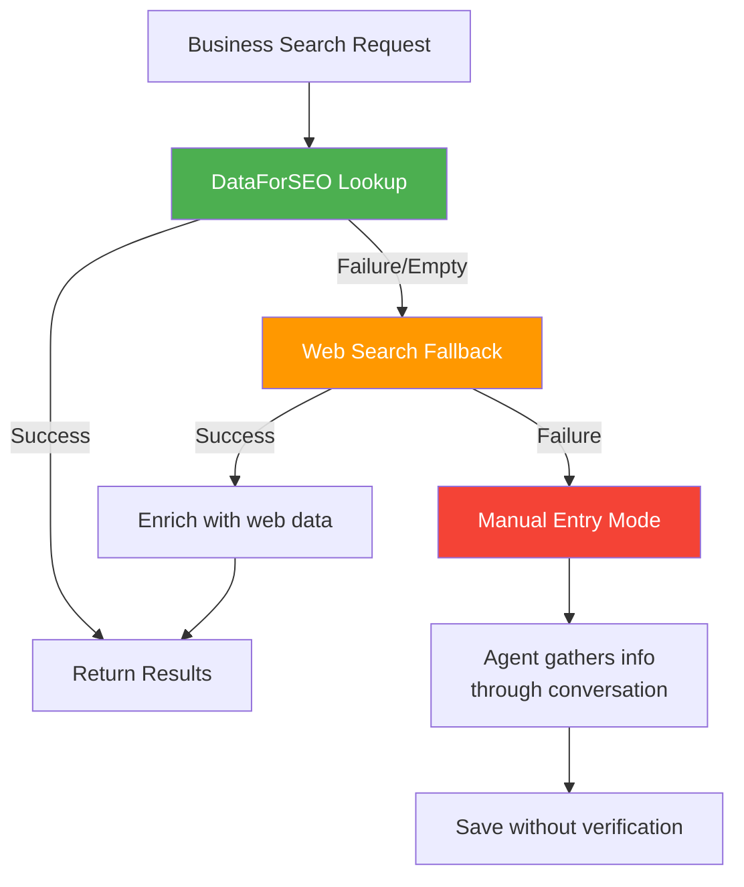
```mermaid
flowchart TD
    START[Business Search Request] --> PRIMARY[DataForSEO Lookup]

    PRIMARY -->|Success| RESULTS[Return Results]
    PRIMARY -->|Failure/Empty| FALLBACK1[Web Search Fallback]

    FALLBACK1 -->|Success| ENRICH[Enrich with web data]
    FALLBACK1 -->|Failure| MANUAL[Manual Entry Mode]

    ENRICH --> RESULTS
    MANUAL --> GATHER[Agent gathers info<br/>through conversation]
    GATHER --> SAVE[Save without verification]

    style PRIMARY fill:#4CAF50,color:#fff
    style FALLBACK1 fill:#FF9800,color:#fff
    style MANUAL fill:#f44336,color:#fff
```

### Error Response Handling

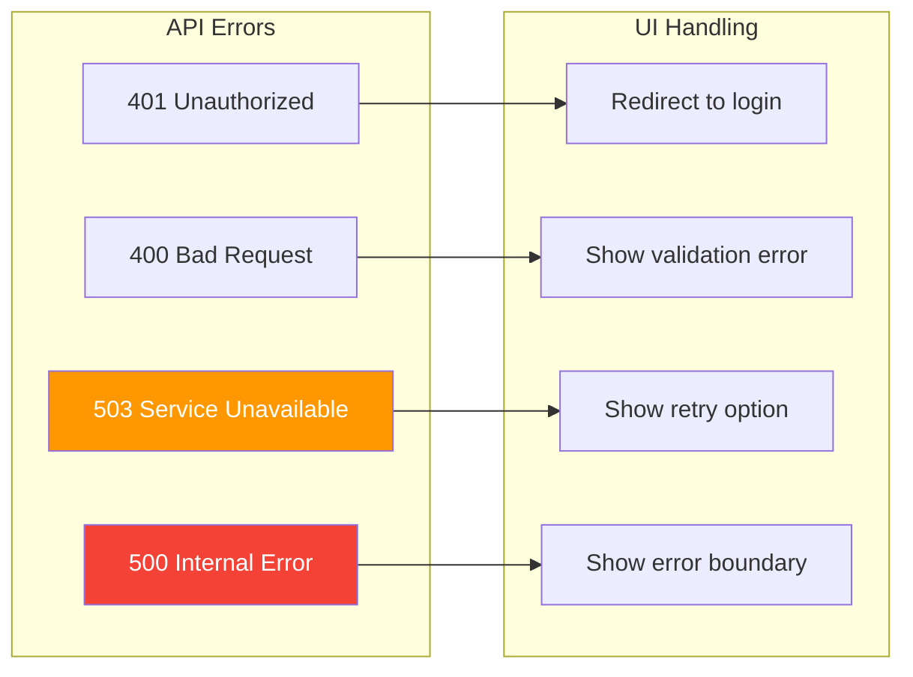
```mermaid
flowchart LR
    subgraph "API Errors"
        E401[401 Unauthorized]
        E400[400 Bad Request]
        E503[503 Service Unavailable]
        E500[500 Internal Error]
    end

    subgraph "UI Handling"
        E401 --> REDIRECT[Redirect to login]
        E400 --> TOAST[Show validation error]
        E503 --> RETRY[Show retry option]
        E500 --> FALLBACK[Show error boundary]
    end

    style E503 fill:#FF9800,color:#fff
    style E500 fill:#f44336,color:#fff
```

---

## Key File Locations

### Agent Core

| File | Purpose |
|------|---------|
| `src/lib/agents/discovery.ts` | Main agent definition |
| `src/lib/agents/discovery/prompts.ts` | System prompt (~2.5K tokens) |
| `src/lib/agents/discovery/state.ts` | State creation & completion checks |
| `src/lib/agents/discovery/schemas.ts` | Zod schemas for all tools |
| `src/lib/agents/discovery/tool-processing.ts` | State merging logic |
| `src/lib/agents/discovery/types.ts` | TypeScript interfaces |

### API & Routes

| File | Purpose |
|------|---------|
| `src/app/api/onboarding/route.ts` | POST/GET handlers |
| `src/lib/supabase/typed-queries.ts` | DB queries |
| `src/lib/api/auth.ts` | Auth helpers |

### UI Components

| File | Purpose |
|------|---------|
| `src/components/onboarding/OnboardingChat.tsx` | Main chat interface |
| `src/components/chat/ChatSurface.tsx` | Message rendering |
| `src/components/chat/ChatInput.tsx` | Input + voice |
| `src/app/(dashboard)/profile/setup/page.tsx` | Setup page |

### Supporting Utilities

| File | Purpose |
|------|---------|
| `src/lib/agents/circuit-breaker.ts` | API resilience |
| `src/lib/agents/web-search.ts` | Fallback web search |
| `src/lib/tools/business-discovery.ts` | DataForSEO integration |
| `src/lib/ai/providers.ts` | Model configuration |

---

## Appendix: Complete Request Lifecycle

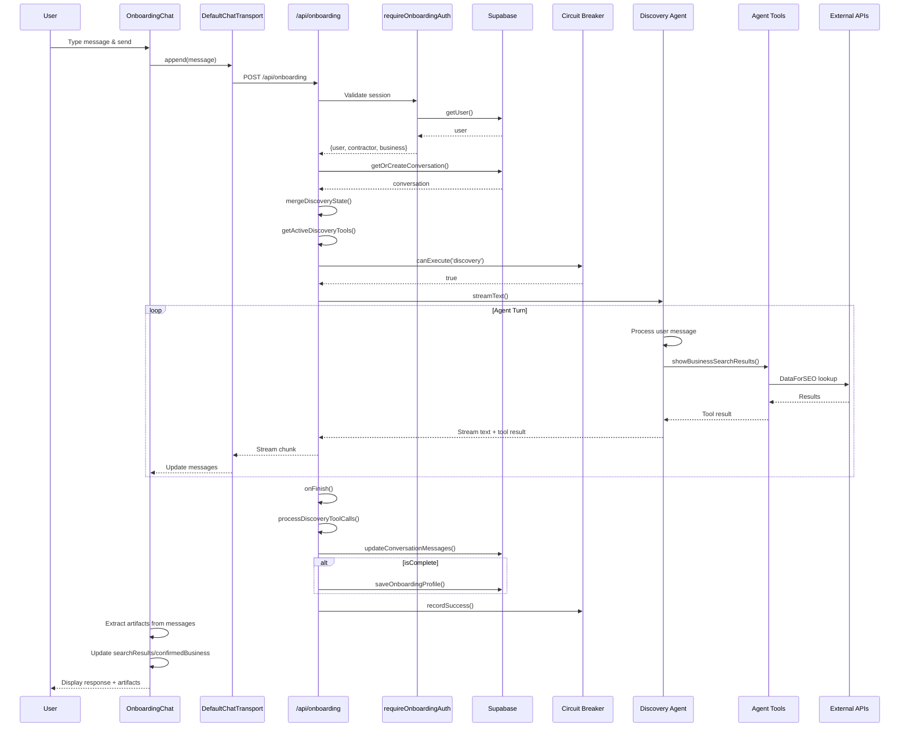
```mermaid
sequenceDiagram
    participant User
    participant UI as OnboardingChat
    participant Transport as DefaultChatTransport
    participant API as /api/onboarding
    participant Auth as requireOnboardingAuth
    participant DB as Supabase
    participant CB as Circuit Breaker
    participant Agent as Discovery Agent
    participant Tools as Agent Tools
    participant External as External APIs

    User->>UI: Type message & send
    UI->>Transport: append(message)
    Transport->>API: POST /api/onboarding

    API->>Auth: Validate session
    Auth->>DB: getUser()
    DB-->>Auth: user
    Auth-->>API: {user, contractor, business}

    API->>DB: getOrCreateConversation()
    DB-->>API: conversation

    API->>API: mergeDiscoveryState()
    API->>API: getActiveDiscoveryTools()

    API->>CB: canExecute('discovery')
    CB-->>API: true

    API->>Agent: streamText()

    loop Agent Turn
        Agent->>Agent: Process user message
        Agent->>Tools: showBusinessSearchResults()
        Tools->>External: DataForSEO lookup
        External-->>Tools: Results
        Tools-->>Agent: Tool result
        Agent-->>API: Stream text + tool result
        API-->>Transport: Stream chunk
        Transport-->>UI: Update messages
    end

    API->>API: onFinish()
    API->>API: processDiscoveryToolCalls()
    API->>DB: updateConversationMessages()

    alt isComplete
        API->>DB: saveOnboardingProfile()
    end

    API->>CB: recordSuccess()

    UI->>UI: Extract artifacts from messages
    UI->>UI: Update searchResults/confirmedBusiness
    UI-->>User: Display response + artifacts
```

---

*Last updated: January 2026*
