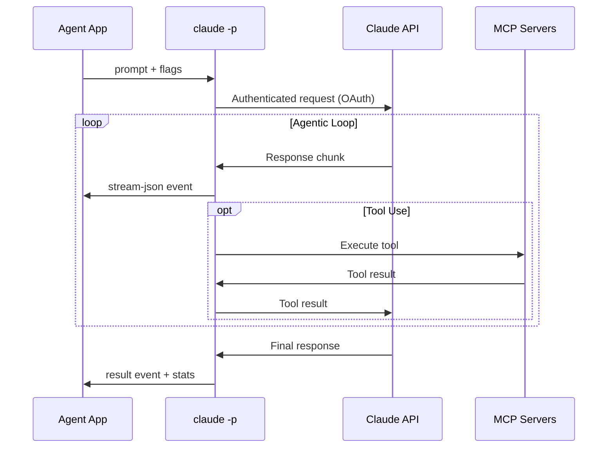
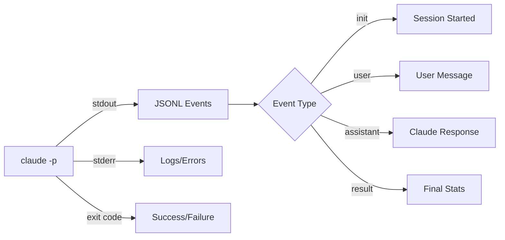
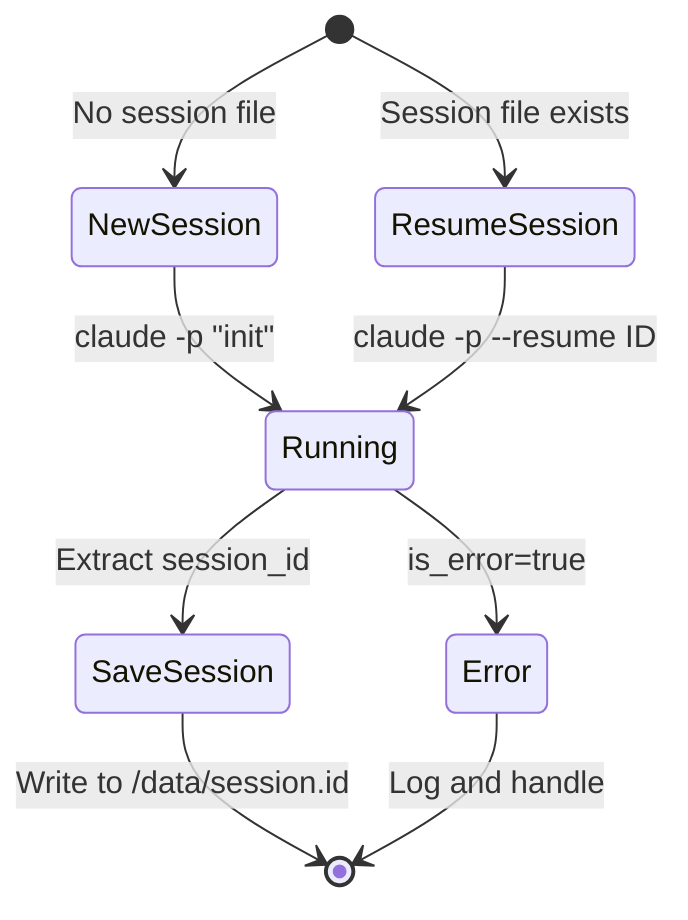
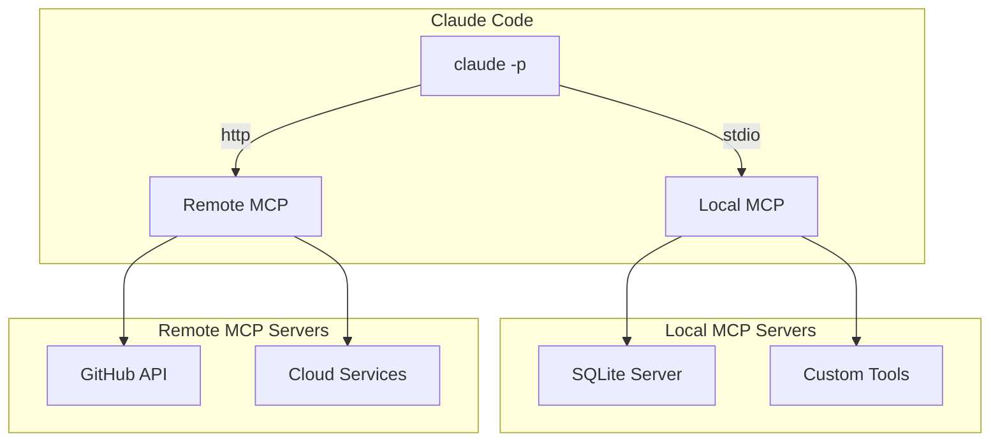
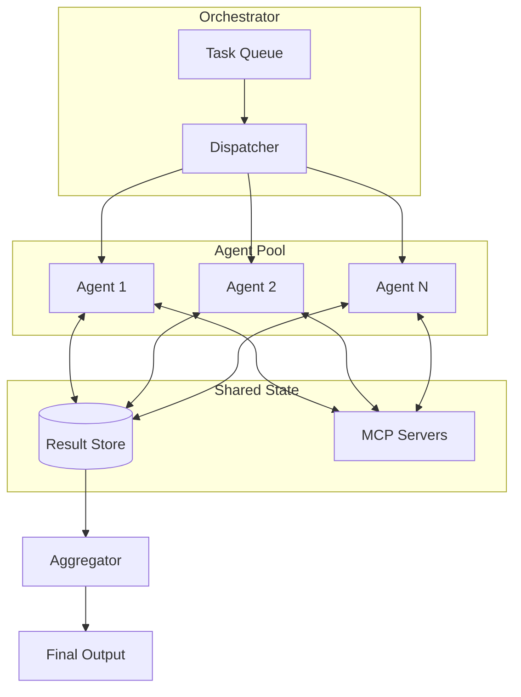
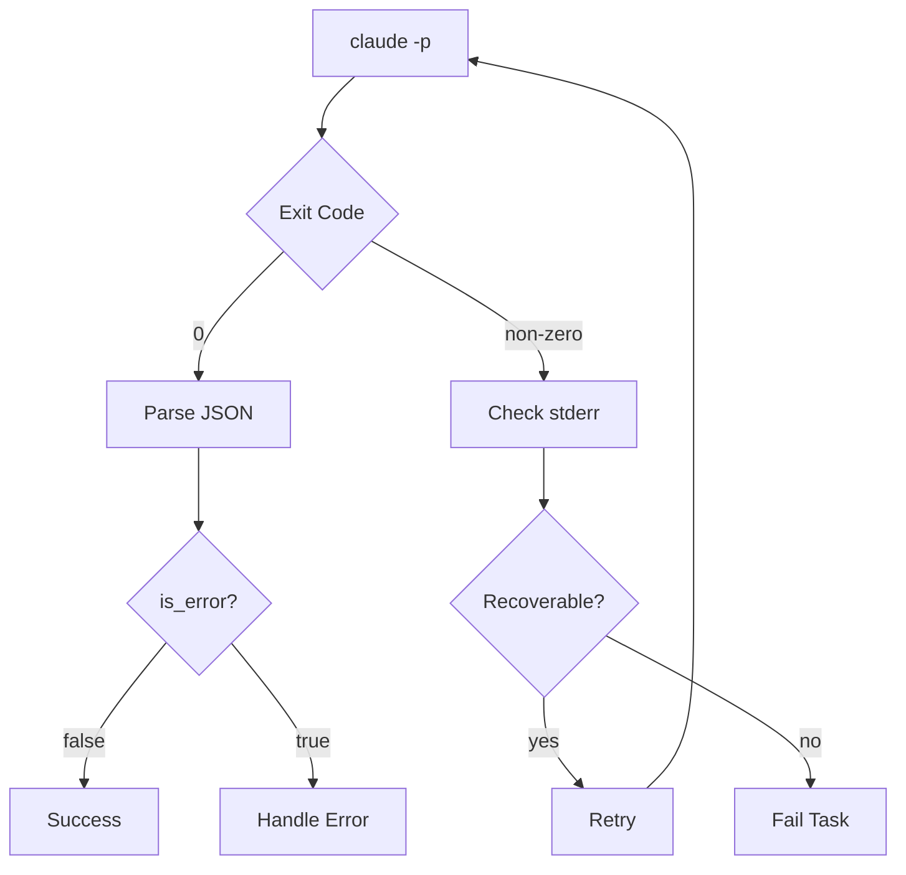

# Architecture: Claude Code Headless Agent System

## System Overview

```mermaid
graph TB
    subgraph "Your Application"
        A[Agent Script] -->|prompt| B[claude -p]
    end

    subgraph "Claude Code CLI"
        B -->|OAuth| C[Claude API]
        B -->|stream-json| D[JSONL Output]
        B <-->|tools| E[MCP Servers]
    end

    subgraph "Persistence"
        B <-->|session| F[(Session Store)]
        F -->|volume mount| G[/data/session.id]
    end

    D -->|parse| H[Event Handler]
    H -->|results| I[Output/Storage]
```

## Data Flow



## Container Deployment Model

```mermaid
graph LR
    subgraph "Container"
        A[entrypoint.sh] --> B[claude -p]
        B --> C[stream parser]
        C --> D[results]
    end

    subgraph "Volumes"
        E[/data/session.id] <--> B
        F[/data/results/] <--> D
        G[/app/mcp.json] --> B
    end

    subgraph "Optional Sidecars"
        H[MCP Server] <--> B
        I[Redis Queue] <--> A
    end
```

## Core Components

### 1. The Primitive: `claude -p`

The foundation is Claude Code CLI in print mode:

```bash
claude -p "prompt" \
  --output-format stream-json \    # Real-time JSONL output
  --resume "$SESSION_ID" \          # Stateful conversation
  --permission-mode acceptEdits \   # Auto-approve in sandbox
  --mcp-config /app/mcp.json        # Tool integrations
```

**Key Properties:**
- Runs as subprocess (spawn from any language)
- JSONL on stdout for real-time parsing
- Exit code 0 on success
- Session state persisted locally

### 2. Output Streams



**JSONL Event Types:**

| Type | Description | Key Fields |
|------|-------------|------------|
| `init` | Session initialization | `session_id` |
| `user` | User message echo | `message.content` |
| `assistant` | Claude's response | `message.content` (text, tool_use) |
| `result` | Final statistics | `total_cost_usd`, `duration_ms`, `is_error` |

### 3. Session Management



**Persistence Strategy:**

```bash
# On container start
if [ -f /data/session.id ]; then
    SESSION_ID=$(cat /data/session.id)
else
    SESSION_ID=$(claude -p "init" --output-format json | jq -r '.session_id')
    echo "$SESSION_ID" > /data/session.id
fi

# All subsequent calls
claude -p --resume "$SESSION_ID" "continue work..."
```

### 4. MCP Integration



**MCP Config (`mcp.json`):**

```json
{
  "mcpServers": {
    "database": {
      "type": "stdio",
      "command": "npx",
      "args": ["-y", "@anthropic-ai/mcp-server-sqlite", "/data/app.db"]
    },
    "github": {
      "type": "http",
      "url": "https://api.github.com/mcp",
      "headers": {
        "Authorization": "Bearer ${GITHUB_TOKEN}"
      }
    }
  }
}
```

## Production Architecture

### Single Agent Container

```mermaid
graph TB
    subgraph "Agent Container"
        A[Entrypoint] --> B{Work Queue?}
        B -->|yes| C[Process Item]
        B -->|no| D[Wait/Exit]

        C --> E[claude -p]
        E --> F[Parse Stream]
        F --> G[Save Result]
        G --> B
    end

    subgraph "Mounted Volumes"
        H[/data/queue.txt] --> B
        I[/data/session.id] <--> E
        G --> J[/data/results/]
    end
```

### Multi-Agent Orchestration



## Error Handling



**Exit Code Handling:**

```bash
if ! output=$(claude -p "$prompt" --output-format json 2>err.log); then
    echo "CLI failed: $(cat err.log)" >&2
    exit 1
fi

if echo "$output" | jq -e '.is_error == true' > /dev/null; then
    echo "Task failed: $(echo "$output" | jq -r '.result')" >&2
    exit 1
fi

# Success
echo "$output" | jq -r '.result'
```

## Resource Considerations

### Container Sizing

| Workload | CPU | Memory | Notes |
|----------|-----|--------|-------|
| Light (code review) | 0.5 | 512MB | Minimal tool use |
| Medium (file ops) | 1 | 1GB | Read/Write/Edit |
| Heavy (builds) | 2+ | 2GB+ | Bash commands, compilation |

### Volume Mounts

| Path | Purpose | Required |
|------|---------|----------|
| `/data/session.id` | Session persistence | For multi-turn |
| `/data/results/` | Output storage | For results |
| `/app/mcp.json` | MCP configuration | For tools |
| `/root/.claude/` | Full CLI state | For complex agents |

## Security Considerations

1. **Sandbox containers** — Use `--permission-mode acceptEdits` only in isolated environments
2. **Tool restrictions** — Limit with `--allowedTools` and `--disallowedTools`
3. **No secrets in prompts** — Use MCP servers or mounted files for credentials
4. **Network isolation** — Restrict outbound if not using web tools
