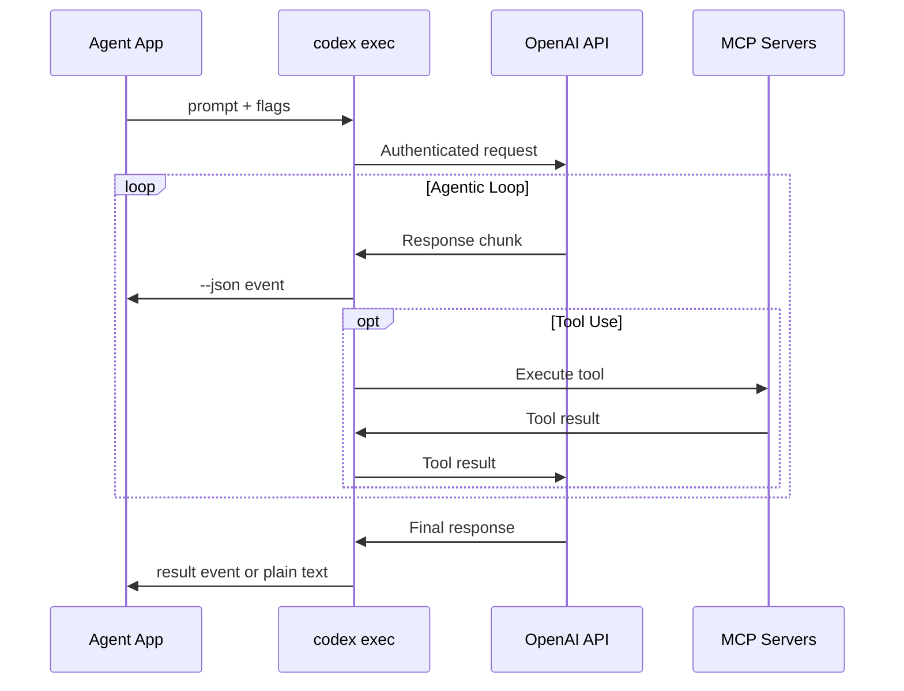
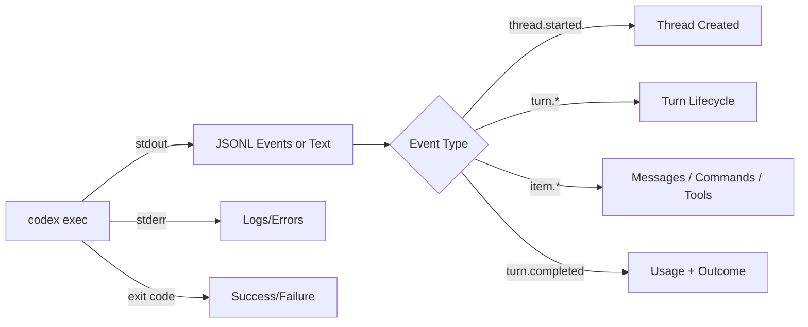
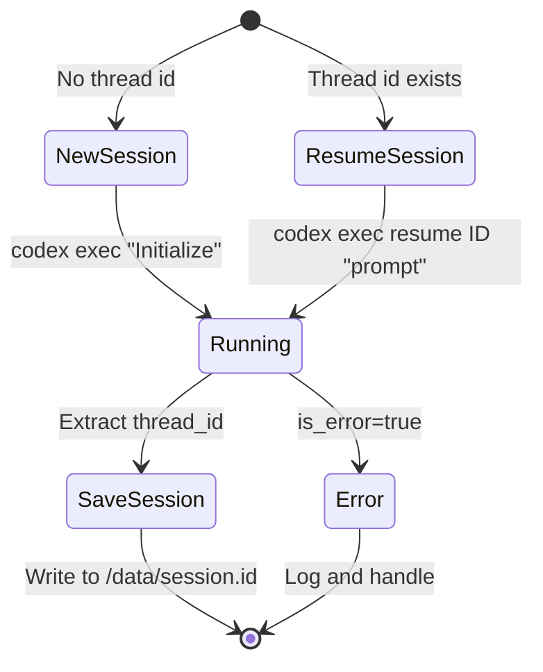
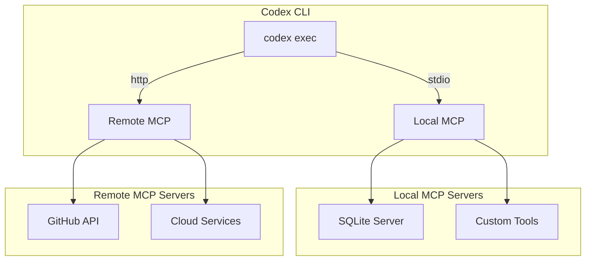
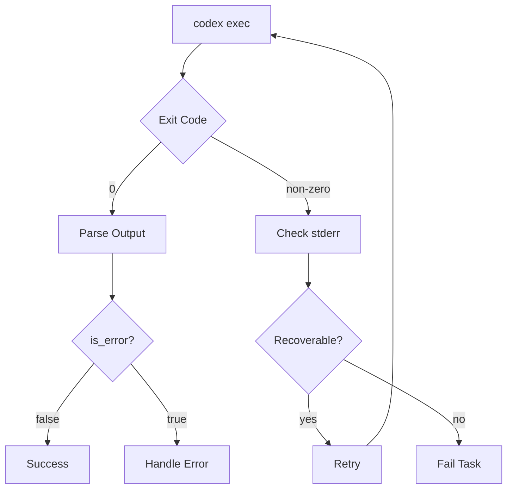

# Architecture: Codex CLI Headless Agent System

This doc mirrors the headless agent architecture we use elsewhere, but adapted for Codex CLI.

## System Overview

```mermaid
graph TB
    subgraph "Your Application"
        A[Agent Script] -->|prompt| B[codex exec]
    end

    subgraph "Codex CLI"
        B -->|OAuth / API key| C[OpenAI Responses API]
    B -->|--json events| D[JSONL Output]
        B <-->|tools| E[MCP Servers]
    end

    subgraph "Persistence"
        B <-->|session| F[(Session Store)]
        F -->|volume mount| G[/data/session.id]
    end

    D -->|parse| H[Event Handler]
    H -->|results| I[Output/Storage]
```

## Data Flow



## Container Deployment Model

```mermaid
graph LR
    subgraph "Container"
        A[entrypoint.sh] --> B[codex exec]
        B --> C[stream parser]
        C --> D[results]
    end

    subgraph "Volumes"
        E[/data/session.id] <--> B
        F[/data/results/] <--> D
        G[~/.codex/] <--> B
    end

    subgraph "Optional Sidecars"
        H[MCP Server] <--> B
        I[Redis Queue] <--> A
    end
```

## Core Components

### 1. The Primitive: `codex exec`

Headless mode is a single subprocess call:

```bash
codex exec "prompt" \
  --json \                       # Real‑time JSONL output
  --output-schema schema.json \  # Enforce structured final response
  --skip-git-repo-check \        # Allow non‑git workspaces
  --sandbox workspace-write      # Tool permissions
```

**Key Properties:**
- Runs as subprocess (spawn from any language)
- JSONL events on stdout when `--json` is enabled
- Plain text on stdout when `--json` is not enabled
- Exit code 0 on success
- Session state persisted locally

### 2. Output Streams



When `--json` is enabled, Codex emits one JSON object per line. The stable contract is that each line has a top‑level `type` field.

Typical event types you will see today:

| Type | Description | Key Fields |
|------|-------------|------------|
| `thread.started` | New thread/session created | `thread_id` |
| `turn.started` | Agent turn begins | — |
| `item.started` / `item.completed` | A unit of work in the turn (message, command, tool call, file patch) | `item.type`, `item.id`, `item.text`, `item.command`, `item.status` |
| `turn.completed` | Turn finished with usage stats | `usage.input_tokens`, `usage.output_tokens` |

`item.type` values are the real work surface. Common ones include:

| item.type | Meaning |
|----------|---------|
| `reasoning` | Internal reasoning summary (may be omitted depending on settings) |
| `agent_message` | A user‑visible assistant message (final answer lives here) |
| `command_execution` | A shell/Bash command Codex ran |
| `file_patch` / `file_edit` | A patch applied to disk |
| `tool_call` / `tool_result` | MCP or built‑in tool invocation |

Codex may add new event types over time; parse defensively and key off `type`/`item.type` rather than positional assumptions.

### 3. Session Management



**Persistence Strategy:**

```bash
# First call: create a thread and capture its id
THREAD_ID=$(codex exec --json "Initialize" \
  | jq -r 'select(.type=="thread.started") | .thread_id' | head -n 1)
echo "$THREAD_ID" > /data/session.id

# Later calls: resume
THREAD_ID=$(cat /data/session.id)
codex exec resume "$THREAD_ID" "Continue work..."
```

Note: resumed turns output plain text by default. To stream JSONL events on a resume, pass `--json` **before** the `resume` subcommand:

```bash
codex exec --json resume "$THREAD_ID" "Continue work…"
```

The top‑level interactive `codex resume` command does not support JSON streaming.

### 4. MCP Integration



Codex manages MCP servers via `codex mcp add/list/get/remove`. You can preload them in containers by copying `~/.codex/config.toml` or running `codex mcp add …` in your build.

## Production Architecture

### Single Agent Container

```mermaid
graph TB
    subgraph "Agent Container"
        A[Entrypoint] --> B{Work Queue?}
        B -->|yes| C[Process Item]
        B -->|no| D[Wait/Exit]

        C --> E[codex exec]
        E --> F[Parse Stream]
        F --> G[Save Result]
        G --> B
    end

    subgraph "Mounted Volumes"
        H[/data/queue.txt] --> B
        I[/data/session.id] <--> E
        G --> J[/data/results/]
    end
```

### Error Handling



## Security Considerations

1. **Use sandboxing** — prefer `--sandbox read-only` unless you need writes.
2. **Approvals in production** — set approval with `codex -a on-failure exec …` so unsafe commands require human review.
3. **No secrets in prompts** — mount credentials or use MCP servers instead.
4. **Network isolation** — if not using web tools or MCP, run containers with restricted egress.
