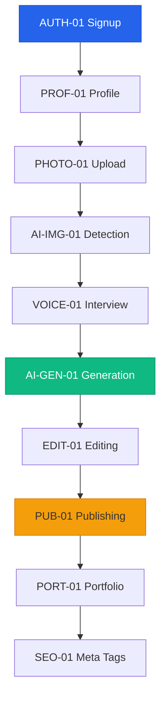

# Capabilities & Scope (MoSCoW)

> **Version:** 1.0
> **Last Updated:** December 8, 2025
> **Status:** Approved for MVP

---

## MoSCoW Prioritization Framework

| Priority | Definition | MVP Impact |
|----------|------------|------------|
| **Must Have** | MVP cannot launch without this | Required |
| **Should Have** | Important but not critical for launch | If time permits |
| **Could Have** | Nice to have, won't affect launch | Post-MVP |
| **Won't Have** | Explicitly out of scope | Future phases |

---

## Critical MVP Assumption

> **Most contractors do NOT use job management software.** The MVP assumes contractors will manually initiate project creation through the app. They upload photos and go through the AI interview flow.
>
> **Integrations with Jobber, ServiceTitan, Housecall Pro are Phase 2** - designed for the subset of contractors who do use such tools.
>
> The AI Interview is the PRIMARY and ONLY content creation path for MVP.

---

## Capability Areas

### 1. Authentication & Accounts

| ID | Capability | Priority | Notes |
|----|------------|----------|-------|
| AUTH-01 | Email/password signup | Must | Supabase Auth |
| AUTH-02 | Email verification | Must | Prevent spam accounts |
| AUTH-03 | Password reset flow | Must | Standard security |
| AUTH-04 | Session persistence | Must | Stay logged in on mobile |
| AUTH-05 | Google OAuth signup | Should | Reduce friction |
| AUTH-06 | Apple Sign-In | Could | Required for iOS app (future) |
| AUTH-07 | Multi-factor authentication | Won't | Not needed for MVP |

### 2. Contractor Profile

| ID | Capability | Priority | Notes |
|----|------------|----------|-------|
| PROF-01 | Business name | Must | Primary identifier |
| PROF-02 | City/State location | Must | SEO + filtering |
| PROF-03 | Services offered (multi-select) | Must | Category taxonomy |
| PROF-04 | Profile photo/logo | Should | Trust signal |
| PROF-05 | Business description | Should | SEO content |
| PROF-06 | Years in business | Could | Trust signal |
| PROF-07 | License/certification info | Could | Verification later |
| PROF-08 | Service areas list | Should | List of cities/neighborhoods served (critical for local SEO) |
| PROF-09 | Business hours | Won't | Not relevant to portfolio |

### 3. Photo Upload & Storage

| ID | Capability | Priority | Notes |
|----|------------|----------|-------|
| PHOTO-01 | Upload from camera | Must | Primary use case |
| PHOTO-02 | Upload from gallery | Must | Existing photos |
| PHOTO-03 | Multi-photo upload (1-10) | Must | Project storytelling |
| PHOTO-04 | Image compression | Must | Storage/bandwidth |
| PHOTO-05 | WebP conversion | Must | SEO performance |
| PHOTO-06 | Responsive sizes (3 variants) | Must | LCP optimization |
| PHOTO-07 | EXIF location extraction | Should | Auto-detect city |
| PHOTO-08 | Before/after tagging | Should | User can label |
| PHOTO-09 | Photo reordering | Should | Display order |
| PHOTO-10 | Image cropping | Could | In-app editing |
| PHOTO-11 | Video upload | Won't | Phase 3 |

### 4. AI Image Analysis

| ID | Capability | Priority | Notes |
|----|------------|----------|-------|
| AI-IMG-01 | Detect project type | Must | Core feature |
| AI-IMG-02 | Identify materials | Must | Content generation |
| AI-IMG-03 | Classify before/after/process | Should | Auto-organization |
| AI-IMG-04 | Confidence scoring | Should | Know when to ask user |
| AI-IMG-05 | Manual override option | Must | User correction |
| AI-IMG-06 | Multi-photo synthesis | Could | Combine analysis |
| AI-IMG-07 | Quality assessment | Won't | Scope creep |

### 5. Voice Interview

| ID | Capability | Priority | Notes |
|----|------------|----------|-------|
| VOICE-01 | Hold-to-record interface | Must | Core UX |
| VOICE-02 | Real-time transcription display | Must | User feedback |
| VOICE-03 | Text input fallback | Must | Accessibility |
| VOICE-04 | Quick-select options | Must | Faster completion |
| VOICE-05 | Question skip option | Must | Flexibility |
| VOICE-06 | Re-record capability | Must | Error correction |
| VOICE-07 | Background noise handling | Should | Jobsite reality |
| VOICE-08 | Voice assistant integration | Won't | Complex, low ROI |

### 6. AI Content Generation

| ID | Capability | Priority | Notes |
|----|------------|----------|-------|
| AI-GEN-01 | Generate title | Must | SEO + display |
| AI-GEN-02 | Generate description (400-600 words) | Must | Core value prop |
| AI-GEN-03 | Generate tags | Must | Discoverability |
| AI-GEN-04 | Generate SEO meta description | Must | Search results |
| AI-GEN-05 | Generate alt text for images | Should | Accessibility + SEO |
| AI-GEN-06 | Regenerate option | Must | User control |
| AI-GEN-07 | Tone/style customization | Could | "Professional" vs "Casual" |
| AI-GEN-08 | Multi-language support | Won't | English only for MVP |

### 7. Guided Editing

| ID | Capability | Priority | Notes |
|----|------------|----------|-------|
| EDIT-01 | Edit title inline | Must | Quick changes |
| EDIT-02 | Edit description (rich text) | Must | Full control |
| EDIT-03 | Edit/add/remove tags | Must | SEO optimization |
| EDIT-04 | Reorder photos | Should | Display preference |
| EDIT-05 | Delete photos | Must | Remove unwanted |
| EDIT-06 | Add photos post-creation | Could | Flexibility |
| EDIT-07 | AI rewrite suggestions | Won't | Phase 2 |

### 8. Project Publishing

| ID | Capability | Priority | Notes |
|----|------------|----------|-------|
| PUB-01 | One-tap publish | Must | Core UX goal |
| PUB-02 | Draft saving | Must | Interrupted workflows |
| PUB-03 | SEO-friendly URL generation | Must | `/[city]/masonry/[type]/[slug]` |
| PUB-04 | Schema.org structured data | Must | Rich search results |
| PUB-05 | Social share preview (OG tags) | Should | Social sharing |
| PUB-06 | Scheduled publishing | Could | Plan content |
| PUB-07 | Bulk publish | Won't | Low priority |

### 9. Portfolio Display

| ID | Capability | Priority | Notes |
|----|------------|----------|-------|
| PORT-01 | Contractor profile page | Must | Public portfolio |
| PORT-02 | Project detail page | Must | Individual showcases |
| PORT-03 | Project list/grid view | Must | Browse portfolio |
| PORT-04 | Filter by project type | Should | Easy navigation |
| PORT-05 | Photo gallery with lightbox | Must | Full-size viewing |
| PORT-06 | Mobile-responsive layout | Must | 70%+ mobile users |
| PORT-07 | Share buttons | Should | Word of mouth |
| PORT-08 | Print view | Won't | Low value |

### 10. SEO & Performance

| ID | Capability | Priority | Notes |
|----|------------|----------|-------|
| SEO-01 | Dynamic meta tags | Must | Page-specific SEO |
| SEO-02 | XML sitemap | Must | Search indexing |
| SEO-03 | robots.txt | Must | Crawl control |
| SEO-04 | Canonical URLs | Must | Duplicate prevention |
| SEO-05 | Schema.org (LocalBusiness) | Must | Rich snippets |
| SEO-06 | Schema.org (HowTo) | Should | Tutorial-style results |
| SEO-07 | Core Web Vitals (LCP < 2.5s) | Must | Ranking factor |
| SEO-08 | Lazy loading images | Must | Performance |
| SEO-09 | City hub pages | Could | Category pages |
| SEO-10 | Internal linking | Could | SEO boost |

### 11. Contractor Dashboard

| ID | Capability | Priority | Notes |
|----|------------|----------|-------|
| DASH-01 | View all projects | Must | Portfolio management |
| DASH-02 | Edit/archive projects | Must | Content control |
| DASH-03 | View profile | Must | Self-service |
| DASH-04 | Edit profile | Must | Updates |
| DASH-05 | Basic stats (views) | Should | Value demonstration |
| DASH-06 | Contact inquiries list | Could | Phase 2 prep |
| DASH-07 | Detailed analytics | Won't | Phase 2 |

### 12. PWA Features

| ID | Capability | Priority | Notes |
|----|------------|----------|-------|
| PWA-01 | Add to home screen | Must | App-like access |
| PWA-02 | Offline indicator | Must | Connection awareness |
| PWA-03 | Push notifications | Should | Approval reminders |
| PWA-04 | Offline draft saving | Could | Reliability |
| PWA-05 | Background sync | Won't | Complex |

---

## MVP Scope Summary

### Must Have (Launch Blockers)

```
Authentication: Email signup, verification, password reset, sessions
Profile: Business name, location, services
Photos: Camera/gallery upload, multi-photo, compression, WebP, responsive
AI Analysis: Project type detection, materials, manual override
Voice: Hold-to-record, transcription, text fallback, quick-select, skip, re-record
AI Generation: Title, description, tags, SEO meta, regenerate
Editing: Title, description, tags, delete photos
Publishing: One-tap, drafts, SEO URLs, Schema.org
Portfolio: Profile page, project pages, gallery, mobile-responsive
SEO: Meta tags, sitemap, robots.txt, canonical, LCP < 2.5s, lazy load
Dashboard: View/edit projects, view/edit profile
PWA: Add to home screen, offline indicator
```

**Total Must-Haves: 47 capabilities**

### Should Have (If Time Permits)

```
Google OAuth, profile photo, business description, EXIF extraction
Before/after tagging, photo reordering, confidence scoring
Background noise handling, alt text generation, social preview
Project type filter, share buttons, basic stats, push notifications
Schema.org (HowTo)
```

**Total Should-Haves: 15 capabilities**

### Could Have (Post-MVP Priority)

```
Apple Sign-In, years in business, license info, image cropping
Multi-photo synthesis, tone customization, add photos later
Scheduled publishing, city hub pages, internal linking
Contact inquiries list, offline draft saving
```

**Total Could-Haves: 12 capabilities**

### Won't Have (Out of Scope)

```
MFA, service area radius, business hours, video upload
Quality assessment, voice assistant, multi-language
AI rewrite suggestions, bulk publish, print view
Detailed analytics, background sync
```

**Total Won't-Haves: 12 capabilities**

---

## Capability Dependencies



---

## Acceptance Criteria Pattern

Each capability should have acceptance criteria following this pattern:

```markdown
## [CAPABILITY-ID]: [Capability Name]

### User Story
As a [role], I want to [action], so that [benefit].

### Acceptance Criteria
Given [precondition]
When [action]
Then [expected result]

### Technical Notes
- Implementation approach
- API endpoints needed
- Database changes required
```

---

## Next Steps

1. **Expand to Epics** - Group related capabilities into epics
2. **Write User Stories** - Detail acceptance criteria for each capability
3. **Size Estimates** - T-shirt sizing for sprint planning
4. **Tech Spikes** - Identify unknowns needing research

---

*MoSCoW prioritization reviewed and approved. Capabilities frozen for MVP; changes require stakeholder approval.*
