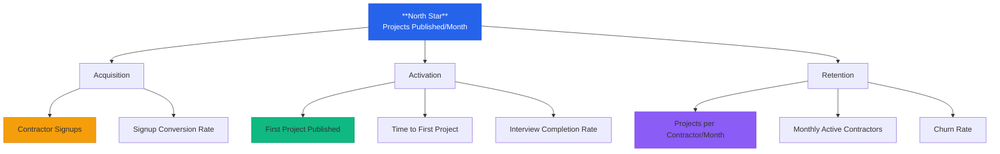

# KnearMe Vision

> **Version:** 1.1
> **Last Updated:** January 1, 2026
> **Status:** Approved for MVP

---

## One-Line Summary

**KnearMe** lets masonry contractors build a professional portfolio in under 5 minutes per project—just talk about the job, and you're done.

---

## Problem Statement

Masonry contractors are terrible at marketing themselves—not because they lack skill, but because they lack time. They're too busy laying brick, rebuilding chimneys, and pouring foundations to write blog posts or update their websites.

The result? **95% of masonry businesses** have outdated or non-existent online portfolios, even though they complete impressive projects every week. Meanwhile, homeowners struggle to find quality contractors and have no way to verify craftsmanship before hiring.

**The core friction:** Creating a portfolio entry takes 15-30 minutes of writing, formatting, and uploading. After a long day on a job site, no contractor is doing that.

---

## Solution

KnearMe eliminates the content creation burden entirely. When a contractor finishes a job:

1. **They snap a few photos** (which they're already doing)
2. **Open the app and upload photos** (takes 30 seconds)
3. **AI analyzes the images** and identifies the project type, materials, and techniques
4. **A quick voice interview** (3-5 questions, 60 seconds total) captures the story
5. **AI generates a professional 400-600 word showcase** with SEO optimization
6. **Contractor approves in 30 seconds** → Published

**Total effort: Under 5 minutes.**
**Result: A professional portfolio that builds itself.**

### What We Sell vs. What We Do

| What We SELL (Contractor Value) | What We DO (Our Strategy) |
|--------------------------------|---------------------------|
| Build a portfolio in <5 min/project | Index every project page for SEO |
| You did the work—now show it off | Drive homeowner traffic to the platform |
| Shareable proof for clients | Aggregate demand for contractors |
| Voice-first, no typing required | Build a content moat over time |

**Key principle:** We promise speed and ease. Leads are a hopeful outcome, not a guarantee.

> **MVP Focus:** The AI Interview is the only content creation path. Most contractors don't use job management software like Jobber—they just finish a job, take photos, and move on. KnearMe meets them where they are: on their phone, after the job.

---

## KPI Tree

### Metric Definitions

| Metric | Definition | Target (6-month) |
|--------|------------|------------------|
| **Projects Published/Month** | Total projects published across all contractors | 500/month |
| **Contractor Signups** | New contractor accounts created | 100 total |
| **First Project Published** | % of signups who publish at least 1 project | >60% |
| **Time to First Project** | Minutes from signup to first published project | <10 min |
| **Interview Completion Rate** | % of started interviews that complete | >85% |
| **Projects per Contractor/Month** | Average projects published per active contractor | 3+ |
| **Monthly Active Contractors** | Contractors who published in last 30 days | 50+ |
| **Churn Rate** | % of Pro subscribers who cancel per month | <5% |

---

## Target Users

### Primary: The Masonry Contractor (MVP Focus)

**Mike the Mason** - 45, owns a 3-person masonry company
- Completes 2-4 jobs per week
- Has a 5-year-old website with 3 outdated project photos
- Gets most work through word-of-mouth and yard signs
- Uses Jobber for scheduling and invoicing
- Technically capable (smartphone, basic apps) but hates typing
- Would love to post his work but "doesn't have time for that marketing stuff"

**Key Insight:** Mike already takes photos of completed work to send to his wife or post on personal Facebook. The content exists—he just needs someone to turn it into a portfolio.

### Secondary: The Homeowner (Phase 2)

**Sarah the Searcher** - 38, homeowner needing chimney repair
- Googles "masonry contractors near me"
- Frustrated by outdated directories and unverified reviews
- Wants to see actual project photos, not stock images
- Willing to pay premium for contractors with proven quality
- Values: transparency, craftsmanship evidence, local expertise

---

## Strategic Positioning

### What KnearMe IS

| Attribute | Description |
|-----------|-------------|
| **5-minute portfolio builder** | Publish a project faster than writing a text message |
| **Voice-first interface** | Built for people who work with their hands |
| **AI-powered content creator** | We write the portfolio, not contractors |
| **Shareable proof of work** | Professional pages to show clients and prospects |

### What KnearMe is NOT

| Competitor Type | Why We're Different |
|----------------|---------------------|
| **Lead marketplace** (Angi, HomeAdvisor) | We don't sell leads or take referral fees |
| **Design portfolio** (Houzz) | We're trades-first, not designer-focused |
| **Social media** (Instagram) | Purpose-built for showing craftsmanship |
| **Directory** (Yelp) | Living showcase, not static listing |

---

## Competitive Moats

### 1. The Integration Moat
Once we're connected to Jobber/ServiceTitan, switching costs are high. We become embedded in the contractor's workflow.

### 2. The Data Moat
Every approved post trains our AI to write better masonry descriptions. Over time, we understand masonry terminology, regional materials, and common problems better than any generic AI.

### 3. The Content Moat
The portfolio content lives on KnearMe. More projects → better SEO → more homeowners → more contractors. Network effects compound.

### 4. The Workflow Moat
Once "approve on phone after each job" becomes habit, contractors aren't going back to manually updating their website.

---

## Success Criteria (6-Month Milestones)

### Month 1-2: MVP Validation
- [ ] 20 contractors onboarded in launch city
- [ ] 100 projects published
- [ ] <3 min average time to publish
- [ ] >80% first-try approval rate (no regenerations)

### Month 3-4: Product-Market Fit Signals
- [ ] 50+ monthly active contractors
- [ ] 300+ projects/month published
- [ ] 5+ organic referrals (contractors telling other contractors)
- [ ] <5% monthly churn on Pro tier

### Month 5-6: Growth Readiness
- [ ] 100 contractors total
- [ ] 500+ projects/month
- [ ] First homeowner-initiated contact via platform
- [ ] Jobber integration live (Phase 2)

---

## Risks & Mitigations

| Risk | Likelihood | Impact | Mitigation |
|------|------------|--------|------------|
| Contractors won't adopt (too busy) | Medium | High | Voice-first, <2 min flow, mobile-native |
| AI generates poor content | Low | Medium | Human review queue, regenerate option, prompt tuning |
| No SEO traction | Medium | Medium | Focus on long-tail local keywords, schema markup |
| Competitors copy features | Low | Low | Integration + data moats defensible |
| Homeowners don't discover | Medium | Low | Phase 2 focus; validate supply first |

---

## Non-Goals (Explicitly Out of Scope for MVP)

- Native mobile app (PWA only)
- Homeowner accounts or search
- Jobber/ServiceTitan integrations
- Social media cross-posting
- Multi-trade support (masonry only)
- Payment processing or lead gen
- Analytics dashboard

---

## Document References

| Document | Purpose |
|----------|---------|
| `02-requirements/user-journeys.md` | Detailed user flows with sequence diagrams |
| `02-requirements/capabilities.md` | MoSCoW prioritization of features |
| `03-architecture/data-model.md` | Database schema and entity relationships |
| `05-decisions/adr/` | Architecture Decision Records |

---

*"The best portfolio is the one that builds itself."*
