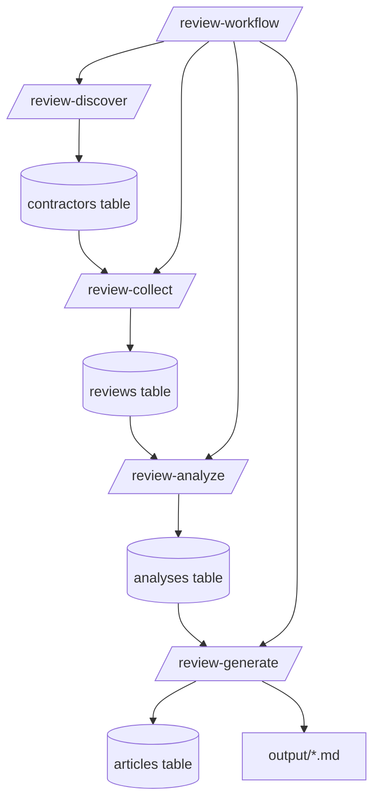

# Contractor Reviews Skill

**Name:** contractor-reviews
**Description:** Analyze contractor reviews and generate SEO-optimized articles using DataForSEO API and Claude AI.

## Overview

This skill provides a complete workflow for:
1. Discovering contractors via Google Maps (DataForSEO)
2. Collecting their Google Reviews
3. Analyzing reviews with Claude AI
4. Generating SEO-optimized articles

## Commands

### /review-discover

Discover contractors in a specific location.

**Usage:**
```
/review-discover "search query" "city"
```

**Examples:**
```
/review-discover "masonry contractors" "Denver"
/review-discover "chimney repair" "Toronto"
/review-discover "brick restoration" "Chicago"
```

**Parameters:**
- `search` (required): Search query for contractor type
- `city` (required): City name for location targeting

**Behavior:**
1. Resolves city to DataForSEO location code (see `src/lib/types.ts` for supported locations)
2. Calls DataForSEO Google Maps API
3. Stores discovered contractors in Supabase `contractors` table
4. Returns count of discovered contractors with ratings and review counts

**Script:** `src/scripts/discover.ts`

---

### /review-collect

Collect Google reviews for a specific contractor.

**Usage:**
```
/review-collect "contractor-name"
```

**Examples:**
```
/review-collect "ABC Masonry Inc"
/review-collect "Denver Chimney Experts"
```

**Parameters:**
- `contractor-name` (required): Business name of the contractor (must exist in database)

**Behavior:**
1. Looks up contractor by name in Supabase
2. Uses place_id to fetch reviews from DataForSEO Google Reviews API
3. Stores reviews in Supabase `reviews` table
4. Returns count of reviews collected

**Script:** `src/scripts/collect-reviews.ts`

---

### /review-analyze

Analyze collected reviews using Claude AI.

**Usage:**
```
/review-analyze "contractor-name"
```

**Examples:**
```
/review-analyze "ABC Masonry Inc"
```

**Parameters:**
- `contractor-name` (required): Business name of the contractor (must have reviews collected)

**Behavior:**
1. Fetches all reviews for the contractor from Supabase
2. Sends reviews to Claude with the analysis prompt (`prompts/analyze-reviews.md`)
3. Claude returns structured `ReviewAnalysis` JSON (see `src/lib/types.ts`)
4. Stores analysis in Supabase `analyses` table

**Output Structure:**
```typescript
interface ReviewAnalysis {
  summary: {
    total_reviews: number;
    average_rating: number;
    rating_distribution: Record<string, number>;
  };
  sentiment: {
    overall: 'positive' | 'negative' | 'mixed' | 'neutral';
    score: number; // -1 to 1
  };
  themes: {
    positive: ThemeAnalysis[];
    negative: ThemeAnalysis[];
  };
  notable_quotes: NotableQuote[];
  red_flags: string[];
  strengths: string[];
  recommendations: string[];
}
```

**Prompt:** `prompts/analyze-reviews.md`
**Script:** `src/scripts/analyze.ts`

---

### /review-generate

Generate an SEO-optimized article from the analysis.

**Usage:**
```
/review-generate "contractor-name"
```

**Examples:**
```
/review-generate "ABC Masonry Inc"
```

**Parameters:**
- `contractor-name` (required): Business name of the contractor (must have analysis completed)

**Behavior:**
1. Fetches contractor details and analysis from Supabase
2. Sends to Claude with article generation prompt (`prompts/generate-article.md`)
3. Claude generates 800-1200 word markdown article
4. Generates SEO metadata (title, description, keywords)
5. Stores article in Supabase `articles` table
6. Outputs markdown file to `output/` directory

**Output Files:**
- `output/{slug}.md` - The generated article
- Supabase `articles` table entry with metadata

**Prompt:** `prompts/generate-article.md`
**Script:** `src/scripts/generate-article.ts`

---

### /review-workflow

Run the complete pipeline from discovery to article generation.

**Usage:**
```
/review-workflow "search query" "city" --limit N
```

**Examples:**
```
/review-workflow "masonry contractors" "Denver" --limit 5
/review-workflow "chimney repair" "Toronto" --limit 10
```

**Parameters:**
- `search` (required): Search query for contractor type
- `city` (required): City name for location targeting
- `--limit N` (optional): Maximum contractors to process (default: 10)
- `--min-rating N` (optional): Minimum star rating (default: 4.0)
- `--min-reviews N` (optional): Minimum review count (default: 5)
- `--skip-analysis` (optional): Skip AI analysis step
- `--skip-articles` (optional): Skip article generation

**Behavior:**
1. Discover contractors matching criteria
2. For each contractor:
   - Collect reviews
   - Analyze with Claude (unless --skip-analysis)
   - Generate article (unless --skip-articles)
3. Report summary of results

**Script:** `src/scripts/pipeline.ts`

---

## Configuration

### Required Environment Variables

```bash
# DataForSEO credentials
DATAFORSEO_LOGIN=your-login
DATAFORSEO_PASSWORD=your-password

# Supabase connection
SUPABASE_URL=https://xxx.supabase.co
SUPABASE_SERVICE_KEY=eyJ...

# Claude API (for AI analysis)
ANTHROPIC_API_KEY=sk-ant-...
```

### Supported Locations

The skill includes pre-configured location codes for:

**US Cities:**
- Denver, Los Angeles, New York, Chicago, Houston, Phoenix, Philadelphia, San Antonio, San Diego, Dallas, Austin

**Canadian Cities:**
- Toronto, Hamilton, Vancouver, Montreal, Calgary, Edmonton, Ottawa

See `src/lib/types.ts` for the complete `US_LOCATION_CODES` and `CANADA_LOCATION_CODES` mappings.

---

## Database Schema

The skill expects these Supabase tables:

```sql
-- contractors: Discovered businesses
-- reviews: Individual customer reviews
-- analyses: AI-generated review analysis (JSON)
-- articles: Generated content articles
```

See `supabase/migrations/` for full schema definitions.

---

## Workflow Diagram



---

## Tips

1. **Start with discovery** to build your contractor database
2. **Filter by rating** (--min-rating 4.0) to focus on quality contractors
3. **Batch processing** using --limit to manage API costs
4. **Review outputs** in the `output/` directory before publishing
5. **Check analyses** in Supabase to verify AI insights

## Error Handling

- API rate limits: DataForSEO has rate limits; the scripts include automatic retry logic
- Missing reviews: Some contractors may have no reviews; these are skipped gracefully
- Analysis failures: Stored in `errors` array in PipelineResult for debugging

## Related Files

- `src/lib/types.ts` - TypeScript type definitions
- `src/scripts/` - CLI script implementations
- `prompts/analyze-reviews.md` - Claude prompt for review analysis
- `prompts/generate-article.md` - Claude prompt for article generation
- `supabase/migrations/` - Database schema
